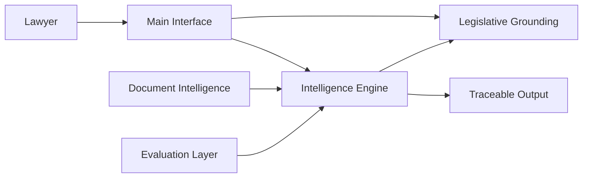

# High-Level Architecture

Language: [pt-BR](pt-br/architecture.md) | `English`

This page describes the product architecture in terms of functions, not
private implementation details.

## Layers

- Main interface: where the lawyer interacts with the product
- Intelligence engine: search, composition, reasoning, and central orchestration
- Legislative grounding: resolution and context for legal provisions
- Document intelligence: corpus reading, signals, and prioritization
- Evaluation and validation: comparisons, tests, and quality evidence

## Simplified flow

## What each layer does

### Main interface

It receives the question, the case context, and the user's workflow.
It should keep the experience simple without pushing technical complexity
onto the lawyer.

### Intelligence engine

This is the central layer that combines search, legal structure, response
composition, and auditability mechanisms.

### Legislative grounding

It provides canonical resolution of statutes, provisions, and legal context,
so that legislation is not handled as loose text.

### Document intelligence

It helps turn documents and corpora into useful signals for the system,
including what is worth prioritizing first.

### Evaluation and validation

It measures how much value the system creates above an unstructured workflow.
This layer includes comparisons, test cases, and external verification.

## What this document does not cover

This page does not detail:

- internal repository or service names
- private infrastructure
- internal endpoints
- technical backlog

Those details stay out of the public repository for now.
