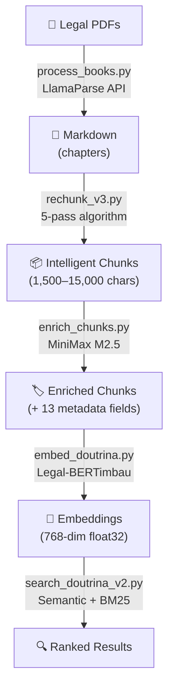
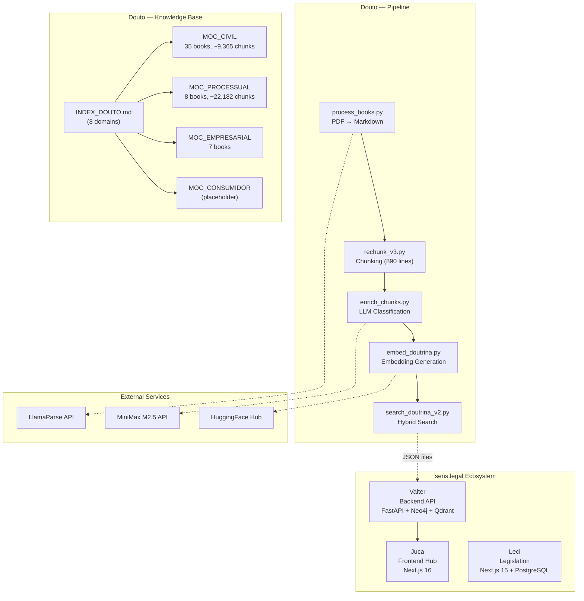
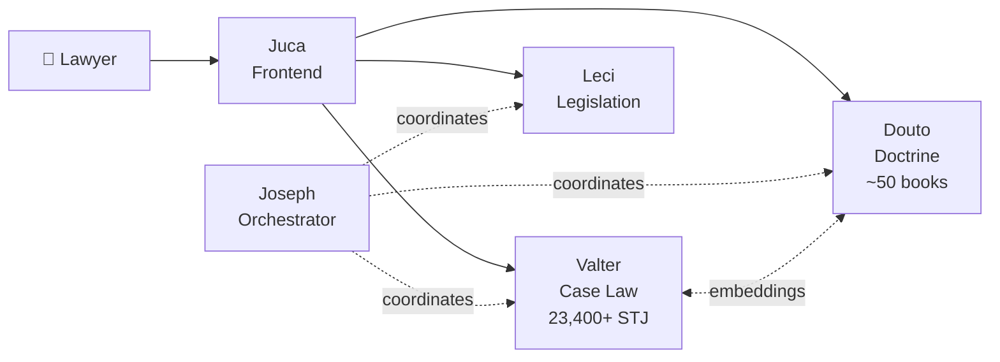
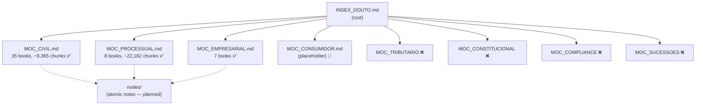
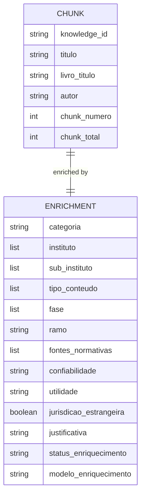
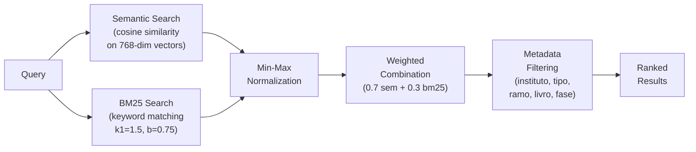
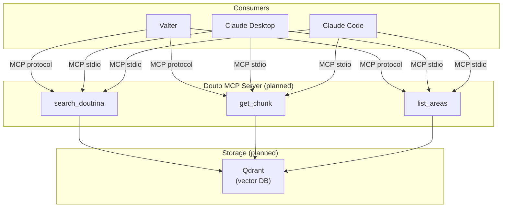

# Architecture Diagrams

All visual representations of Douto's architecture, rendered in Mermaid.

## Pipeline Data Flow

The complete five-stage pipeline, showing data formats at each transition:

## Component Diagram

All Douto components and their connections to external services and the sens.legal ecosystem:

## Ecosystem Position

How Douto fits within the sens.legal platform from the user's perspective:

## Knowledge Base Hierarchy

The skill graph structure from root to leaf:

## Enrichment Metadata Schema

The 13 metadata fields added to each chunk during enrichment:

Field descriptions:

| Field | Type | Example Values |
|-------|------|---------------|
| `instituto` | `list[str]` | `["exceptio non adimpleti contractus", "contrato bilateral"]` |
| `sub_instituto` | `list[str]` | `["inadimplemento relativo"]` |
| `tipo_conteudo` | `list[str]` | `["definicao", "requisitos", "jurisprudencia_comentada"]` |
| `fase` | `list[str]` | `["formacao", "execucao", "extincao"]` |
| `ramo` | `str` | `"direito_civil"` |
| `fontes_normativas` | `list[str]` | `["CC art. 476", "CC art. 477"]` |
| `confiabilidade` | `str` | `"alta"`, `"media"`, `"baixa"` |
| `categoria` | `str` | `"doutrina"` |

## Search Architecture

How hybrid search combines semantic and keyword scoring:

## Planned Architecture (v0.4+)

When the MCP server is implemented, Douto will be queryable in real time:

