# Architecture Overview

Douto operates in two complementary modes: a batch ETL pipeline that transforms legal PDFs into searchable data, and a markdown-based knowledge graph navigable by humans and AI agents. It is not a web application or a running service — it is a set of processing tools and a structured knowledge base.

## Architectural Pattern

**Batch Processing Pipeline** — Five independent Python scripts executed sequentially. Each reads from disk, processes data, and writes back to disk. No database, no message queue, no orchestrator.

**Markdown Knowledge Graph** — An Obsidian-compatible hierarchy using YAML frontmatter, wikilinks, and Maps of Content (MOCs). Designed for dual consumption: human navigation in Obsidian and programmatic querying by AI agents.

## Pipeline Data Flow

```mermaid
flowchart TD
    PDF["📄 Legal PDFs<br/>(staging/input/)"]
    PB["process_books.py<br/>LlamaParse API"]
    RC["rechunk_v3.py<br/>5-pass algorithm"]
    EN["enrich_chunks.py<br/>MiniMax M2.5 LLM"]
    EM["embed_doutrina.py<br/>Legal-BERTimbau"]
    SE["search_doutrina_v2.py<br/>Hybrid: Semantic + BM25"]
    JSON["📦 JSON Artifacts<br/>embeddings + corpus + BM25"]

    PDF -->|"PDF files"| PB
    PB -->|"markdown<br/>(chapters)"| RC
    RC -->|"intelligent<br/>chunks"| EN
    EN -->|"enriched chunks<br/>(13 metadata fields)"| EM
    EM -->|"768-dim vectors"| JSON
    JSON --> SE
```

Each arrow represents a file-system handoff — there is no in-memory pipeline or streaming. Scripts can be re-run independently with `--force` or `--dry-run`.

## Knowledge Base Structure

The knowledge base has three layers:

| Layer | File | Purpose | Status |
|-------|------|---------|--------|
| **Root** | `knowledge/INDEX_DOUTO.md` | Skill graph entry point — maps 8 legal domains | Active |
| **Domain Maps** | `knowledge/mocs/MOC_*.md` | Books per domain with metadata and status | 3 active, 1 placeholder, 4 missing |
| **Atomic Notes** | `knowledge/nodes/*.md` | One note per legal concept (instituto) | Planned (directory exists, no content) |

The hierarchy uses Obsidian conventions: `[[wikilinks]]` for navigation, YAML frontmatter for structured metadata.

## Output Artifacts

The pipeline produces three JSON files per legal area (e.g., `contratos`, `processo_civil`):

| File | Contents | Estimated Size |
|------|----------|---------------|
| `embeddings_{area}.json` | `doc_ids[]` + `embeddings[][]` (768-dim float32 vectors) | ~500 MB for 31,500 chunks |
| `search_corpus_{area}.json` | Full metadata per chunk (title, author, instituto, tipo, etc.) | ~200 MB |
| `bm25_index_{area}.json` | `doc_ids[]` + `documents[]` (tokenized text for BM25) | ~300 MB |

These files are loaded entirely into memory by `search_doutrina_v2.py` at startup.

## Position in the sens.legal Ecosystem

Currently, Douto integrates with the ecosystem via JSON files deposited in a shared directory. There is no API, MCP server, or real-time query capability. MCP integration is planned for [v0.4](../roadmap/milestones#v04--senslegal-integration).

## Design Principles

From `CLAUDE.md`, in priority order:

1. **Correctness** — especially doctrinal data, citations, legal metadata
2. **Simplicity** — code another agent understands without context
3. **Maintainability** — easy to change without breaking
4. **Reversibility** — decisions that can be undone
5. **Performance** — optimize only with evidence of a problem

Operational principles:

- **Idempotent** — every script is safe to re-run (skip markers, `--force` to override)
- **Dry-run first** — every script supports `--dry-run`
- **Structured logging** — events go to `processing_log.jsonl`

## Known Limitations

These are architectural constraints, not bugs. Each has a tracking reference:

| Limitation | Impact | Tracking |
|-----------|--------|----------|
| No database — JSON flat files | Doesn't scale past ~100 books, full load into memory | [ADR-003](decisions#adr-003-json-flat-files-instead-of-vector-database) |
| No API or MCP server | No real-time queries from other agents | [F30, v0.4](../roadmap/milestones#v04--senslegal-integration) |
| No CI/CD | No automated testing or linting | [F39, v0.5](../roadmap/milestones#v05--knowledge-graph--automation) |
| Hardcoded paths in 2 scripts | Pipeline runs only on creator's machine | [F22, v0.2](../roadmap/milestones#v02--stable-pipeline) |
| 0% test coverage | Regressions undetectable except by manual inspection | [F26-F27, v0.3](../roadmap/milestones#v03--quality--coverage) |
| Missing enrichment prompt | `enrich_prompt.md` not in repo — enrichment unreproducible | [M01](../roadmap/milestones#v02--stable-pipeline) |
