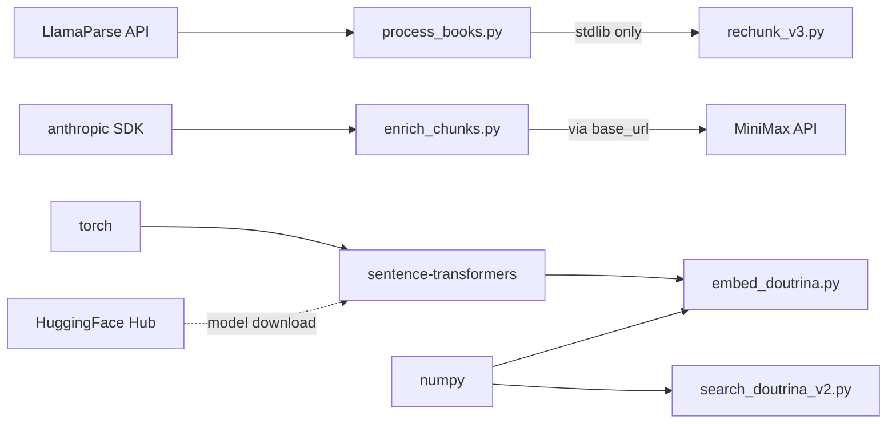

# Technology Stack

Every technology used in Douto, why it was chosen, and where it's used.

## Languages

| Language | Version | Usage |
|----------|---------|-------|
| Python 3 | 3.10+ (required for `tuple[dict, str]` type hints) | All 5 pipeline scripts |
| Markdown | — | Knowledge base (Obsidian conventions, YAML frontmatter, wikilinks) |

## Core Dependencies

From `pipeline/requirements.txt`:

| Package | Version | Purpose | Used In |
|---------|---------|---------|---------|
| `sentence-transformers` | unpinned | Embedding generation via Legal-BERTimbau | `embed_doutrina.py` |
| `torch` | unpinned | ML backend for sentence-transformers | `embed_doutrina.py` |
| `numpy` | unpinned | Vector math (cosine similarity, score normalization) | `embed_doutrina.py`, `search_doutrina_v2.py` |
| `anthropic` | unpinned | Python SDK used as HTTP client for MiniMax M2.5 API | `enrich_chunks.py` |
| `llama-parse` | unpinned | PDF → markdown extraction via LlamaIndex cloud | `process_books.py` |

:::caution
All versions are unpinned. Running `pip install -r requirements.txt` at different times may produce different environments. Pinning is planned for [F24](../roadmap/milestones#v02--stable-pipeline).
:::

## ML Models

| Model | Provider | Dimensions | Max Tokens | Purpose |
|-------|----------|-----------|------------|---------|
| `rufimelo/Legal-BERTimbau-sts-base` | HuggingFace | 768 | 512 | Semantic embeddings for legal text |
| MiniMax-M2.5 | MiniMax (via Anthropic SDK) | — | ~8,000 | Chunk enrichment and classification |
| LlamaParse | LlamaIndex | — | — | PDF → markdown extraction |

**Legal-BERTimbau** was trained on Portuguese legal corpora. It's the standard choice for Portuguese legal NLP, though it was trained on PT-PT (Portugal), not PT-BR (Brazil). No benchmark comparison with alternatives (multilingual-e5, nomic-embed, Cohere embed v3) has been performed for Douto's specific domain.

## External Services

| Service | Purpose | Authentication | Required For |
|---------|---------|---------------|-------------|
| LlamaParse API | PDF → markdown conversion | `LLAMA_CLOUD_API_KEY` | `process_books.py` only |
| MiniMax M2.5 API | Chunk classification with legal metadata | `MINIMAX_API_KEY` | `enrich_chunks.py` only |
| HuggingFace Hub | Model download (auto on first run) | None (public model) | `embed_doutrina.py` (first run) |

:::danger
The MiniMax integration uses the Anthropic Python SDK with `base_url="https://api.minimax.io/anthropic"`. This is an undocumented compatibility layer — not officially supported by either Anthropic or MiniMax. It can break without notice.
:::

## Standard Library Usage

The following stdlib modules are used across pipeline scripts — no external packages needed:

`re`, `json`, `pathlib`, `argparse`, `asyncio`, `shutil`, `threading`, `math`, `collections`, `os`, `sys`, `time`, `datetime`

Notably, `rechunk_v3.py` (the most complex script at 890 lines) uses **only** stdlib modules.

:::note
The project uses a custom regex-based YAML parser (`parse_frontmatter()`) instead of `PyYAML`. This parser is duplicated in `enrich_chunks.py` and `embed_doutrina.py`. Extracting it to a shared `utils.py` and optionally replacing with PyYAML is tracked as [F23](../roadmap/milestones#v02--stable-pipeline).
:::

## Infrastructure

| Category | Current State | Planned |
|----------|-------------|---------|
| Build system | None — scripts run manually | Makefile ([F31](../roadmap/milestones#v03--quality--coverage)) |
| Database | None — JSON flat files | Vector DB migration ([M12](../roadmap/milestones#v04--senslegal-integration)) |
| Containerization | None | Docker ([F38](../roadmap/milestones#v10--integrated-platform)) |
| CI/CD | None | GitHub Actions ([F39](../roadmap/milestones#v05--knowledge-graph--automation)) |
| Linting | None | ruff ([F32](../roadmap/milestones#v03--quality--coverage)) |
| Testing | None (0% coverage) | pytest ([F26-F27](../roadmap/milestones#v03--quality--coverage)) |

## Dependency Graph

