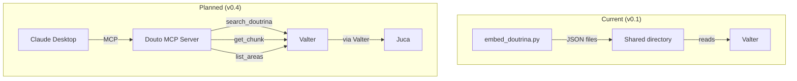

# External Integrations

How Douto connects to external services and the sens.legal ecosystem.

## LlamaParse (PDF Extraction)

**Service:** [LlamaParse](https://cloud.llamaindex.ai/) by LlamaIndex
**Purpose:** Convert legal PDF textbooks into structured markdown
**Used by:** `process_books.py`
**Auth:** `LLAMA_CLOUD_API_KEY` environment variable (loaded implicitly by the SDK)

### Setup

1. Create a free account at [cloud.llamaindex.ai](https://cloud.llamaindex.ai/).
2. Generate an API key from the dashboard.
3. Set the environment variable:

```bash
export LLAMA_CLOUD_API_KEY="llx-your-key-here"
```

### Tiers

LlamaParse offers three processing tiers. The default in Douto is `cost_effective`:

| Tier | Best for | Speed | Cost |
|------|----------|-------|------|
| `agentic` | Scanned PDFs, complex tables, multi-column layouts | Slowest | Highest |
| `cost_effective` | Clean-text legal textbooks (default) | Medium | Medium |
| `fast` | Simple text-only documents | Fastest | Lowest |

Override the tier per run:

```bash
python3 pipeline/process_books.py --tier agentic livro.pdf
```

### Usage Notes

- PDF extraction is a **one-time operation** per book. Once converted to markdown, the original PDF is not needed again by the pipeline.
- Processed markdown is saved to `$VAULT_PATH/Knowledge/_staging/processed/{slug}/`.
- If extraction fails, the PDF is moved to `$VAULT_PATH/Knowledge/_staging/failed/`.
- LlamaParse uses `asyncio` internally. This is the only async component in the pipeline.

:::tip
Since extraction is one-time, even if LlamaParse changes pricing or becomes unavailable, previously extracted books are unaffected. Only processing new books requires an active API key.
:::

---

## MiniMax M2.5 (Chunk Enrichment)

**Service:** MiniMax M2.5 LLM
**Purpose:** Classify chunks with structured legal metadata (instituto, tipo_conteudo, ramo, etc.)
**Used by:** `enrich_chunks.py`
**Auth:** `MINIMAX_API_KEY` environment variable

### Setup

1. Obtain an API key from [MiniMax](https://www.minimax.io/).
2. Set the environment variable:

```bash
export MINIMAX_API_KEY="your-minimax-api-key"
```

### The Anthropic SDK Hack

:::caution[Fragile integration -- not officially supported]
Douto uses the **Anthropic Python SDK** to call MiniMax's API. This works because MiniMax exposes an Anthropic-compatible endpoint, but it is **not an officially documented or supported integration** by either Anthropic or MiniMax.

```python
# From enrich_chunks.py (line 30-31)
MINIMAX_BASE_URL = "https://api.minimax.io/anthropic"
MINIMAX_MODEL = "MiniMax-M2.5"

# The client is instantiated as:
client = anthropic.Anthropic(
    api_key=os.environ["MINIMAX_API_KEY"],
    base_url=MINIMAX_BASE_URL,
)
```

Any change to MiniMax's API compatibility layer, or a breaking change in the Anthropic SDK, will silently break enrichment. There will be no deprecation warning.
:::

### Concurrency Settings

Enrichment runs with 5 concurrent threads and a 0.5-second delay between requests to avoid rate limiting:

| Parameter | Value |
|-----------|-------|
| `WORKERS` | 5 threads |
| `DELAY_BETWEEN_REQUESTS` | 0.5 seconds |
| Model | `MiniMax-M2.5` |

### Missing Prompt File

:::danger
The enrichment prompt file (`enrich_prompt.md`) is referenced in the code at line 27 but is **not present in the repository**. Without this file, `enrich_chunks.py` will exit with an error. Recovering or reconstructing this prompt is tracked as mitigation action M01 (P0 priority).
:::

### Pending Decision: D06

The choice of MiniMax M2.5 as the enrichment model is under review. Options being evaluated:

| Option | Pros | Cons |
|--------|------|------|
| **Keep MiniMax M2.5** | Works, cheap | Fragile SDK hack, generic model |
| Migrate to Claude | Ecosystem consistency | Higher cost |
| Local model | Zero cost, no dependency | Slower, setup complexity |
| Evaluate later | No effort now | Risk compounds |

---

## HuggingFace (Embedding Model)

**Service:** HuggingFace Hub (public model)
**Purpose:** Download and cache the Legal-BERTimbau embedding model
**Used by:** `embed_doutrina.py`, `search_doutrina_v2.py`
**Auth:** None required (public model)

### Model Details

| Property | Value |
|----------|-------|
| Model ID | `rufimelo/Legal-BERTimbau-sts-base` |
| Dimensions | 768 |
| Max tokens | 512 |
| Language | Portuguese (trained on PT-PT legal corpus) |
| Size on disk | ~500 MB |
| License | Open source |

### Setup

The model is **automatically downloaded** on first run by the `sentence-transformers` library. No manual setup is needed.

To pre-download the model (useful for offline environments or Docker):

```bash
python3 -c "from sentence_transformers import SentenceTransformer; SentenceTransformer('rufimelo/Legal-BERTimbau-sts-base')"
```

To control where the model is cached:

```bash
export HF_HOME="/path/to/cache"
# or specifically:
export SENTENCE_TRANSFORMERS_HOME="/path/to/cache"
```

:::note
The model was trained on Portuguese (PT-PT) legal text, not specifically Brazilian Portuguese. This may cause minor differences in semantic similarity for BR-specific legal terms (see PREMORTEM PF04). No benchmark comparison against alternatives exists yet (planned in F40).
:::

---

## sens.legal Ecosystem Integration

### Current State (v0.1)

Integration with the broader sens.legal ecosystem is currently through **static JSON files**:

```
embed_doutrina.py
      |
      v
embeddings_doutrina.json  ─── deposited in ──→  Juca/Valter data directory
search_corpus_doutrina.json                      ($OUTPUT_PATH)
bm25_index_doutrina.json
```

- No real-time query capability from other agents.
- No API or protocol.
- Valter and Juca read the JSON files from a shared filesystem path.
- Updates require re-running the embedding pipeline and restarting consumers.

### Ecosystem Components

| Component | Role | Stack | Douto's relationship |
|-----------|------|-------|---------------------|
| **Valter** | Backend API -- STJ case law, knowledge graph, vector search | FastAPI, PostgreSQL, Qdrant, Neo4j, Redis | Primary consumer of Douto's embeddings |
| **Juca** | Frontend -- user interface for lawyers | Next.js | Accesses doctrine through Valter |
| **Leci** | Legislation service | Next.js, PostgreSQL, Drizzle | Future cross-reference target (F35) |
| **Joseph** | Orchestrator -- coordinates agents | -- | Future coordination with Douto queries |

### Planned Integration (v0.4)

> **Planned Feature** -- MCP server for doctrine search is on the roadmap (F30) but not yet implemented.

The v0.4 milestone will establish programmatic integration between Douto and the sens.legal ecosystem:

**MCP Server** with at least 3 tools:

| Tool | Description |
|------|-------------|
| `search_doutrina` | Hybrid search across doctrine corpus |
| `get_chunk` | Retrieve a specific chunk by ID with full metadata |
| `list_areas` | List available legal domains with corpus statistics |

**Protocol Decision (D01) -- not yet resolved:**

| Option | Description | Pros | Cons |
|--------|-------------|------|------|
| MCP stdio | Standard MCP transport | Aligned with Valter's MCP | Process-per-query overhead |
| MCP HTTP/SSE | Persistent MCP connection | More flexible, lower latency | More infrastructure |
| REST API (FastAPI) | Conventional HTTP API | Simple, well-understood | Not aligned with MCP ecosystem |
| Keep JSON files | Current approach | Zero effort | No real-time queries, doesn't scale |

**Architecture Decision (D02) -- not yet resolved:**

Whether Douto remains an independent service or is absorbed as a module within Valter (`valter/stores/doutrina/`). This decision blocks v0.4.

:::tip
Valter already has Qdrant (vector DB) and Neo4j (knowledge graph) infrastructure. When Douto integrates, it should leverage these existing services rather than maintaining its own JSON-based storage.
:::

### Integration Diagram


