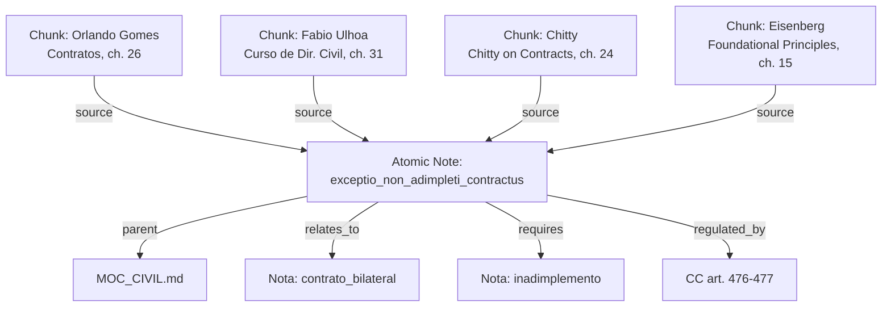
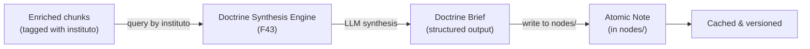

# Atomic Notes (F21, F36)

`knowledge/nodes/` -- The planned third and most granular layer of the skill graph. Each atomic note would represent a single legal concept (`instituto juridico`) with definitions from multiple authors, requirements, related concepts, and provenance links to source chunks.

> **Planned Feature** -- This feature is on the roadmap but not yet implemented. The `nodes/` directory exists with only a `.gitkeep` file. No atomic notes have been created. Implementation depends on pending decision **D03**.

## Current State

| Property | Value |
|----------|-------|
| **Directory** | `knowledge/nodes/` |
| **Files** | 1 (`.gitkeep` only) |
| **Status** | In Progress (~5%) -- directory created, schema defined, no content |
| **Milestone** | v0.5 |
| **Blocking decision** | D03: auto-generate vs. curate vs. hybrid |
| **Pre-requisite** | Metadata quality gate (M06: accuracy >= 85%) |

## What Atomic Notes Would Be

An atomic note represents a single legal concept -- an `instituto juridico` -- synthesized from all chunks across all books that discuss that concept. Where a chunk is a passage from a single book, an atomic note is a **cross-book synthesis** of a single idea.

### Example: "Exceptio Non Adimpleti Contractus"

An atomic note for this concept would contain:
- **Definition** synthesized from Orlando Gomes, Fabio Ulhoa Coelho, Chitty, and other authors in the corpus
- **Requirements/elements** as enumerated by the doctrine
- **Statutory basis** (`CC art. 476`, `CC art. 477`)
- **Related concepts** (contrato bilateral, inadimplemento, resolucao contratual, pacta sunt servanda)
- **Provenance** linking to every chunk that discusses this concept, with author and book attribution



## Proposed Format

Based on the schema defined in `CLAUDE.md`, atomic notes would use this structure:

### Frontmatter

```yaml
---
tipo: nota
instituto: exceptio_non_adimpleti_contractus
sub_instituto: []
ramo: direito_civil
fontes_normativas:
  - "CC art. 476"
  - "CC art. 477"
autores:
  - "Orlando Gomes"
  - "Fabio Ulhoa Coelho"
  - "Chitty"
  - "Melvin Eisenberg"
chunks_origem:
  - "contratos-orlando-gomes/026-contratos-bilaterais"
  - "curso-de-direito-civil-contratos/031-exceptio"
  - "chitty-on-contracts/024-bilateral-contracts"
total_fontes: 4
confiabilidade: alta
data_criacao: "2026-03-15T10:00:00"
data_atualizacao: "2026-03-15T10:00:00"
---
```

### Content

```markdown
# Exceptio Non Adimpleti Contractus

## Definicao
[Synthesized definition from multiple authors, with inline citations]

## Requisitos
1. Contrato bilateral (sinalagmatico)
2. Inadimplemento da parte contraria
3. ...

## Posicao doutrinaria
[Where authors agree and where they diverge]

## Fontes normativas
- CC art. 476 — ...
- CC art. 477 — ...

## Conceitos relacionados
- [[contrato_bilateral]]
- [[inadimplemento]]
- [[resolucao_contratual]]
- [[pacta_sunt_servanda]]

## Fontes
| Autor | Obra | Chunk | Tipo |
|-------|------|-------|------|
| Orlando Gomes | Contratos | [[026-contratos-bilaterais]] | definicao, requisitos |
| Fabio Ulhoa | Curso Dir. Civil | [[031-exceptio]] | doutrina_comparada |
```

## Generation Strategy (Pending Decision D03)

Decision D03 from the ROADMAP evaluates three approaches:

### Option A: Auto-Generate

Generate one note per unique `instituto` value from the enrichment metadata. A script would:

1. Collect all unique `instituto` values from enriched chunks
2. For each instituto, gather all chunks tagged with it
3. Generate a note with provenance links and a placeholder for synthesis

**Pros:** Fast, comprehensive (covers every instituto in the corpus), no human effort.
**Cons:** Potentially noisy -- if enrichment metadata is inaccurate, notes inherit those errors. No synthesis or cross-referencing, just aggregation.

### Option B: Manual Curation

A legal expert reviews chunks and writes each atomic note by hand.

**Pros:** High quality, accurate synthesis, correct cross-references.
**Cons:** Extremely slow. At ~500+ unique institutos in the corpus, manual curation would take weeks of expert time. Does not scale.

### Option C: Hybrid (Recommended)

Auto-generate draft notes from enrichment metadata, then flag them for human review. A reviewer validates, corrects, and enriches each note.

**Pros:** Combines speed of automation with quality of human judgment. Reviewers have a starting point instead of a blank page.
**Cons:** Still requires significant review effort. Needs a workflow for tracking review status.

:::tip
The ROADMAP recommends Option C (hybrid), but with an important **pre-condition**: the metadata quality gate (mitigation M06) must confirm that enrichment accuracy is >= 85% before generating draft notes. Generating notes from bad metadata would create a systematically misleading knowledge base.
:::

## Relationship to the Doctrine Synthesis Engine (F43)

The [Doctrine Synthesis Engine](https://github.com/sensdiego/douto/blob/main/INNOVATION_LAYER.md) (F43 from `INNOVATION_LAYER.md`) proposes a more sophisticated approach to atomic notes. Instead of simple aggregation, it would use an LLM to synthesize a **Doctrine Brief** for each legal concept:

| Aspect | Atomic Notes (F21/F36) | Doctrine Brief (F43) |
|--------|----------------------|---------------------|
| **Content** | Aggregated links + placeholder text | LLM-synthesized analysis with citations |
| **Quality** | Depends on metadata accuracy | Depends on LLM + metadata accuracy |
| **Output** | Markdown note with wikilinks | Structured JSON + Markdown |
| **Effort** | Low (automated) to Medium (hybrid) | Medium (prompt engineering + LLM costs) |
| **Value** | Navigation and organization | Actual doctrinal synthesis -- "what do authors say about X?" |

If F43 is implemented, Doctrine Briefs could **become** the content of atomic notes. The workflow would be:



This makes atomic notes the **cached, versioned output** of the synthesis engine rather than just an index of sources. Each note would contain genuine doctrinal analysis, not just metadata aggregation.

:::note
From `INNOVATION_LAYER.md`: "The Synthesis Engine is the answer to 'what does Douto DO that nobody else does?' -- the atomic notes would contain synthesized analysis that no legal tech competitor currently offers."
:::

## Implementation Timeline

| Milestone | Feature | What Happens |
|-----------|---------|-------------|
| v0.2.5 | M06 (metadata quality gate) | Validate 200 chunks for enrichment accuracy. Must be >= 85%. |
| v0.3 | F26, F27 (tests) | Test infrastructure for pipeline components |
| v0.3.5 | F43 (Doctrine Synthesis Engine) | If approved, generates the content for atomic notes |
| v0.5 | F36 (auto-generate atomic notes) | Generate draft notes from enriched chunks |
| v0.5 | F21 (complete knowledge nodes) | Populate `nodes/` directory |

### Pre-requisites

1. **Metadata quality gate (M06) must pass.** If enrichment accuracy is below 85%, auto-generated notes would systematically mislead users. The re-enrichment action enters the pipeline before note generation.
2. **Decision D03 must be made.** The generation strategy (auto/curated/hybrid) determines the implementation approach, timeline, and resource requirements.
3. **Tests must exist (F26, F27).** The atomic note generator will depend on `parse_frontmatter()`, corpus traversal, and possibly `extract_json()`. These must be tested before building on top of them.

## What Exists Today

The only file in `knowledge/nodes/` is `.gitkeep`, which preserves the empty directory in git:

```
knowledge/nodes/
  .gitkeep       # Placeholder — no atomic notes exist yet
```

The directory structure is ready. The enriched corpus contains the data. The schema is defined. What remains is the generation strategy decision (D03) and the quality gate (M06) before implementation can begin.
