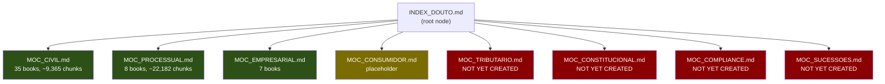

# Skill Graph (F08)

`knowledge/INDEX_DOUTO.md` -- The root node of Douto's knowledge base. It maps 8 legal domains into a navigable hierarchy following the Obsidian knowledge management pattern: INDEX (root) leads to MOCs (Maps of Content) which lead to individual book entries, which will eventually lead to atomic notes.

## Overview

The skill graph serves two purposes:

1. **Human navigation** -- A lawyer or researcher can start at `INDEX_DOUTO.md`, click through to a domain MOC, find a relevant book, and drill down to the specific chapter or legal concept they need.
2. **Programmatic access** -- Each file has YAML frontmatter with structured metadata (`type`, `domain`, `description`), enabling scripts and agents to traverse the knowledge base, discover content, and build aggregations.



## The 8 Domains

| # | Domain | MOC File | Status | Books | Chunks |
|---|--------|----------|--------|-------|--------|
| 1 | Direito Civil | `MOC_CIVIL.md` | Active | 35 | ~9,365 |
| 2 | Direito Processual Civil | `MOC_PROCESSUAL.md` | Active | 8 | ~22,182 |
| 3 | Direito Empresarial | `MOC_EMPRESARIAL.md` | Active | 7 | -- |
| 4 | Direito do Consumidor | `MOC_CONSUMIDOR.md` | Placeholder | 0 | 0 |
| 5 | Direito Tributario | -- | Missing | -- | -- |
| 6 | Direito Constitucional | -- | Missing | -- | -- |
| 7 | Compliance & Governanca | -- | Missing | -- | -- |
| 8 | Sucessoes & Planejamento Patrimonial | -- | Missing | -- | -- |

**Summary:** 4 MOC files exist (3 active, 1 placeholder). 4 MOC files are missing. Creating them is tracked as **F25** (P1, milestone v0.3).

## INDEX_DOUTO.md Structure

The index file uses a specific format defined in `CLAUDE.md`:

### Frontmatter

```yaml
---
type: skill-graph-index
description: Mapa do conhecimento juridico doutrinario da FS.
              Ponto de entrada para navegacao tematica.
domains: [civil, consumidor, empresarial, tributario,
          processual, constitucional, compliance, sucessorio]
---
```

### Content

Each domain is listed under a heading with a wikilink to its MOC and a brief description of coverage:

```markdown
### Direito Civil
[[MOC_CIVIL]] — obrigacoes, contratos, responsabilidade civil, propriedade

### Direito do Consumidor
[[MOC_CONSUMIDOR]] — relacao de consumo, responsabilidade objetiva, praticas abusivas
```

### Cross-Domain Links

The index also references cross-cutting concepts that span multiple domains:

```markdown
## Cross-Domain
- [[teoria_geral_do_direito]] — conceitos que cruzam areas
- [[principios_constitucionais]] — base para todos os ramos
```

:::note
The cross-domain notes (`teoria_geral_do_direito`, `principios_constitucionais`) are referenced via wikilinks but do not yet exist as files. They are part of the planned atomic notes layer (F21/F36).
:::

## Navigation Pattern

Douto's knowledge base follows three conventions from `CLAUDE.md`:

### 1. Wikilinks for Internal Navigation

All internal references use Obsidian-style wikilinks (`[[target]]`), never markdown relative links. This ensures compatibility with Obsidian's graph view and link resolution, and makes it trivial for scripts to parse and traverse connections.

```markdown
# In INDEX_DOUTO.md:
[[MOC_CIVIL]] — obrigacoes, contratos...

# In MOC_CIVIL.md:
[[contratos-orlando-gomes]] — Orlando Gomes, tratado classico

# In a chunk file:
[[MOC_CIVIL]] (back-link to parent MOC)
```

### 2. Frontmatter for Programmatic Access

Every knowledge base file has YAML frontmatter with structured metadata:

| File Type | Required Fields |
|-----------|----------------|
| INDEX | `type: skill-graph-index`, `description`, `domains[]` |
| MOC | `type: moc`, `domain`, `description`, `key_authors[]`, `total_obras`, `total_chunks` |
| Book entry | `tipo: livro_chunk`, `titulo`, `livro_titulo`, `autor`, `area_direito[]`, `status_enriquecimento` |
| Atomic note (planned) | `tipo: nota`, `instituto`, `sub_instituto`, `ramo`, `fontes_normativas[]`, `autores[]`, `chunks_origem[]` |

### 3. Hierarchical Traversal

The knowledge base forms a strict tree:

```
INDEX_DOUTO.md          (1 file — root)
  |
  +-- mocs/MOC_*.md     (8 files — one per domain)
  |     |
  |     +-- book entries  (per-book directories in staging)
  |           |
  |           +-- chunks   (individual chapter .md files)
  |
  +-- nodes/            (planned — one file per legal concept)
```

This hierarchy enables both top-down navigation (domain exploration) and bottom-up aggregation (collecting all chunks for a given legal concept across books).

## Relationship to Other Features

| Feature | Relationship |
|---------|-------------|
| [MOCs](mocs.md) (F09-F11, F19) | MOCs are the second layer of the skill graph, directly linked from INDEX |
| [Atomic Notes](atomic-notes.md) (F21, F36) | Planned third layer -- one note per legal concept |
| F25 (Create missing MOCs) | Completes the skill graph by filling in 4 missing domains |
| F43 (Doctrine Synthesis Engine) | Would generate Doctrine Briefs that feed into atomic notes |

## Planned Improvements

> **Planned Feature** -- The following improvements are on the roadmap but not yet implemented.

- **F25: Create 4 missing MOCs** (P1, v0.3) -- `MOC_TRIBUTARIO`, `MOC_CONSTITUCIONAL`, `MOC_COMPLIANCE`, `MOC_SUCESSOES`. Even as placeholders with minimal structure, their existence completes the navigational map.
- **F36: Atomic notes from enriched chunks** (P2, v0.5) -- Generate one note per unique `instituto` from enrichment metadata, creating the third layer of the hierarchy.
- **F21: Complete knowledge nodes** (In Progress, v0.5) -- The `nodes/` directory exists with only a `.gitkeep`. Populating it depends on decision **D03** (auto-generate vs. curate vs. hybrid).
