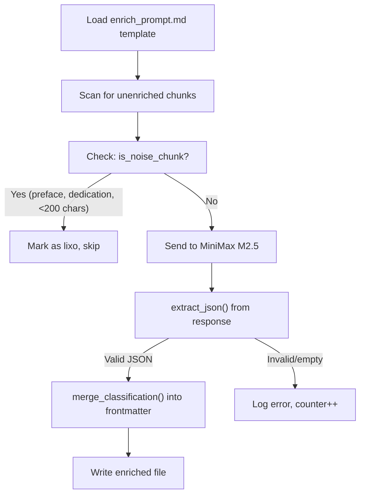

# Chunk Enrichment (F03)

`pipeline/enrich_chunks.py` -- Classifies each chunk using the MiniMax M2.5 LLM to add structured legal metadata. This is the step that transforms raw text into searchable, filterable knowledge by tagging each chunk with its legal concept (`instituto`), content type, branch of law, procedural phase, and normative sources.

## Overview

| Property | Value |
|----------|-------|
| **Script** | `pipeline/enrich_chunks.py` (403 lines) |
| **Input** | Chunked markdown files with `status_enriquecimento: "pendente"` |
| **Output** | Same files with enriched frontmatter (13+ metadata fields) |
| **LLM** | MiniMax M2.5 via Anthropic SDK with custom `base_url` |
| **Concurrency** | 5 threads, 0.5s delay between requests |
| **Idempotent** | Yes -- skips chunks with `status_enriquecimento: "completo"` or `"lixo"` |

:::danger
**CRITICAL: `enrich_prompt.md` is MISSING from the repository.** Line 27 references a prompt file that does not exist in the repo:
```python
PROMPT_PATH = Path(__file__).parent / "enrich_prompt.md"
```
This means the prompt that generated all metadata for ~31,500 chunks is not version-controlled. If lost, all enrichment metadata becomes unreproducible. This is tracked as **F42** (P1 priority, v0.3) and flagged as an existential risk in the ROADMAP.
:::

## How It Works



### Step 1: Load prompt template

The enrichment prompt is loaded from `pipeline/enrich_prompt.md`. Placeholder variables are substituted per chunk:
- `{livro_titulo}` -- book title
- `{autor}` -- author name
- `{capitulo}` -- chapter title
- `{chunk_numero}` / `{chunk_total}` -- chunk position
- `{chunk_content}` -- first 8,000 characters of the chunk body

### Step 2: Noise detection

Before sending to the LLM, each chunk is checked against noise patterns. Chunks matching any of these are marked as `"lixo"` (trash) without API calls:

- Title contains: "prefacio", "agradecimento", "dedicatoria", "nota do editor", "sobre o autor", etc.
- Body text is shorter than 200 characters

### Step 3: LLM classification

The chunk text + prompt is sent to MiniMax M2.5 via the Anthropic SDK with a custom base URL:

```python
client = anthropic.Anthropic(
    api_key=api_key,
    base_url="https://api.minimax.io/anthropic"
)

message = client.messages.create(
    model="MiniMax-M2.5",
    max_tokens=2000,
    system="Voce e um classificador juridico especializado. "
           "Responda APENAS com JSON valido, sem markdown, sem backticks, sem explicacoes.",
    messages=[{"role": "user", "content": prompt}]
)
```

### Step 4: JSON extraction

The LLM response is parsed using `extract_json()`, which has a brace-matching fallback for cases where the LLM wraps the JSON in markdown code fences or adds surrounding text:

```python
def extract_json(text: str) -> dict:
    text = text.strip()
    text = re.sub(r'^```json\s*', '', text)
    text = re.sub(r'\s*```$', '', text)
    text = text.strip()

    # Try direct parse first
    try:
        return json.loads(text)
    except json.JSONDecodeError:
        pass

    # Extract first complete JSON object by brace matching
    start = text.find('{')
    if start == -1:
        raise json.JSONDecodeError("No JSON object found", text, 0)

    depth = 0
    in_string = False
    escape = False
    for i in range(start, len(text)):
        c = text[i]
        if escape:
            escape = False
            continue
        if c == '\\' and in_string:
            escape = True
            continue
        if c == '"' and not escape:
            in_string = not in_string
            continue
        if in_string:
            continue
        if c == '{':
            depth += 1
        elif c == '}':
            depth -= 1
            if depth == 0:
                return json.loads(text[start:i+1])

    raise json.JSONDecodeError("Incomplete JSON object", text, len(text))
```

:::tip
The brace-matching approach is robust against common LLM output issues: markdown fencing, preamble text, and trailing explanations. It correctly handles nested objects and escaped characters within strings.
:::

### Step 5: Merge classification

The parsed JSON fields are merged into the existing frontmatter via `merge_classification()`, and status metadata is appended:

```python
enriched["status_enriquecimento"] = "completo"
enriched["data_enriquecimento"] = datetime.now().isoformat()
enriched["modelo_enriquecimento"] = "MiniMax-M2.5"
```

## Metadata Schema

The `merge_classification()` function maps 13 fields from the LLM response into the chunk frontmatter. These fields are the foundation for all downstream search and filtering.

| # | Field | Type | Description | Example Values |
|---|-------|------|-------------|----------------|
| 1 | `categoria` | `str` | High-level category | `"doutrina"`, `"legislacao_comentada"` |
| 2 | `tipo_contratual` | `str` | Contract type (if applicable) | `"compra_e_venda"`, `"locacao"` |
| 3 | `objeto_especifico` | `str` | Specific subject matter | `"clausula_penal"`, `"exceptio"` |
| 4 | `instituto` | `list[str]` | Legal concepts/institutes | `["exceptio_non_adimpleti_contractus", "contrato_bilateral"]` |
| 5 | `sub_instituto` | `list[str]` | Sub-concepts | `["inadimplemento_relativo"]` |
| 6 | `fase` | `list[str]` | Contract/procedural phase | `["formacao", "execucao", "extincao"]` |
| 7 | `ramo` | `str` | Branch of law | `"direito_civil"`, `"processo_civil"` |
| 8 | `fontes_normativas` | `list[str]` | Statutory references | `["CC art. 476", "CC art. 477"]` |
| 9 | `tipo_conteudo` | `list[str]` | Content type classification | `["definicao", "requisitos", "jurisprudencia_comentada"]` |
| 10 | `utilidade` | `str` | Practical utility rating | `"alta"`, `"media"`, `"baixa"` |
| 11 | `confiabilidade` | `str` | Source reliability | `"alta"`, `"media"` |
| 12 | `jurisdicao_estrangeira` | `bool` or `str` | Foreign jurisdiction reference | `false`, `"common_law"` |
| 13 | `justificativa` | `str` | LLM reasoning for classification | Free text explaining the tagging logic |

In addition to these 13 LLM-provided fields, `merge_classification()` adds 3 system fields:

| Field | Type | Value |
|-------|------|-------|
| `status_enriquecimento` | `str` | `"completo"` |
| `data_enriquecimento` | `str` | ISO 8601 timestamp |
| `modelo_enriquecimento` | `str` | `"MiniMax-M2.5"` |

## Configuration

### Environment Variables

| Variable | Required | Description |
|----------|----------|-------------|
| `MINIMAX_API_KEY` | Yes (unless `--dry-run`) | MiniMax API authentication |
| `VAULT_PATH` | No | Base directory (default: `/mnt/c/Users/sensd/vault`) |

### CLI Arguments

```bash
# Enrich all unenriched chunks across all books
python3 pipeline/enrich_chunks.py all

# Enrich a specific book
python3 pipeline/enrich_chunks.py contratos-orlando-gomes

# Re-enrich already completed chunks
python3 pipeline/enrich_chunks.py all --force

# Limit to first N chunks (for testing)
python3 pipeline/enrich_chunks.py all --limit 10

# Preview without API calls
python3 pipeline/enrich_chunks.py all --dry-run

# Use a specific API key
python3 pipeline/enrich_chunks.py all --api-key "sk-..."

# Adjust thread count (default: 5)
python3 pipeline/enrich_chunks.py all --workers 3
```

### Concurrency Settings

| Setting | Value | Description |
|---------|-------|-------------|
| `WORKERS` | 5 | Number of concurrent threads |
| `DELAY_BETWEEN_REQUESTS` | 0.5s | Delay after each API call (per thread) |

The estimated processing time is displayed at startup:
```
Estimativa: ~{(total * 0.5) / workers / 60:.0f} min
```

For 1,000 chunks with 5 workers: approximately 1.7 minutes.

## Logging

Results are appended to `Logs/enrichment_log.jsonl`:

```json
{
  "timestamp": "2026-02-28T14:30:00",
  "file": "/path/to/chunk.md",
  "success": true,
  "model": "MiniMax-M2.5",
  "tags_count": 3,
  "tipo_conteudo": ["definicao", "requisitos"]
}
```

## Known Issues

:::danger
**Missing enrichment prompt (F42):** The prompt file `pipeline/enrich_prompt.md` that generated metadata for the entire corpus is not in the repository. Recovery options:
1. Locate it in the original vault or MiniMax API history
2. Reconstruct from enrichment output patterns
3. Write a new prompt and re-enrich (expensive but ensures reproducibility)
:::

- **No schema validation on LLM output.** If the LLM returns unexpected field values (e.g., `ramo: "unknown_branch"`), the data is accepted without validation. Invalid metadata propagates to embeddings and search. Tracked as mitigation **M10** in the ROADMAP.
- **Broad `except Exception` catches** in `classify_chunk()` and `process_one()` swallow all errors, including API failures, rate limits, and network issues. The error counter increments but the specific cause is not logged in `classify_chunk()`.
- **No accuracy measurement.** The quality of LLM classification has never been validated against human judgment. Mitigation **M06** proposes sampling 200 chunks for manual review. If accuracy is below 85%, all enrichment should be redone.
- **MiniMax via Anthropic SDK** uses an undocumented compatibility layer. If MiniMax changes their API, the integration could break silently. Decision **D06** in the ROADMAP considers migrating to Claude or local models.
- **Thread safety** relies on `threading.Lock()` for counters and log writes. The `anthropic.Anthropic` client is shared across threads without explicit documentation that it is thread-safe.
- **Chunk content is truncated to 8,000 characters** before sending to the LLM. Longer chunks may have important content in their tail that the classifier never sees.
