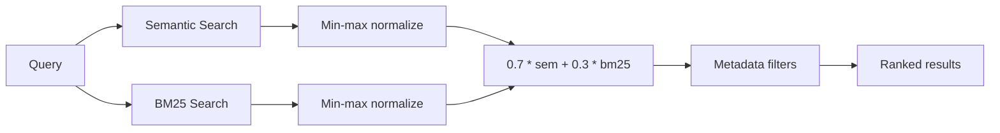

# Hybrid Search (F05, F06, F07)

`pipeline/search_doutrina_v2.py` -- The query interface for the doctrinal corpus. Combines semantic search (cosine similarity on Legal-BERTimbau embeddings) with BM25 keyword search, post-retrieval metadata filtering, and multi-area support. Available as both a CLI tool and an interactive REPL.

## Overview

| Property | Value |
|----------|-------|
| **Script** | `pipeline/search_doutrina_v2.py` (374 lines) |
| **Input** | User query (natural language or legal term) |
| **Indexes** | `embeddings_doutrina.json`, `search_corpus_doutrina.json`, `bm25_index_doutrina.json` |
| **Model** | `rufimelo/Legal-BERTimbau-sts-base` (shared with embedding generation) |
| **Default mode** | Hybrid (0.7 semantic + 0.3 BM25) |
| **Areas** | `contratos`, `processo_civil`, or `all` |

## Search Modes

### Semantic Search

Encodes the user query with Legal-BERTimbau (same model used for indexing), then computes cosine similarity against all chunk embeddings via numpy dot product:

```python
def semantic_search(query: str, areas: list[str], top_k: int = 10):
    model = load_model()
    query_vec = model.encode(
        [query],
        normalize_embeddings=True,
        convert_to_numpy=True
    )

    for area in areas:
        data = load_area(area)
        emb = data["embeddings"]
        scores = np.dot(emb["vectors"], query_vec.T).flatten()
        top_idx = np.argsort(scores)[::-1][:top_k]
```

**Best for:** conceptual queries, synonym matching, questions phrased differently from the source text. Example: searching "defense for non-performance" finds chunks about "exceptio non adimpleti contractus."

### BM25 Search

A from-scratch BM25 implementation with standard parameters:

| Parameter | Value | Meaning |
|-----------|-------|---------|
| `k1` | 1.5 | Term frequency saturation |
| `b` | 0.75 | Document length normalization |

```python
def bm25_search(query: str, areas: list[str], top_k: int = 10):
    query_terms = set(re.findall(r'\w+', query.lower()))
    k1, b = 1.5, 0.75

    for area in areas:
        # ...
        for i, doc in enumerate(docs):
            doc_terms = re.findall(r'\w+', doc.lower())
            dl = len(doc_terms)
            tf = Counter(doc_terms)
            score = 0.0
            for t in query_terms:
                if tf[t] == 0:
                    continue
                idf = math.log((N - df[t] + 0.5) / (df[t] + 0.5) + 1)
                tf_norm = (tf[t] * (k1 + 1)) / (tf[t] + k1 * (1 - b + b * dl / avg_dl))
                score += idf * tf_norm
```

**Best for:** exact term matching, Latin legal phrases, article numbers. Example: searching "Art. 476" finds the exact statutory reference.

### Hybrid Search (Default)

Runs both semantic and BM25 searches, normalizes their scores independently using min-max normalization, then combines them with configurable weights:

```python
def hybrid_search(query, areas, top_k=10, semantic_weight=0.7):
    sem_results = semantic_search(query, areas, top_k=top_k * 2)
    bm25_results = bm25_search(query, areas, top_k=top_k * 2)

    def normalize(results):
        if not results:
            return {}
        max_s = max(s for _, s, _ in results)
        min_s = min(s for _, s, _ in results)
        rng = max_s - min_s if max_s != min_s else 1.0
        return {(doc_id, area): (s - min_s) / rng for doc_id, s, area in results}

    sem_norm = normalize(sem_results)
    bm25_norm = normalize(bm25_results)

    all_keys = set(sem_norm.keys()) | set(bm25_norm.keys())
    combined = {}
    for key in all_keys:
        combined[key] = (
            semantic_weight * sem_norm.get(key, 0.0) +
            (1 - semantic_weight) * bm25_norm.get(key, 0.0)
        )
```

**Default weights:** 0.7 semantic + 0.3 BM25.

**Why hybrid?** Semantic search excels at conceptual matching but can miss exact terms. BM25 excels at term matching but misses synonyms and paraphrases. The combination covers both failure modes. The 0.7/0.3 weighting favors semantic understanding while preserving exact-match capability for legal precision.



## Multi-Area Search (F06)

The search system supports independent indexes for different legal areas. Each area has its own set of three JSON files:

| Area | Embeddings | Corpus | BM25 |
|------|-----------|--------|------|
| `contratos` | `embeddings_doutrina.json` | `search_corpus_doutrina.json` | `bm25_index_doutrina.json` |
| `processo_civil` | `embeddings_processo_civil.json` | `search_corpus_processo_civil.json` | `bm25_index_processo_civil.json` |

When `--area all` is used, results from both areas are merged and re-ranked together. The area of origin is displayed in results.

:::note
Adding a new area requires: (1) processing and enriching the books, (2) generating the three JSON files with appropriate names, and (3) adding an entry to the `AREA_FILES` dictionary in the script.
:::

## Metadata Filtering

Post-retrieval filters narrow results by structured metadata. All filters use **case-insensitive substring matching**:

| Filter | Frontmatter Field | CLI Flag | Example |
|--------|-------------------|----------|---------|
| Instituto | `instituto[]` | `--instituto` | `--instituto "boa-fe"` |
| Content type | `tipo_conteudo[]` | `--tipo` | `--tipo "definicao"` |
| Branch of law | `ramo` | `--ramo` | `--ramo "civil"` |
| Book title | `livro` | `--livro` | `--livro "orlando"` |
| Procedural phase | `fase[]` | `--fase` | `--fase "execucao"` |

```python
def filter_by_metadata(results, areas, instituto=None, tipo=None,
                       ramo=None, livro=None, fase=None):
    for doc_id, score, area in results:
        meta = data["corpus"].get(doc_id, {})
        if instituto and not any(
            instituto.lower() in i.lower()
            for i in meta.get("instituto", [])
        ):
            continue
        # ... similar for tipo, ramo, livro, fase
```

:::caution
Filters are applied **after** scoring and ranking, not during retrieval. This means filtered results may have fewer than `top_k` entries. It also means the scoring does not benefit from metadata constraints -- a filter-aware retrieval system would produce better results.
:::

## Interactive Mode (F07)

Launch with `--interativo` or `-i` for a REPL with runtime-configurable search parameters:

```bash
python3 pipeline/search_doutrina_v2.py --interativo
```

### Commands

| Command | Description | Example |
|---------|-------------|---------|
| `/area` | Switch search area | `/area contratos`, `/area processo_civil`, `/area all` |
| `/filtro` | Set metadata filters | `/filtro instituto=boa-fe tipo=definicao` |
| `/verbose` | Toggle text preview in results | `/verbose` |
| `/top N` | Change result count | `/top 10` |
| `/bm25` | Switch to BM25 mode | `/bm25` |
| `/sem` | Switch to semantic mode | `/sem` |
| `/hybrid` | Switch to hybrid mode (default) | `/hybrid` |
| `/quit` | Exit | `/quit` |

### Example Session

```
BUSCA DOUTRINA JURIDICA v2 -- Multi-Area
============================================================
Carregando...
  Carregando contratos embeddings (487 MB)... OK (9365 docs)
  Carregando processo_civil embeddings (1.2 GB)... OK (22182 docs)
Pronto!

[contratos+processo_civil] > exceptio non adimpleti contractus

  (5 resultados, 0.34s, modo=hybrid, area=all)

  1. [0.947] Contratos bilaterais > Exceptio non adimpleti contractus
     Contratos (Orlando Gomes) (chunk 26/42) [contratos]
     exceptio_non_adimpleti_contractus | definicao, requisitos

  2. [0.891] Da Exceptio non adimpleti contractus
     Curso de Direito Civil (Fabio Ulhoa) (chunk 31/55) [contratos]
     exceptio_non_adimpleti_contractus | doutrina_comparada

[contratos+processo_civil] > /filtro tipo=requisitos
  Filtros: {'tipo': 'requisitos'}

[contratos+processo_civil] > tutela antecipada

  (3 resultados, 0.28s, modo=hybrid, area=all)
  ...
```

## CLI Usage

```bash
# Basic search across all areas
python3 pipeline/search_doutrina_v2.py "exceptio non adimpleti contractus" --area all

# Search in a specific area
python3 pipeline/search_doutrina_v2.py "tutela antecipada requisitos" --area processo_civil

# Search with metadata filter
python3 pipeline/search_doutrina_v2.py "boa-fe objetiva" --instituto "boa-fe" --area contratos

# BM25 only (exact term matching)
python3 pipeline/search_doutrina_v2.py "Art. 476" --modo bm25

# Verbose output with text preview
python3 pipeline/search_doutrina_v2.py "clausula penal" --verbose --top 10

# Filter by book
python3 pipeline/search_doutrina_v2.py "formacao do contrato" --livro "orlando"

# Interactive mode
python3 pipeline/search_doutrina_v2.py --interativo
python3 pipeline/search_doutrina_v2.py -i --area contratos
```

## Known Limitations

- **BM25 recalculates per query.** Document frequencies (`df`) and average document length (`avg_dl`) are recomputed for every query. For ~31,500 documents, this adds noticeable latency. Pre-computing these values at index time would eliminate this cost. Tracked as mitigation **M13**.
- **Full JSON load on startup.** All embedding matrices, corpus metadata, and BM25 indexes must be loaded into memory before the first query. For `all` areas, this can take 10-20 seconds and consume 1+ GB of RAM.
- **No caching between queries.** In CLI (non-interactive) mode, the model and indexes are loaded fresh for each invocation. Interactive mode avoids this by keeping them in memory.
- **Brute-force search.** Cosine similarity is computed against every embedding in the index (O(n) per query). An HNSW or FAISS index would reduce this to O(log n) at the cost of approximate results. Not a problem at current scale (~31K), but will not scale past ~100K chunks.
- **No relevance feedback or learning-to-rank.** The system cannot learn from user behavior to improve ranking over time.
- **Post-retrieval metadata filtering** reduces result count below `top_k` when filters are restrictive. A pre-retrieval approach (filtering before scoring) would guarantee `top_k` results but requires a different architecture.
- **Tokenization is simplistic.** Both BM25 and the query parser use `re.findall(r'\w+', text.lower())` for tokenization. This does not handle Portuguese stop words, stemming, or compound legal terms (e.g., "boa-fe" is split into "boa" and "fe").
