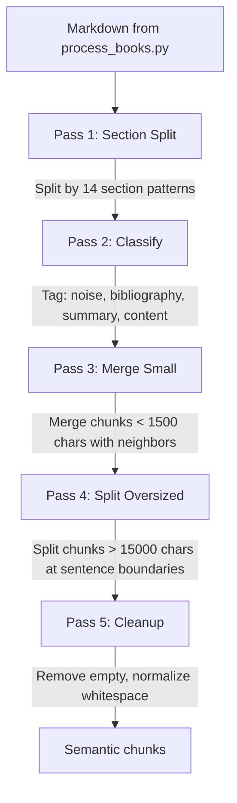

# Intelligent Chunking v3 (F02)

`pipeline/rechunk_v3.py` -- The most sophisticated and critical component of the pipeline. Splits legal markdown (output of `process_books.py`) into semantically coherent chunks using domain-specific heuristics tuned for Brazilian and international legal textbooks.

## Overview

| Property | Value |
|----------|-------|
| **Script** | `pipeline/rechunk_v3.py` (890 lines) |
| **Input** | Markdown files in `_staging/processed/{book}/` |
| **Output** | Re-chunked markdown files (same directory, overwritten) |
| **Min chunk** | 1,500 characters (`MIN_CHUNK_CHARS`) |
| **Max chunk** | 15,000 characters (`MAX_CHUNK_CHARS`) |
| **Test coverage** | 0% -- flagged as **F26** (P1, v0.3) |

:::caution
This script has **0% test coverage** for 890 lines of complex regex-based logic. It is the single highest-risk component in the pipeline. Adding tests is tracked as **F26** (P1 priority, milestone v0.3).
:::

## The 5-Pass Algorithm

The rechunker processes each book through five sequential passes. Each pass has a specific responsibility, and the output of one feeds into the next.



### Pass 1: Section Split

Detects section boundaries using 14 regex patterns (see below) and splits the document at each boundary. Each detected section header becomes the title of a new chunk.

### Pass 2: Classify

Classifies each chunk by content type using `classify_block_content()`:

| Classification | Detection Logic | Handling |
|---------------|-----------------|----------|
| `example` | Patterns: "por exemplo", "imagine que", "e.g.", "for instance" | Kept with preceding principle |
| `table` | More than 5 pipe characters and 2+ newlines | Can be standalone chunk |
| `characteristics` | 3+ contract characteristic terms (bilateral, oneroso, consensual...) | Kept as indivisible block |
| `law_article` | Starts with `Art. {number}` | Kept with subsequent commentary |
| `bibliography` | >50% of lines start with ALL CAPS author names, 5+ lines | Extracted as separate chunk |
| `regular` | Default | Normal processing |

### Pass 3: Merge Small

Chunks below `MIN_CHUNK_CHARS` (1,500) are merged with their neighbors. The merge strategy preserves semantic coherence:
- Examples merge with the preceding principle they illustrate
- Footnotes merge with their referencing paragraph
- Law articles merge with their commentary

### Pass 4: Split Oversized

Chunks exceeding `MAX_CHUNK_CHARS` (15,000) are split at sentence boundaries, ensuring no chunk exceeds the maximum while keeping sentences intact.

### Pass 5: Cleanup

Final pass removes empty chunks, normalizes whitespace, and validates that all chunks meet the minimum content threshold (200 characters of real text).

## 14 Section Patterns (`SECTION_PATTERNS`)

The section detector uses these regex patterns in priority order. The first match wins.

| # | Pattern | Type | Example Match |
|---|---------|------|---------------|
| 1 | `^#{1,3}\s+(.+)$` | `md_header` | `# Chapter 1` |
| 2 | `^\*\*Chapter\s+\d+[\.:]?\*?\*?\s*(.*?)` | `chapter_en` | `**Chapter 5:** Title` |
| 3 | `^\*?\*?Cap[ií]tulo\s+\*?\*?\w+\*?\*?\.?\s*(.*?)` | `capitulo_pt` | `Capitulo V - Dos Contratos` |
| 4 | `^CHAPTER\s+\d+\.?\s*(.*)$` | `chapter_caps` | `CHAPTER 5 BILATERAL CONTRACTS` |
| 5 | `^CAP[ÍI]TULO\s+\w+\.?\s*(.*)$` | `capitulo_caps` | `CAPITULO V` |
| 6 | `^\*?\*?T[ÍI]TULO\s+\w+\*?\*?\.?\s*(.*)$` | `titulo` | `**TITULO VI** Dos Contratos` |
| 7 | `^\*?\*?PARTE\s+\w+\*?\*?\.?\s*(.*)$` | `parte` | `PARTE ESPECIAL` |
| 8 | `^\*?\*?Part\s+\w+\*?\*?\.?\s*(.*)$` | `part_en` | `**Part One** General Theory` |
| 9 | `^(?:#{1,3}\s+)?\*?\*?Art\.?\s+\d+[\.\)]?\*?\*?\s*(.*)$` | `artigo` | `Art. 481.` or `### Art. 481` |
| 10 | `^(?:#{1,3}\s+)?_?\*?\*?Se[çc][ãa]o\s+\w+_?\*?\*?\.?\s*(.*)$` | `secao` | `Secao I - Disposicoes Gerais` |
| 11 | `^\*?\*?Section\s+\w+\*?\*?\.?\s*(.*)$` | `section_en` | `**Section 3** Formation` |
| 12 | `^(\d{1,3})\.\s+([A-Z][A-Z\s,]{8,80})$` | `numbered_caps` | `1. CONTRATOS BILATERAIS` |
| 13 | `^\*\*(\d{1,3})\.?\*?\*?\s+(.{5,80})$` | `numbered_bold` | `**1.** Conceito e Natureza` |
| 14 | `^([A-Z\s,]{15,80})$` | `allcaps_title` | `CONTRATOS BILATERAIS E UNILATERAIS` |

:::note
Pattern 14 (`allcaps_title`) matches any line of 15-80 ALL CAPS characters. This is intentionally broad to catch legal section headers that lack formatting, but it may produce false positives on bibliographic entries or publisher information.
:::

## Noise and Metadata Detection

### NOISE_TITLES

Content with these title keywords is filtered as non-substantive:

```python
NOISE_TITLES = {
    # Portuguese
    'prefácio', 'prefacio', 'agradecimentos', 'agradecimento',
    'dedicatória', 'dedicatoria', 'palavras do coordenador',
    'nota do editor', 'notas do editor', 'nota à edição',
    'sobre o autor', 'sobre os autores', 'dados catalográficos',
    'ficha catalográfica', 'expediente',
    'editora forense', 'editora saraiva', 'editora atlas',
    'editora renovar', 'editora revista dos tribunais',
    'no_content_here',
    # English
    'preface', 'foreword', 'acknowledgements', 'acknowledgments',
    'dedication', 'about the author', 'about the authors',
    "editor's note", "publisher's note",
}
```

### BIBLIOGRAPHY_TITLES

Sections matching these are extracted as separate bibliography chunks:

```python
BIBLIOGRAPHY_TITLES = {
    'bibliografia', 'referências bibliográficas', 'referências',
    'bibliography', 'references', 'works cited', 'further reading',
    'leituras complementares', 'obras consultadas',
}
```

### SUMMARY_TITLES

Tables of contents are tagged as metadata (not discarded, but marked):

```python
SUMMARY_TITLES = {
    'sumário', 'sumario', 'índice', 'indice',
    'table of contents', 'contents', 'summary',
    'índice remissivo', 'indice remissivo',
    'table of cases', 'table of legislation', 'table of statutes',
}
```

## Domain-Specific Features

### Running Header Detection

PDF extraction often produces repeated lines (book title, author name, chapter heading) at the top of every page. The rechunker detects these by frequency analysis across the document and filters them out before chunking.

### Footnote Aggregation

Legal textbooks heavily use footnotes. The rechunker groups footnotes with their referencing paragraph using two detection functions:

```python
def is_footnote_line(line: str) -> bool:
    """Detect footnote lines at bottom of text."""
    stripped = line.strip()
    # "1 Author, Book, p. 123" or "¹ Author..." or "[1] Author..."
    if re.match(r'^\d{1,3}\s+[A-ZÁÉÍÓÚÀÂÊÔÃÕÇ]', stripped):
        return True
    if re.match(r'^[¹²³⁴⁵⁶⁷⁸⁹⁰]+\s+', stripped):
        return True
    if re.match(r'^\[\d{1,3}\]\s+', stripped):
        return True
    return False
```

### Law Article + Commentary Preservation

When a chunk contains a law article transcription (e.g., `Art. 476 do Codigo Civil...`), the rechunker ensures the author's commentary that follows is never separated from the article itself. This is critical because the commentary is only meaningful in the context of the article being discussed.

### Indivisible Blocks

Contract characteristic lists (bilateral, oneroso, consensual, comutativo...) are detected when 3+ characteristic terms appear together and are kept as a single indivisible block, because splitting them would destroy the comparative analysis.

## Configuration

### CLI Arguments

```bash
# Rechunk all books in staging
python3 pipeline/rechunk_v3.py

# Rechunk a specific book
python3 pipeline/rechunk_v3.py contratos-orlando-gomes

# Set minimum chunk size (characters)
python3 pipeline/rechunk_v3.py --min-chars 1500

# Preview changes without writing
python3 pipeline/rechunk_v3.py --dry-run

# Force rechunk even if already processed
python3 pipeline/rechunk_v3.py --force
```

### Constants

| Constant | Value | Description |
|----------|-------|-------------|
| `MIN_CHUNK_CHARS` | 1,500 | Minimum characters for a valid chunk |
| `MAX_CHUNK_CHARS` | 15,000 | Maximum characters before forced split |

## Known Limitations

:::danger
**Hardcoded VAULT_PATH (line 29):** The script uses a hardcoded WSL path:
```python
VAULT_PATH = Path("/mnt/c/Users/sensd/vault")
```
This is different from the path in `process_books.py` (which uses a Linux path). Tracked as **F22** (P0 priority) for v0.2.
:::

- **0% test coverage** for 890 lines of regex-heavy logic. A single false positive in section detection can cascade through the entire document. Tracked as **F26**.
- **Custom YAML parser** uses regex instead of PyYAML. Special characters in titles (colons, quotes) can corrupt frontmatter. The same regex parser is duplicated across `enrich_chunks.py` and `embed_doutrina.py`. Tracked as **F23**.
- **Assumes hierarchical structure** -- books without clear H1/H2/section patterns (e.g., dictionaries, legal compilations, multi-author essays) produce poor chunking results.
- **Running header detection is heuristic** -- repeated lines that are NOT headers (e.g., a legal maxim appearing multiple times) can be falsely filtered.
- **`allcaps_title` pattern is broad** -- any line of 15-80 uppercase characters is treated as a section boundary, which can produce false positives on bibliographic entries, publisher names, or emphasized text.
- **No language-specific tokenization** -- the sentence splitter for oversized chunks does not use a Portuguese-specific tokenizer, which may split at abbreviations (e.g., "Art.", "Dr.").
