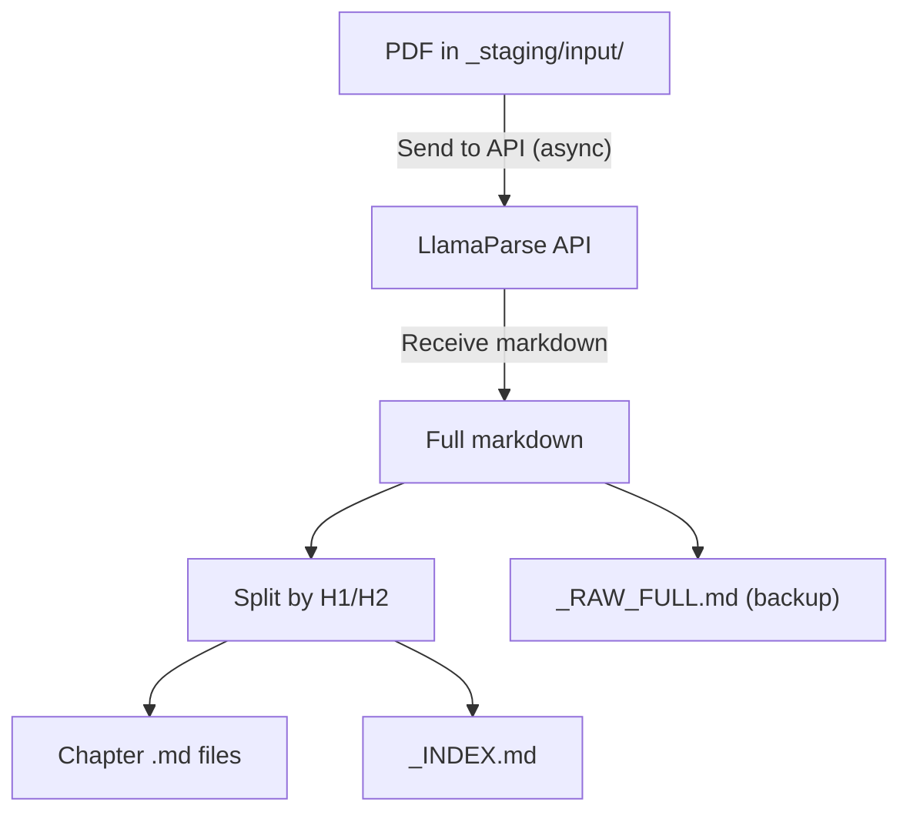

# PDF Extraction (F01)

`pipeline/process_books.py` -- The entry point of the Douto pipeline. Converts legal textbook PDFs into structured markdown files with chapter splitting and YAML frontmatter, preparing them for downstream chunking and enrichment.

## Overview

| Property | Value |
|----------|-------|
| **Script** | `pipeline/process_books.py` (414 lines) |
| **Input** | PDF files in `Knowledge/_staging/input/` |
| **Output** | Markdown files in `Knowledge/_staging/processed/{slug}/` |
| **Engine** | [LlamaParse](https://docs.llamaindex.ai/en/stable/llama_cloud/llama_parse/) (LlamaIndex) |
| **Dependencies** | `llama_parse`, `asyncio` |
| **Idempotent** | Yes -- skips already-processed PDFs via marker files |



## How It Works

### 1. Scan for unprocessed PDFs

The script scans `_staging/input/` for `.pdf` files that do not have a `.processed_{filename}` marker file. This marker is created after successful processing, making the operation idempotent.

### 2. Send to LlamaParse

Each PDF is sent to the LlamaParse cloud API with configurable extraction tier:

| Tier | Use Case | Cost |
|------|----------|------|
| `fast` | Quick extraction without formatting, cheapest | Low |
| `cost_effective` | Best cost-benefit for clean digital text (default) | Medium |
| `agentic` | Scanned PDFs or complex layouts | High |

The parser is configured for Portuguese (`language="pt"`) with 2 workers:

```python
parser = LlamaParse(
    result_type="markdown",
    num_workers=2,
    verbose=True,
    language="pt",
)
documents = await parser.aload_data(str(pdf_path))
```

### 3. Split into chapters

The `split_into_chapters()` function divides the markdown output by H1 (`#`) and H2 (`##`) headers. Each chapter becomes an independent chunk:

```python
def split_into_chapters(markdown_text: str, filename: str) -> list[dict]:
    lines = markdown_text.split('\n')
    chunks = []
    current_chunk = {
        "title": "Introdução / Pré-textual",
        "level": 0,
        "content": [],
        "page_hint": ""
    }
    parent_title = filename

    for line in lines:
        h1_match = re.match(r'^# (.+)$', line)
        h2_match = re.match(r'^## (.+)$', line)

        if h1_match or h2_match:
            # Save previous chunk if it has substantial content
            if current_chunk["content"]:
                content_text = '\n'.join(current_chunk["content"]).strip()
                if len(content_text) > 100:  # ignore very small chunks
                    chunks.append({
                        "title": current_chunk["title"],
                        "parent": parent_title,
                        "content": content_text
                    })
            # Start new chunk...
```

Key design decisions:
- **H1 headers** set the parent title context. Subsequent H2 chunks inherit it as `parent_title > section_title`.
- **Minimum content threshold**: chunks with fewer than 100 characters are discarded.
- **Fallback**: if no headers are detected, the entire document becomes a single chunk.

### 4. Generate slug

File and directory names use a Portuguese-aware slugification function:

```python
def slugify(text: str) -> str:
    text = text.lower().strip()
    text = re.sub(r'[àáâãäå]', 'a', text)
    text = re.sub(r'[èéêë]', 'e', text)
    text = re.sub(r'[ìíîï]', 'i', text)
    text = re.sub(r'[òóôõö]', 'o', text)
    text = re.sub(r'[ùúûü]', 'u', text)
    text = re.sub(r'[ç]', 'c', text)
    text = re.sub(r'[^a-z0-9\s-]', '', text)
    text = re.sub(r'[\s_]+', '-', text)
    text = re.sub(r'-+', '-', text)
    return text.strip('-')[:80]
```

### 5. Write output files

For each book, the script writes:

- **`_RAW_FULL.md`** -- Complete LlamaParse output as backup
- **`_INDEX.md`** -- Book index note with wikilinks to all chapters
- **`001-{slug}.md` ... `NNN-{slug}.md`** -- Individual chapter files with YAML frontmatter

## Output Format

Each chapter file includes YAML frontmatter designed for downstream enrichment:

```yaml
---
knowledge_id: ""
tipo: "livro_chunk"
titulo: "Contratos Bilaterais e Unilaterais"
livro_titulo: "Contratos"
livro_arquivo_original: "contratos-orlando-gomes.pdf"
chunk_numero: 5
chunk_total: 42
fonte_primaria: ""
autor: ""
editora: ""
edicao: ""
ano: ""
paginas: ""
confianca: "UNVERIFIED"
confidencialidade: "Publico"
area_direito: []
teses_extraidas: []
casos_vinculados: []
tags: []
data_criacao: "2026-02-28T14:30:00"
data_ultima_modificacao: ""
status_enriquecimento: "pendente"
---
```

:::note
Fields left empty (e.g., `autor`, `editora`, `area_direito`) are filled by the enrichment stage (F03). The `status_enriquecimento: "pendente"` flag signals that the chunk has not yet been classified.
:::

## Configuration

### Environment Variables

| Variable | Required | Description |
|----------|----------|-------------|
| `LLAMA_CLOUD_API_KEY` | Yes | LlamaParse API authentication (via env or `.env`) |

### CLI Arguments

```bash
# Process all unprocessed PDFs in staging
python3 pipeline/process_books.py

# Process a specific PDF file
python3 pipeline/process_books.py contratos-orlando-gomes.pdf

# Use a different LlamaParse tier
python3 pipeline/process_books.py --tier fast
python3 pipeline/process_books.py --tier agentic

# Default tier is cost_effective
python3 pipeline/process_books.py --tier cost_effective
```

:::caution
There is no `--dry-run` flag in `process_books.py` (unlike other pipeline scripts). Running the script will send PDFs to the LlamaParse API and write files. Use the marker file mechanism to prevent re-processing.
:::

### Directory Structure

```
vault/Knowledge/_staging/
  input/              # Place PDFs here
    livro.pdf
    .processed_livro.pdf   # Marker (auto-created)
  processed/
    contratos-orlando-gomes/
      _RAW_FULL.md
      _INDEX.md
      001-introducao.md
      002-contratos-bilaterais.md
      ...
  failed/             # PDFs that failed processing
```

## Logging

All events are appended to `_staging/processing_log.jsonl`:

```json
{"op": "process_success", "file": "contratos.pdf", "book_title": "Contratos", "chunks": 42, "chars": 185000, "tier": "cost_effective", "output_dir": "/path/to/output", "ts": "2026-02-28T14:30:00"}
{"op": "skip", "file": "contratos.pdf", "reason": "already_processed", "ts": "2026-02-28T14:35:00"}
{"op": "process_failed", "file": "scanned-book.pdf", "error": "LlamaParse retornou vazio", "tier": "fast", "ts": "2026-02-28T14:40:00"}
```

## Known Limitations

:::danger
**Hardcoded VAULT_PATH (line 27):** The script uses a hardcoded Linux path:
```python
VAULT_PATH = Path("/home/sensd/.openclaw/workspace/vault")
```
This will fail on any other machine. Tracked as **F22** (P0 priority) for v0.2.
:::

- **No `--dry-run` mode** -- unlike `rechunk_v3.py` and `enrich_chunks.py`, this script cannot preview operations without making API calls.
- **LlamaParse quality varies** -- scanned PDFs or those with complex layouts (tables, multi-column) may produce poor markdown. Use `--tier agentic` for difficult PDFs.
- **Chapter splitting assumes H1/H2 structure** -- books without markdown headers (e.g., flat extracted text) become a single chunk. Non-hierarchical legal texts (dictionaries, compilations) produce poor results.
- **No OCR quality validation** -- there is no post-extraction check for garbled text or extraction artifacts.
- **Title detection is heuristic** -- the book title is derived from the filename (`pdf_path.stem.replace('-', ' ').title()`), which may not match the actual title.
- **`slugify()` is duplicated** -- the same function exists in `rechunk_v3.py`. Tracked as **F23** for extraction into `pipeline/utils.py`.
