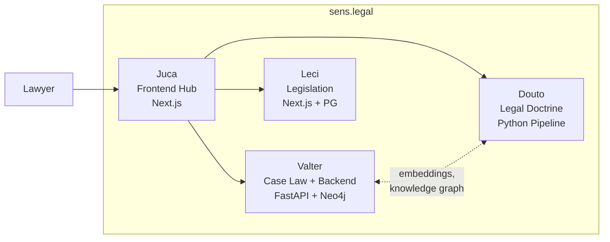

# Douto

Douto is the legal doctrine knowledge agent for the [sens.legal](https://sens.legal) ecosystem. It transforms legal textbooks into searchable, structured, AI-ready knowledge through a five-stage Python pipeline and maintains a navigable skill graph organized by legal domain.

## Key Capabilities

Douto's pipeline processes legal textbooks from PDF to searchable embeddings:

- **PDF Extraction** — converts legal PDFs to structured markdown via LlamaParse
- **Intelligent Chunking** — splits documents using legal-domain heuristics (footnote grouping, law article preservation, running header detection)
- **LLM Enrichment** — classifies each chunk with structured metadata: instituto jurídico, tipo de conteúdo, ramo do direito, fontes normativas
- **Semantic Embeddings** — generates 768-dimensional vectors using Legal-BERTimbau with metadata-enhanced text composition
- **Hybrid Search** — combines semantic search (cosine similarity) with BM25 keyword search and metadata filtering

## Current Status

| Metric | Value |
|--------|-------|
| Books processed | ~50 |
| Chunks in corpus | ~31,500 |
| Legal domains covered | 3 active (Civil, Processual, Empresarial) + 5 planned |
| Embedding dimensions | 768 (Legal-BERTimbau) |
| Search modes | Semantic, BM25, Hybrid |
| Test coverage | 0% |
| Pipeline scripts | 5 |
| Version | v0.1.0 (pre-release) |

## Quick Links

| Section | Description |
|---------|-------------|
| [Introduction](getting-started/introduction) | What Douto is, why it exists, and who uses it |
| [Quickstart](getting-started/quickstart) | Run a search in under 5 minutes |
| [Architecture](architecture/overview) | How the pipeline and knowledge base work |
| [Features](features/) | Complete feature inventory with status |
| [Roadmap](roadmap/) | Where Douto is going — milestones v0.2 through v1.0 |
| [Glossary](reference/glossary) | Legal and technical terminology |

## Part of sens.legal

Douto is one of five components in the sens.legal unified legal research platform:

| Agent | Role | Stack |
|-------|------|-------|
| **Valter** | Case law backend — 23,400+ STJ decisions, 28 MCP tools | FastAPI, PostgreSQL, Qdrant, Neo4j, Redis |
| **Juca** | Frontend hub — user interface for lawyers | Next.js 16, block system, briefing progressivo |
| **Leci** | Legislation — federal law database | Next.js 15, PostgreSQL, Drizzle |
| **Joseph** | Orchestrator — coordinates agents | — |
| **Douto** | Legal doctrine — this project | Python 3, LlamaParse, Legal-BERTimbau |
