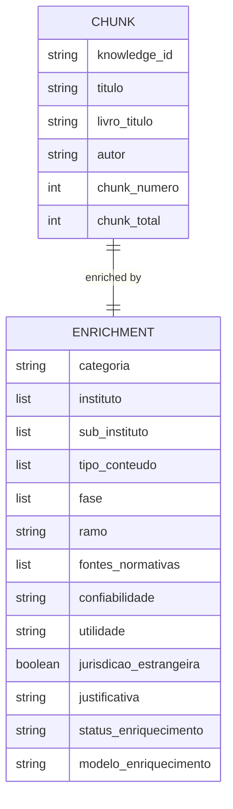
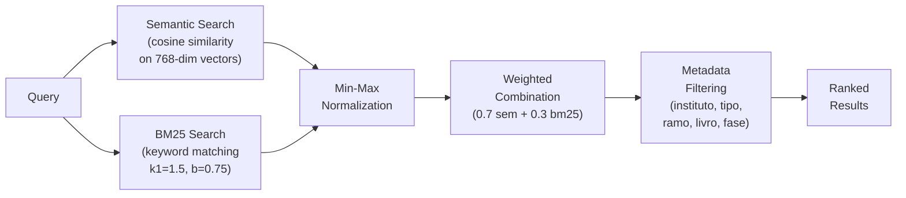
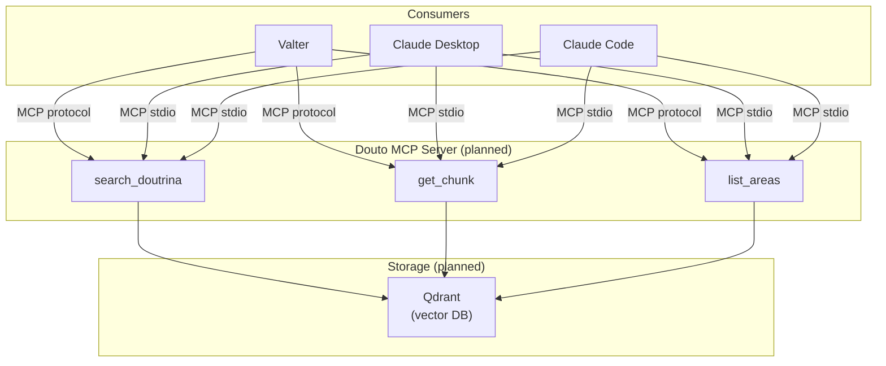

# Diagramas de Arquitetura

Todas as representacoes visuais da arquitetura do Douto, renderizadas em Mermaid.

## Fluxo de Dados do Pipeline

O pipeline completo de cinco estagios, mostrando os formatos de dados em cada transicao:

```mermaid
flowchart TD
    PDF["📄 Legal PDFs"]
    MD["📝 Markdown<br/>(chapters)"]
    CK["📦 Intelligent Chunks<br/>(1,500–15,000 chars)"]
    ECK["🏷️ Enriched Chunks<br/>(+ 13 metadata fields)"]
    EMB["🔢 Embeddings<br/>(768-dim float32)"]
    RES["🔍 Ranked Results"]

    PDF -->|"process_books.py<br/>LlamaParse API"| MD
    MD -->|"rechunk_v3.py<br/>5-pass algorithm"| CK
    CK -->|"enrich_chunks.py<br/>MiniMax M2.5"| ECK
    ECK -->|"embed_doutrina.py<br/>Legal-BERTimbau"| EMB
    EMB -->|"search_doutrina_v2.py<br/>Semantic + BM25"| RES
```

## Diagrama de Componentes

Todos os componentes do Douto e suas conexoes com servicos externos e o ecossistema sens.legal:

```mermaid
graph TB
    subgraph "Douto — Pipeline"
        PB["process_books.py<br/>PDF → Markdown"]
        RC["rechunk_v3.py<br/>Chunking (890 lines)"]
        EN["enrich_chunks.py<br/>LLM Classification"]
        EM["embed_doutrina.py<br/>Embedding Generation"]
        SE["search_doutrina_v2.py<br/>Hybrid Search"]
    end

    subgraph "Douto — Knowledge Base"
        IX["INDEX_DOUTO.md<br/>(8 domains)"]
        MC["MOC_CIVIL<br/>35 books, ~9,365 chunks"]
        MP["MOC_PROCESSUAL<br/>8 books, ~22,182 chunks"]
        ME["MOC_EMPRESARIAL<br/>7 books"]
        MCo["MOC_CONSUMIDOR<br/>(placeholder)"]
    end

    subgraph "sens.legal Ecosystem"
        VA["Valter<br/>Backend API<br/>FastAPI + Neo4j + Qdrant"]
        JU["Juca<br/>Frontend Hub<br/>Next.js 16"]
        LE["Leci<br/>Legislation<br/>Next.js 15 + PostgreSQL"]
    end

    subgraph "External Services"
        LP["LlamaParse API"]
        MM["MiniMax M2.5 API"]
        HF["HuggingFace Hub"]
    end

    PB --> RC --> EN --> EM --> SE
    SE -.->|"JSON files"| VA
    VA --> JU
    IX --> MC & MP & ME & MCo
    PB -.-> LP
    EN -.-> MM
    EM -.-> HF
```

## Posicao no Ecossistema

Como o Douto se encaixa na plataforma sens.legal do ponto de vista do usuario:

```mermaid
graph LR
    USER["👤 Lawyer"]
    JU["Juca<br/>Frontend"]
    VA["Valter<br/>Case Law<br/>23,400+ STJ"]
    LE["Leci<br/>Legislation"]
    DO["Douto<br/>Doctrine<br/>~50 books"]
    JO["Joseph<br/>Orchestrator"]

    USER --> JU
    JU --> VA
    JU --> LE
    JU --> DO
    JO -.->|"coordinates"| VA & LE & DO
    VA <-.->|"embeddings"| DO
```

## Hierarquia da Knowledge Base

A estrutura do skill graph da raiz ate as folhas:

```mermaid
graph TD
    IX["INDEX_DOUTO.md<br/>(root)"]

    MC["MOC_CIVIL.md<br/>35 books, ~9,365 chunks ✅"]
    MP["MOC_PROCESSUAL.md<br/>8 books, ~22,182 chunks ✅"]
    ME["MOC_EMPRESARIAL.md<br/>7 books ✅"]
    MCo["MOC_CONSUMIDOR.md<br/>(placeholder) 🔨"]
    MT["MOC_TRIBUTARIO ❌"]
    MCn["MOC_CONSTITUCIONAL ❌"]
    MCp["MOC_COMPLIANCE ❌"]
    MS["MOC_SUCESSOES ❌"]

    ND["nodes/<br/>(atomic notes — planned)"]

    IX --> MC & MP & ME & MCo & MT & MCn & MCp & MS
    MC & MP & ME -.-> ND
```

## Schema de Metadados de Enriquecimento

Os 13 campos de metadados adicionados a cada chunk durante o enriquecimento:

Descricao dos campos:

| Campo | Tipo | Valores de Exemplo |
|-------|------|-------------------|
| `instituto` | `list[str]` | `["exceptio non adimpleti contractus", "contrato bilateral"]` |
| `sub_instituto` | `list[str]` | `["inadimplemento relativo"]` |
| `tipo_conteudo` | `list[str]` | `["definicao", "requisitos", "jurisprudencia_comentada"]` |
| `fase` | `list[str]` | `["formacao", "execucao", "extincao"]` |
| `ramo` | `str` | `"direito_civil"` |
| `fontes_normativas` | `list[str]` | `["CC art. 476", "CC art. 477"]` |
| `confiabilidade` | `str` | `"alta"`, `"media"`, `"baixa"` |
| `categoria` | `str` | `"doutrina"` |

## Arquitetura de Busca

Como a busca hibrida combina scoring semantico e por palavras-chave:

## Arquitetura Planejada (v0.4+)

Quando o servidor MCP for implementado, o Douto sera consultavel em tempo real:

