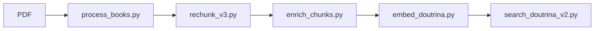
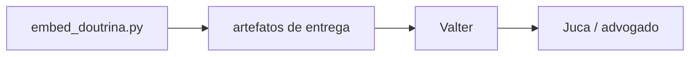

# Visao Geral da Arquitetura

O Douto nao deve ser entendido como um servico rodando continuamente.
Hoje ele e uma arquitetura em tres camadas:

1. pipeline batch;
2. entrega de artefatos ao Valter;
3. camada editorial em markdown.

## Camada 1 - Pipeline Batch

Fluxo atual:

```mermaid
flowchart LR
    PDF["PDF"] --> PB["process_books.py"]
    PB --> RC["rechunk_v3.py"]
    RC --> EN["enrich_chunks.py"]
    EN --> EM["embed_doutrina.py"]
    EM --> SE["search_doutrina_v2.py"]
```

Essa camada produz o corpus operacional do Douto.

## Camada 2 - Entrega ao Valter

Hoje a integracao real acontece por artefatos estaticos, nao por API.

```mermaid
flowchart LR
    EM["embed_doutrina.py"] --> ART["artefatos de entrega"]
    ART --> VAL["Valter"]
    VAL --> JUC["Juca / advogado"]
```

Essa camada e o centro do produto no curto prazo.

## Camada 3 - Markdown Editorial

- `knowledge/INDEX_DOUTO.md`
- `knowledge/mocs/*.md`
- `knowledge/nodes/` (ainda vazio)

Essa camada ajuda a organizar o corpus e a navegacao humana.
Ela **nao** e o centro do produto.

## Unidades Arquiteturais

| Tipo | Unidade |
|------|---------|
| Uso | instituto juridico / problema juridico |
| Evidencia | chunk doutrinario |
| Entrega | artefato doutrinario para o Valter |

## Principios Operacionais

1. precisao antes de velocidade;
2. ambiguidade explicita antes de falsa certeza;
3. retrieval confiavel antes de sintese;
4. artefato entregue antes de servico sofisticado.

## Limitacoes Reais Hoje

- paths ainda em regularizacao;
- zero testes automatizados;
- enrichment dependia de prompt nao versionado;
- retrieval ainda nasce de artefatos JSON flat;
- busca atual ainda e local e acoplada a CLI.
