# Visao Geral da Arquitetura

O Douto opera em dois modos complementares: um pipeline ETL em lote que transforma PDFs juridicos em dados pesquisaveis, e um knowledge graph baseado em markdown navegavel por humanos e agentes de IA. Nao e uma aplicacao web nem um servico em execucao -- e um conjunto de ferramentas de processamento e uma base de conhecimento estruturada.

## Padrao Arquitetural

**Pipeline de Processamento em Lote** -- Cinco scripts Python independentes executados sequencialmente. Cada um le do disco, processa os dados e grava de volta no disco. Sem banco de dados, sem fila de mensagens, sem orquestrador.

**Knowledge Graph em Markdown** -- Uma hierarquia compativel com Obsidian usando frontmatter YAML, wikilinks e Maps of Content (MOCs). Projetada para consumo dual: navegacao humana no Obsidian e consulta programatica por agentes de IA.

## Fluxo de Dados do Pipeline

```mermaid
flowchart TD
    PDF["📄 Legal PDFs<br/>(staging/input/)"]
    PB["process_books.py<br/>LlamaParse API"]
    RC["rechunk_v3.py<br/>5-pass algorithm"]
    EN["enrich_chunks.py<br/>MiniMax M2.5 LLM"]
    EM["embed_doutrina.py<br/>Legal-BERTimbau"]
    SE["search_doutrina_v2.py<br/>Hybrid: Semantic + BM25"]
    JSON["📦 JSON Artifacts<br/>embeddings + corpus + BM25"]

    PDF -->|"PDF files"| PB
    PB -->|"markdown<br/>(chapters)"| RC
    RC -->|"intelligent<br/>chunks"| EN
    EN -->|"enriched chunks<br/>(13 metadata fields)"| EM
    EM -->|"768-dim vectors"| JSON
    JSON --> SE
```

Cada seta representa uma passagem via sistema de arquivos -- nao existe pipeline em memoria nem streaming. Scripts podem ser re-executados independentemente com `--force` ou `--dry-run`.

## Estrutura da Knowledge Base

A knowledge base tem tres camadas:

| Camada | Arquivo | Finalidade | Status |
|--------|---------|-----------|--------|
| **Raiz** | `knowledge/INDEX_DOUTO.md` | Ponto de entrada do skill graph -- mapeia 8 dominios juridicos | Ativo |
| **Mapas de Dominio** | `knowledge/mocs/MOC_*.md` | Livros por dominio com metadados e status | 3 ativos, 1 placeholder, 4 ausentes |
| **Notas Atomicas** | `knowledge/nodes/*.md` | Uma nota por conceito juridico (instituto) | Planejado (diretorio existe, sem conteudo) |

A hierarquia segue convencoes do Obsidian: `[[wikilinks]]` para navegacao, frontmatter YAML para metadados estruturados.

## Artefatos de Saida

O pipeline produz tres arquivos JSON por area juridica (ex.: `contratos`, `processo_civil`):

| Arquivo | Conteudo | Tamanho Estimado |
|---------|----------|-----------------|
| `embeddings_{area}.json` | `doc_ids[]` + `embeddings[][]` (vetores float32 de 768 dimensoes) | ~500 MB para 31.500 chunks |
| `search_corpus_{area}.json` | Metadados completos por chunk (titulo, autor, instituto, tipo, etc.) | ~200 MB |
| `bm25_index_{area}.json` | `doc_ids[]` + `documents[]` (texto tokenizado para BM25) | ~300 MB |

Esses arquivos sao carregados inteiramente em memoria pelo `search_doutrina_v2.py` na inicializacao.

## Posicao no Ecossistema sens.legal

Atualmente, o Douto integra com o ecossistema por meio de arquivos JSON depositados em um diretorio compartilhado. Nao ha API, servidor MCP nem capacidade de consulta em tempo real. A integracao via MCP esta planejada para [v0.4](../roadmap/milestones#v04--senslegal-integration).

## Principios de Design

Extraidos do `CLAUDE.md`, em ordem de prioridade:

1. **Corretude** -- especialmente dados doutrinarios, citacoes e metadados juridicos
2. **Simplicidade** -- codigo que outro agente entende sem contexto
3. **Manutenibilidade** -- facil de alterar sem quebrar
4. **Reversibilidade** -- decisoes que podem ser desfeitas
5. **Performance** -- otimizar somente com evidencia de problema

Principios operacionais:

- **Idempotente** -- todo script e seguro para re-executar (marcadores de skip, `--force` para sobrescrever)
- **Dry-run primeiro** -- todo script suporta `--dry-run`
- **Logging estruturado** -- eventos vao para `processing_log.jsonl`

## Limitacoes Conhecidas

Estas sao restricoes arquiteturais, nao bugs. Cada uma tem referencia de rastreamento:

| Limitacao | Impacto | Rastreamento |
|-----------|---------|-------------|
| Sem banco de dados -- arquivos JSON flat | Nao escala alem de ~100 livros, carga total em memoria | [ADR-003](decisions#adr-003-json-flat-files-instead-of-vector-database) |
| Sem API ou servidor MCP | Sem consultas em tempo real de outros agentes | [F30, v0.4](../roadmap/milestones#v04--senslegal-integration) |
| Sem CI/CD | Sem testes ou linting automatizados | [F39, v0.5](../roadmap/milestones#v05--knowledge-graph--automation) |
| Caminhos hardcoded em 2 scripts | Pipeline roda apenas na maquina do criador | [F22, v0.2](../roadmap/milestones#v02--stable-pipeline) |
| 0% de cobertura de testes | Regressoes indetectaveis exceto por inspecao manual | [F26-F27, v0.3](../roadmap/milestones#v03--quality--coverage) |
| Prompt de enriquecimento ausente | `enrich_prompt.md` fora do repo -- enriquecimento irreproduzivel | [M01](../roadmap/milestones#v02--stable-pipeline) |
