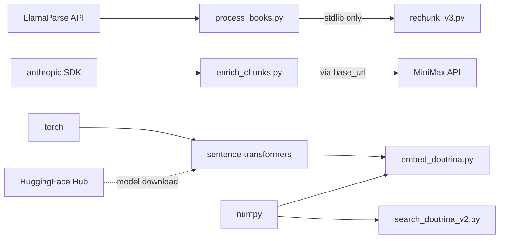

# Stack Tecnologica

Todas as tecnologias usadas no Douto, por que foram escolhidas e onde sao utilizadas.

## Linguagens

| Linguagem | Versao | Uso |
|-----------|--------|-----|
| Python 3 | 3.10+ (necessario para type hints `tuple[dict, str]`) | Todos os 5 scripts do pipeline |
| Markdown | -- | Knowledge base (convencoes Obsidian, frontmatter YAML, wikilinks) |

## Dependencias Principais

Do `pipeline/requirements.txt`:

| Pacote | Versao | Finalidade | Usado Em |
|--------|--------|-----------|----------|
| `sentence-transformers` | sem pin | Geracao de embeddings via Legal-BERTimbau | `embed_doutrina.py` |
| `torch` | sem pin | Backend ML para sentence-transformers | `embed_doutrina.py` |
| `numpy` | sem pin | Operacoes vetoriais (similaridade cosseno, normalizacao de scores) | `embed_doutrina.py`, `search_doutrina_v2.py` |
| `anthropic` | sem pin | SDK Python usado como cliente HTTP para a API MiniMax M2.5 | `enrich_chunks.py` |
| `llama-parse` | sem pin | Extracao de PDF para markdown via LlamaIndex Cloud | `process_books.py` |

:::caution
Todas as versoes estao sem pin. Executar `pip install -r requirements.txt` em momentos diferentes pode gerar ambientes distintos. O pinning esta planejado para [F24](../roadmap/milestones#v02--stable-pipeline).
:::

## Modelos de ML

| Modelo | Provedor | Dimensoes | Max Tokens | Finalidade |
|--------|----------|-----------|------------|-----------|
| `rufimelo/Legal-BERTimbau-sts-base` | HuggingFace | 768 | 512 | Embeddings semanticos para texto juridico |
| MiniMax-M2.5 | MiniMax (via Anthropic SDK) | -- | ~8.000 | Enriquecimento e classificacao de chunks |
| LlamaParse | LlamaIndex | -- | -- | Extracao de PDF para markdown |

O **Legal-BERTimbau** foi treinado em corpora juridicos em portugues. E a escolha padrao para NLP juridico em portugues, embora tenha sido treinado em PT-PT (Portugal), e nao PT-BR (Brasil). Nenhuma comparacao de benchmark com alternativas (multilingual-e5, nomic-embed, Cohere embed v3) foi realizada para o dominio especifico do Douto.

## Servicos Externos

| Servico | Finalidade | Autenticacao | Necessario Para |
|---------|-----------|-------------|----------------|
| LlamaParse API | Conversao de PDF para markdown | `LLAMA_CLOUD_API_KEY` | Apenas `process_books.py` |
| MiniMax M2.5 API | Classificacao de chunks com metadados juridicos | `MINIMAX_API_KEY` | Apenas `enrich_chunks.py` |
| HuggingFace Hub | Download do modelo (automatico na primeira execucao) | Nenhuma (modelo publico) | `embed_doutrina.py` (primeira execucao) |

:::danger
A integracao com MiniMax usa o SDK Python da Anthropic com `base_url="https://api.minimax.io/anthropic"`. Essa e uma camada de compatibilidade nao documentada -- nao e oficialmente suportada nem pela Anthropic, nem pela MiniMax. Pode quebrar sem aviso.
:::

## Uso da Biblioteca Padrao

Os seguintes modulos da stdlib sao usados nos scripts do pipeline -- sem necessidade de pacotes externos:

`re`, `json`, `pathlib`, `argparse`, `asyncio`, `shutil`, `threading`, `math`, `collections`, `os`, `sys`, `time`, `datetime`

Destaque: o `rechunk_v3.py` (o script mais complexo com 890 linhas) usa **apenas** modulos da stdlib.

:::note
O projeto usa um parser YAML customizado baseado em regex (`parse_frontmatter()`) em vez do `PyYAML`. Esse parser esta duplicado em `enrich_chunks.py` e `embed_doutrina.py`. A extracao para um `utils.py` compartilhado e a possivel substituicao por PyYAML estao rastreadas como [F23](../roadmap/milestones#v02--stable-pipeline).
:::

## Infraestrutura

| Categoria | Estado Atual | Planejado |
|-----------|-------------|----------|
| Build system | Nenhum -- scripts executados manualmente | Makefile ([F31](../roadmap/milestones#v03--quality--coverage)) |
| Banco de dados | Nenhum -- arquivos JSON flat | Migracao para vector DB ([M12](../roadmap/milestones#v04--senslegal-integration)) |
| Containerizacao | Nenhuma | Docker ([F38](../roadmap/milestones#v10--integrated-platform)) |
| CI/CD | Nenhum | GitHub Actions ([F39](../roadmap/milestones#v05--knowledge-graph--automation)) |
| Linting | Nenhum | ruff ([F32](../roadmap/milestones#v03--quality--coverage)) |
| Testes | Nenhum (0% de cobertura) | pytest ([F26-F27](../roadmap/milestones#v03--quality--coverage)) |

## Grafo de Dependencias

