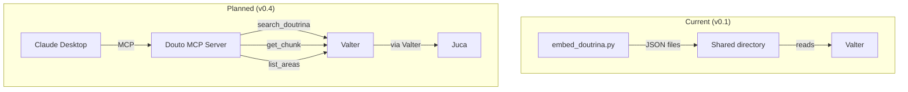

# Integracoes Externas

Como o Douto se conecta a servicos externos e ao ecossistema sens.legal.

## LlamaParse (Extracao de PDF)

**Servico:** [LlamaParse](https://cloud.llamaindex.ai/) da LlamaIndex
**Finalidade:** Converter livros juridicos em PDF para markdown estruturado
**Usado por:** `process_books.py`
**Autenticacao:** Variavel de ambiente `LLAMA_CLOUD_API_KEY` (carregada implicitamente pelo SDK)

### Setup

1. Crie uma conta gratuita em [cloud.llamaindex.ai](https://cloud.llamaindex.ai/).
2. Gere uma chave de API no dashboard.
3. Defina a variavel de ambiente:

```bash
export LLAMA_CLOUD_API_KEY="llx-your-key-here"
```

### Tiers

O LlamaParse oferece tres tiers de processamento. O padrao no Douto e `cost_effective`:

| Tier | Indicado para | Velocidade | Custo |
|------|-------------|-----------|-------|
| `agentic` | PDFs escaneados, tabelas complexas, layouts multi-coluna | Mais lento | Mais alto |
| `cost_effective` | Livros juridicos de texto limpo (padrao) | Media | Medio |
| `fast` | Documentos somente texto | Mais rapida | Mais baixo |

Sobrescreva o tier por execucao:

```bash
python3 pipeline/process_books.py --tier agentic livro.pdf
```

### Notas de Uso

- A extracao de PDF e uma **operacao unica** por livro. Uma vez convertido para markdown, o PDF original nao e mais necessario pelo pipeline.
- O markdown processado e salvo em `$VAULT_PATH/Knowledge/_staging/processed/{slug}/`.
- Se a extracao falhar, o PDF e movido para `$VAULT_PATH/Knowledge/_staging/failed/`.
- O LlamaParse usa `asyncio` internamente. Este e o unico componente assincrono do pipeline.

:::tip
Como a extracao e unica, mesmo que o LlamaParse mude a precificacao ou fique indisponivel, livros previamente extraidos nao sao afetados. Somente o processamento de novos livros requer uma chave de API ativa.
:::

---

## MiniMax M2.5 (Enriquecimento de Chunks)

**Servico:** MiniMax M2.5 LLM
**Finalidade:** Classificar chunks com metadados juridicos estruturados (instituto, tipo_conteudo, ramo, etc.)
**Usado por:** `enrich_chunks.py`
**Autenticacao:** Variavel de ambiente `MINIMAX_API_KEY`

### Setup

1. Obtenha uma chave de API em [MiniMax](https://www.minimax.io/).
2. Defina a variavel de ambiente:

```bash
export MINIMAX_API_KEY="your-minimax-api-key"
```

### O Hack com o SDK da Anthropic

:::caution[Integracao fragil -- nao suportada oficialmente]
O Douto usa o **SDK Python da Anthropic** para chamar a API da MiniMax. Isso funciona porque a MiniMax expoe um endpoint compativel com a Anthropic, mas **nao e uma integracao documentada ou oficialmente suportada** por nenhuma das empresas.

```python
# From enrich_chunks.py (line 30-31)
MINIMAX_BASE_URL = "https://api.minimax.io/anthropic"
MINIMAX_MODEL = "MiniMax-M2.5"

# The client is instantiated as:
client = anthropic.Anthropic(
    api_key=os.environ["MINIMAX_API_KEY"],
    base_url=MINIMAX_BASE_URL,
)
```

Qualquer mudanca na camada de compatibilidade da API da MiniMax, ou uma breaking change no SDK da Anthropic, vai quebrar silenciosamente o enriquecimento. Nao havera aviso de depreciacao.
:::

### Configuracoes de Concorrencia

O enriquecimento roda com 5 threads concorrentes e um delay de 0,5 segundo entre requisicoes para evitar rate limiting:

| Parametro | Valor |
|-----------|-------|
| `WORKERS` | 5 threads |
| `DELAY_BETWEEN_REQUESTS` | 0,5 segundos |
| Modelo | `MiniMax-M2.5` |

### Arquivo de Prompt Ausente

:::danger
O arquivo de prompt de enriquecimento (`enrich_prompt.md`) e referenciado no codigo na linha 27, mas **nao esta presente no repositorio**. Sem esse arquivo, `enrich_chunks.py` vai encerrar com erro. A recuperacao ou reconstrucao desse prompt esta rastreada como acao de mitigacao M01 (prioridade P0).
:::

### Decisao Pendente: D06

A escolha do MiniMax M2.5 como modelo de enriquecimento esta em revisao. Opcoes sendo avaliadas:

| Opcao | Pros | Contras |
|-------|------|---------|
| **Manter MiniMax M2.5** | Funciona, barato | Hack fragil com SDK, modelo generico |
| Migrar para Claude | Consistencia no ecossistema | Custo mais alto |
| Modelo local | Zero custo, sem dependencia | Mais lento, complexidade de setup |
| Avaliar depois | Sem esforco agora | Risco se acumula |

---

## HuggingFace (Modelo de Embedding)

**Servico:** HuggingFace Hub (modelo publico)
**Finalidade:** Baixar e cachear o modelo de embedding Legal-BERTimbau
**Usado por:** `embed_doutrina.py`, `search_doutrina_v2.py`
**Autenticacao:** Nenhuma necessaria (modelo publico)

### Detalhes do Modelo

| Propriedade | Valor |
|-------------|-------|
| Model ID | `rufimelo/Legal-BERTimbau-sts-base` |
| Dimensoes | 768 |
| Max tokens | 512 |
| Idioma | Portugues (treinado em corpus juridico PT-PT) |
| Tamanho em disco | ~500 MB |
| Licenca | Open source |

### Setup

O modelo e **baixado automaticamente** na primeira execucao pela biblioteca `sentence-transformers`. Nenhum setup manual e necessario.

Para pre-baixar o modelo (util para ambientes offline ou Docker):

```bash
python3 -c "from sentence_transformers import SentenceTransformer; SentenceTransformer('rufimelo/Legal-BERTimbau-sts-base')"
```

Para controlar onde o modelo e cacheado:

```bash
export HF_HOME="/path/to/cache"
# or specifically:
export SENTENCE_TRANSFORMERS_HOME="/path/to/cache"
```

:::note
O modelo foi treinado em texto juridico de Portugal (PT-PT), nao especificamente em portugues brasileiro. Isso pode causar diferencas sutis na similaridade semantica para termos juridicos especificos do Brasil (veja PREMORTEM PF04). Nenhuma comparacao de benchmark com alternativas existe ainda (planejada em F40).
:::

---

## Integracao com o Ecossistema sens.legal

### Estado Atual (v0.1)

A integracao com o ecossistema sens.legal e atualmente feita por **arquivos JSON estaticos**:

```
embed_doutrina.py
      |
      v
embeddings_doutrina.json  ─── deposited in ──→  Juca/Valter data directory
search_corpus_doutrina.json                      ($OUTPUT_PATH)
bm25_index_doutrina.json
```

- Sem capacidade de consulta em tempo real a partir de outros agentes.
- Sem API ou protocolo.
- Valter e Juca leem os arquivos JSON de um caminho compartilhado no sistema de arquivos.
- Atualizacoes requerem re-executar o pipeline de embeddings e reiniciar os consumidores.

### Componentes do Ecossistema

| Componente | Papel | Stack | Relacao com o Douto |
|-----------|-------|-------|-------------------|
| **Valter** | API backend -- jurisprudencia STJ, knowledge graph, busca vetorial | FastAPI, PostgreSQL, Qdrant, Neo4j, Redis | Consumidor primario dos embeddings do Douto |
| **Juca** | Frontend -- interface para advogados | Next.js | Acessa doutrina via Valter |
| **Leci** | Servico de legislacao | Next.js, PostgreSQL, Drizzle | Alvo futuro de referencia cruzada (F35) |
| **Joseph** | Orquestrador -- coordena agentes | -- | Futura coordenacao com consultas do Douto |

### Integracao Planejada (v0.4)

> **Feature Planejada** -- Servidor MCP para busca doutrinaria esta no roadmap (F30), mas ainda nao foi implementado.

O milestone v0.4 estabelecera a integracao programatica entre o Douto e o ecossistema sens.legal:

**Servidor MCP** com pelo menos 3 tools:

| Tool | Descricao |
|------|-----------|
| `search_doutrina` | Busca hibrida no corpus doutrinario |
| `get_chunk` | Recuperar um chunk especifico por ID com metadados completos |
| `list_areas` | Listar dominios juridicos disponiveis com estatisticas do corpus |

**Decisao de Protocolo (D01) -- ainda nao resolvida:**

| Opcao | Descricao | Pros | Contras |
|-------|-----------|------|---------|
| MCP stdio | Transporte MCP padrao | Alinhado com o MCP do Valter | Overhead de processo por consulta |
| MCP HTTP/SSE | Conexao MCP persistente | Mais flexivel, menor latencia | Mais infraestrutura |
| REST API (FastAPI) | API HTTP convencional | Simples, bem conhecida | Nao alinhada com ecossistema MCP |
| Manter arquivos JSON | Abordagem atual | Zero esforco | Sem consultas em tempo real, nao escala |

**Decisao de Arquitetura (D02) -- ainda nao resolvida:**

Se o Douto permanece como servico independente ou e absorvido como modulo dentro do Valter (`valter/stores/doutrina/`). Esta decisao bloqueia v0.4.

:::tip
O Valter ja possui infraestrutura de Qdrant (vector DB) e Neo4j (knowledge graph). Quando o Douto integrar, deve aproveitar esses servicos existentes em vez de manter seu proprio armazenamento baseado em JSON.
:::

### Diagrama de Integracao


