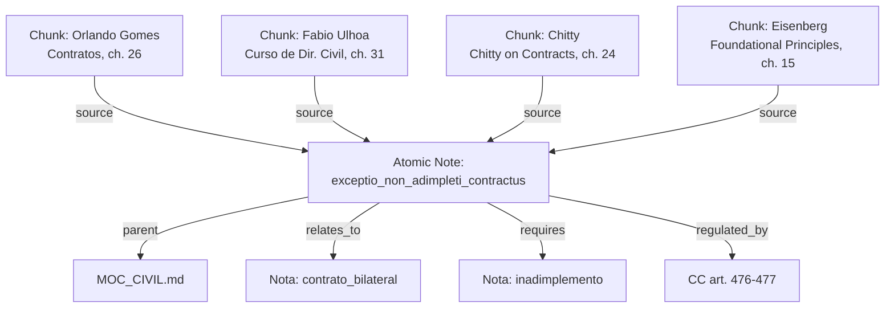
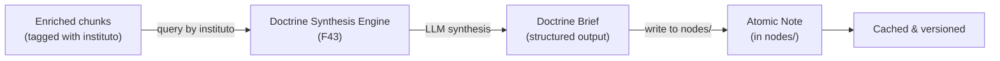

# Notas Atomicas (F21, F36)

`knowledge/nodes/` -- A terceira e mais granular camada planejada do skill graph. Cada nota atomica representaria um unico conceito juridico (`instituto juridico`) com definicoes de multiplos autores, requisitos, conceitos relacionados e links de proveniencia para os chunks de origem.

> **Funcionalidade Planejada** -- Esta funcionalidade esta no roadmap mas ainda nao foi implementada. O diretorio `nodes/` existe apenas com um arquivo `.gitkeep`. Nenhuma nota atomica foi criada. A implementacao depende da decisao pendente **D03**.

## Estado Atual

| Propriedade | Valor |
|-------------|-------|
| **Diretorio** | `knowledge/nodes/` |
| **Arquivos** | 1 (apenas `.gitkeep`) |
| **Status** | Em Andamento (~5%) -- diretorio criado, schema definido, sem conteudo |
| **Milestone** | v0.5 |
| **Decisao bloqueante** | D03: auto-gerar vs. curar vs. hibrido |
| **Pre-requisito** | Quality gate de metadados (M06: acuracia >= 85%) |

## O que Seriam as Notas Atomicas

Uma nota atomica representa um unico conceito juridico -- um `instituto juridico` -- sintetizado a partir de todos os chunks de todos os livros que discutem aquele conceito. Enquanto um chunk e uma passagem de um unico livro, uma nota atomica e uma **sintese cross-book** de uma unica ideia.

### Exemplo: "Exceptio Non Adimpleti Contractus"

Uma nota atomica para este conceito conteria:
- **Definicao** sintetizada a partir de Orlando Gomes, Fabio Ulhoa Coelho, Chitty e outros autores do corpus
- **Requisitos/elementos** conforme enumerados pela doutrina
- **Base normativa** (`CC art. 476`, `CC art. 477`)
- **Conceitos relacionados** (contrato bilateral, inadimplemento, resolucao contratual, pacta sunt servanda)
- **Proveniencia** vinculando cada chunk que discute este conceito, com atribuicao de autor e obra



## Formato Proposto

Com base no schema definido no `CLAUDE.md`, as notas atomicas usariam esta estrutura:

### Frontmatter

```yaml
---
tipo: nota
instituto: exceptio_non_adimpleti_contractus
sub_instituto: []
ramo: direito_civil
fontes_normativas:
  - "CC art. 476"
  - "CC art. 477"
autores:
  - "Orlando Gomes"
  - "Fabio Ulhoa Coelho"
  - "Chitty"
  - "Melvin Eisenberg"
chunks_origem:
  - "contratos-orlando-gomes/026-contratos-bilaterais"
  - "curso-de-direito-civil-contratos/031-exceptio"
  - "chitty-on-contracts/024-bilateral-contracts"
total_fontes: 4
confiabilidade: alta
data_criacao: "2026-03-15T10:00:00"
data_atualizacao: "2026-03-15T10:00:00"
---
```

### Conteudo

```markdown
# Exceptio Non Adimpleti Contractus

## Definicao
[Definicao sintetizada a partir de multiplos autores, com citacoes inline]

## Requisitos
1. Contrato bilateral (sinalagmatico)
2. Inadimplemento da parte contraria
3. ...

## Posicao doutrinaria
[Onde os autores concordam e onde divergem]

## Fontes normativas
- CC art. 476 — ...
- CC art. 477 — ...

## Conceitos relacionados
- [[contrato_bilateral]]
- [[inadimplemento]]
- [[resolucao_contratual]]
- [[pacta_sunt_servanda]]

## Fontes
| Autor | Obra | Chunk | Tipo |
|-------|------|-------|------|
| Orlando Gomes | Contratos | [[026-contratos-bilaterais]] | definicao, requisitos |
| Fabio Ulhoa | Curso Dir. Civil | [[031-exceptio]] | doutrina_comparada |
```

## Estrategia de Geracao (Decisao Pendente D03)

A decisao D03 do ROADMAP avalia tres abordagens:

### Opcao A: Auto-Gerar

Gerar uma nota por valor unico de `instituto` nos metadados de enriquecimento. Um script:

1. Coletaria todos os valores unicos de `instituto` dos chunks enriquecidos
2. Para cada instituto, reuniria todos os chunks tagueados com ele
3. Geraria uma nota com links de proveniencia e um placeholder para sintese

**Vantagens:** Rapido, abrangente (cobre todos os institutos do corpus), sem esforco humano.
**Desvantagens:** Potencialmente ruidoso -- se os metadados de enriquecimento forem imprecisos, as notas herdam esses erros. Sem sintese ou referencia cruzada, apenas agregacao.

### Opcao B: Curacao Manual

Um especialista juridico revisa os chunks e escreve cada nota atomica manualmente.

**Vantagens:** Alta qualidade, sintese precisa, referencias cruzadas corretas.
**Desvantagens:** Extremamente lento. Com ~500+ institutos unicos no corpus, a curacao manual levaria semanas de trabalho especializado. Nao escala.

### Opcao C: Hibrido (Recomendado)

Auto-gerar rascunhos de notas a partir dos metadados de enriquecimento, marcando-os para revisao humana. Um revisor valida, corrige e enriquece cada nota.

**Vantagens:** Combina a velocidade da automacao com a qualidade do julgamento humano. Revisores partem de um rascunho em vez de uma pagina em branco.
**Desvantagens:** Ainda requer esforco significativo de revisao. Necessita de um workflow para rastrear o status de revisao.

:::tip
O ROADMAP recomenda a Opcao C (hibrido), mas com uma **pre-condicao** importante: o quality gate de metadados (mitigacao M06) deve confirmar que a acuracia do enriquecimento e >= 85% antes de gerar os rascunhos. Gerar notas a partir de metadados ruins criaria uma knowledge base sistematicamente enganosa.
:::

## Relacao com o Doctrine Synthesis Engine (F43)

O [Doctrine Synthesis Engine](https://github.com/sensdiego/douto/blob/main/INNOVATION_LAYER.md) (F43 do `INNOVATION_LAYER.md`) propoe uma abordagem mais sofisticada para notas atomicas. Em vez de simples agregacao, usaria um LLM para sintetizar um **Doctrine Brief** para cada conceito juridico:

| Aspecto | Notas Atomicas (F21/F36) | Doctrine Brief (F43) |
|---------|------------------------|---------------------|
| **Conteudo** | Links agregados + texto placeholder | Analise sintetizada por LLM com citacoes |
| **Qualidade** | Depende da acuracia dos metadados | Depende do LLM + acuracia dos metadados |
| **Output** | Nota markdown com wikilinks | JSON estruturado + Markdown |
| **Esforco** | Baixo (automatizado) a Medio (hibrido) | Medio (prompt engineering + custos de LLM) |
| **Valor** | Navegacao e organizacao | Sintese doutrinaria real -- "o que os autores dizem sobre X?" |

Se F43 for implementado, os Doctrine Briefs poderiam **se tornar** o conteudo das notas atomicas. O workflow seria:



Isso tornaria as notas atomicas o **output cacheado e versionado** do motor de sintese, em vez de apenas um indice de fontes. Cada nota conteria analise doutrinaria genuina, nao apenas agregacao de metadados.

:::note
Do `INNOVATION_LAYER.md`: "O Synthesis Engine e a resposta para 'o que o Douto FAZ que ninguem mais faz?' -- as notas atomicas conteriam analise sintetizada que nenhum concorrente de legal tech oferece atualmente."
:::

## Cronograma de Implementacao

| Milestone | Funcionalidade | O que Acontece |
|-----------|----------------|----------------|
| v0.2.5 | M06 (quality gate de metadados) | Validar 200 chunks quanto a acuracia do enriquecimento. Deve ser >= 85%. |
| v0.3 | F26, F27 (testes) | Infraestrutura de testes para componentes do pipeline |
| v0.3.5 | F43 (Doctrine Synthesis Engine) | Se aprovado, gera o conteudo para notas atomicas |
| v0.5 | F36 (auto-gerar notas atomicas) | Gerar rascunhos de notas a partir de chunks enriquecidos |
| v0.5 | F21 (completar knowledge nodes) | Popular o diretorio `nodes/` |

### Pre-requisitos

1. **O quality gate de metadados (M06) deve passar.** Se a acuracia do enriquecimento estiver abaixo de 85%, notas auto-geradas enganariam sistematicamente os usuarios. A acao de re-enriquecimento entra no pipeline antes da geracao de notas.
2. **A decisao D03 deve ser tomada.** A estrategia de geracao (auto/curada/hibrida) determina a abordagem de implementacao, cronograma e requisitos de recursos.
3. **Testes devem existir (F26, F27).** O gerador de notas atomicas dependera de `parse_frontmatter()`, travessia do corpus e possivelmente `extract_json()`. Estes devem ser testados antes de construir sobre eles.

## O que Existe Hoje

O unico arquivo em `knowledge/nodes/` e `.gitkeep`, que preserva o diretorio vazio no git:

```
knowledge/nodes/
  .gitkeep       # Placeholder — nenhuma nota atomica existe ainda
```

A estrutura de diretorios esta pronta. O corpus enriquecido contem os dados. O schema esta definido. O que falta e a decisao sobre a estrategia de geracao (D03) e o quality gate (M06) antes que a implementacao possa comecar.
