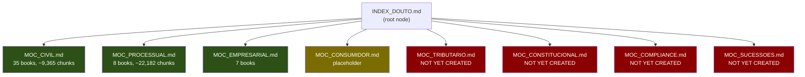

# Skill Graph (F08)

`knowledge/INDEX_DOUTO.md` -- O no raiz da knowledge base do Douto. Mapeia 8 dominios juridicos em uma hierarquia navegavel seguindo o padrao de gestao de conhecimento do Obsidian: INDEX (raiz) leva aos MOCs (Maps of Content), que levam a entradas de livros individuais, que futuramente levarao a notas atomicas.

## Visao Geral

O skill graph serve a dois propositos:

1. **Navegacao humana** -- Um advogado ou pesquisador pode partir do `INDEX_DOUTO.md`, navegar ate o MOC de um dominio, encontrar um livro relevante e aprofundar-se ate o capitulo ou conceito juridico especifico que procura.
2. **Acesso programatico** -- Cada arquivo possui frontmatter YAML com metadados estruturados (`type`, `domain`, `description`), permitindo que scripts e agentes percorram a knowledge base, descubram conteudo e construam agregacoes.



## Os 8 Dominios

| # | Dominio | Arquivo MOC | Status | Livros | Chunks |
|---|---------|-------------|--------|--------|--------|
| 1 | Direito Civil | `MOC_CIVIL.md` | Ativo | 35 | ~9.365 |
| 2 | Direito Processual Civil | `MOC_PROCESSUAL.md` | Ativo | 8 | ~22.182 |
| 3 | Direito Empresarial | `MOC_EMPRESARIAL.md` | Ativo | 7 | -- |
| 4 | Direito do Consumidor | `MOC_CONSUMIDOR.md` | Placeholder | 0 | 0 |
| 5 | Direito Tributario | -- | Ausente | -- | -- |
| 6 | Direito Constitucional | -- | Ausente | -- | -- |
| 7 | Compliance & Governanca | -- | Ausente | -- | -- |
| 8 | Sucessoes & Planejamento Patrimonial | -- | Ausente | -- | -- |

**Resumo:** 4 arquivos MOC existem (3 ativos, 1 placeholder). 4 arquivos MOC estao ausentes. A criacao deles e rastreada como **F25** (P1, milestone v0.3).

## Estrutura do INDEX_DOUTO.md

O arquivo de indice segue um formato especifico definido no `CLAUDE.md`:

### Frontmatter

```yaml
---
type: skill-graph-index
description: Mapa do conhecimento juridico doutrinario da FS.
              Ponto de entrada para navegacao tematica.
domains: [civil, consumidor, empresarial, tributario,
          processual, constitucional, compliance, sucessorio]
---
```

### Conteudo

Cada dominio e listado sob um heading com um wikilink para seu MOC e uma breve descricao da cobertura:

```markdown
### Direito Civil
[[MOC_CIVIL]] — obrigacoes, contratos, responsabilidade civil, propriedade

### Direito do Consumidor
[[MOC_CONSUMIDOR]] — relacao de consumo, responsabilidade objetiva, praticas abusivas
```

### Links Cross-Domain

O indice tambem referencia conceitos transversais que abrangem multiplos dominios:

```markdown
## Cross-Domain
- [[teoria_geral_do_direito]] — conceitos que cruzam areas
- [[principios_constitucionais]] — base para todos os ramos
```

:::note
As notas cross-domain (`teoria_geral_do_direito`, `principios_constitucionais`) sao referenciadas via wikilinks mas ainda nao existem como arquivos. Fazem parte da camada de notas atomicas planejada (F21/F36).
:::

## Padrao de Navegacao

A knowledge base do Douto segue tres convencoes definidas no `CLAUDE.md`:

### 1. Wikilinks para Navegacao Interna

Todas as referencias internas usam wikilinks no estilo Obsidian (`[[alvo]]`), nunca links relativos em markdown. Isso garante compatibilidade com o graph view e a resolucao de links do Obsidian, e torna trivial para scripts analisar e percorrer as conexoes.

```markdown
# No INDEX_DOUTO.md:
[[MOC_CIVIL]] — obrigacoes, contratos...

# No MOC_CIVIL.md:
[[contratos-orlando-gomes]] — Orlando Gomes, tratado classico

# Em um arquivo de chunk:
[[MOC_CIVIL]] (back-link para o MOC pai)
```

### 2. Frontmatter para Acesso Programatico

Todo arquivo da knowledge base possui frontmatter YAML com metadados estruturados:

| Tipo de Arquivo | Campos Obrigatorios |
|-----------------|---------------------|
| INDEX | `type: skill-graph-index`, `description`, `domains[]` |
| MOC | `type: moc`, `domain`, `description`, `key_authors[]`, `total_obras`, `total_chunks` |
| Entrada de livro | `tipo: livro_chunk`, `titulo`, `livro_titulo`, `autor`, `area_direito[]`, `status_enriquecimento` |
| Nota atomica (planejada) | `tipo: nota`, `instituto`, `sub_instituto`, `ramo`, `fontes_normativas[]`, `autores[]`, `chunks_origem[]` |

### 3. Travessia Hierarquica

A knowledge base forma uma arvore estrita:

```
INDEX_DOUTO.md          (1 arquivo — raiz)
  |
  +-- mocs/MOC_*.md     (8 arquivos — um por dominio)
  |     |
  |     +-- entradas de livros  (diretorios por livro no staging)
  |           |
  |           +-- chunks   (arquivos .md individuais por capitulo)
  |
  +-- nodes/            (planejado — um arquivo por conceito juridico)
```

Essa hierarquia permite tanto a navegacao top-down (exploracao por dominio) quanto a agregacao bottom-up (coletar todos os chunks de um dado conceito juridico entre livros).

## Relacao com Outras Funcionalidades

| Funcionalidade | Relacao |
|----------------|---------|
| [MOCs](mocs.md) (F09-F11, F19) | MOCs sao a segunda camada do skill graph, vinculados diretamente ao INDEX |
| [Notas Atomicas](atomic-notes.md) (F21, F36) | Terceira camada planejada -- uma nota por conceito juridico |
| F25 (Criar MOCs ausentes) | Completa o skill graph preenchendo os 4 dominios ausentes |
| F43 (Doctrine Synthesis Engine) | Geraria Doctrine Briefs que alimentam as notas atomicas |

## Melhorias Planejadas

> **Funcionalidade Planejada** -- As melhorias a seguir estao no roadmap mas ainda nao foram implementadas.

- **F25: Criar 4 MOCs ausentes** (P1, v0.3) -- `MOC_TRIBUTARIO`, `MOC_CONSTITUCIONAL`, `MOC_COMPLIANCE`, `MOC_SUCESSOES`. Mesmo como placeholders com estrutura minima, a existencia deles completa o mapa de navegacao.
- **F36: Notas atomicas a partir de chunks enriquecidos** (P2, v0.5) -- Gerar uma nota por `instituto` unico a partir dos metadados de enriquecimento, criando a terceira camada da hierarquia.
- **F21: Completar knowledge nodes** (Em Andamento, v0.5) -- O diretorio `nodes/` existe apenas com um `.gitkeep`. Popula-lo depende da decisao **D03** (auto-gerar vs. curar vs. hibrido).
