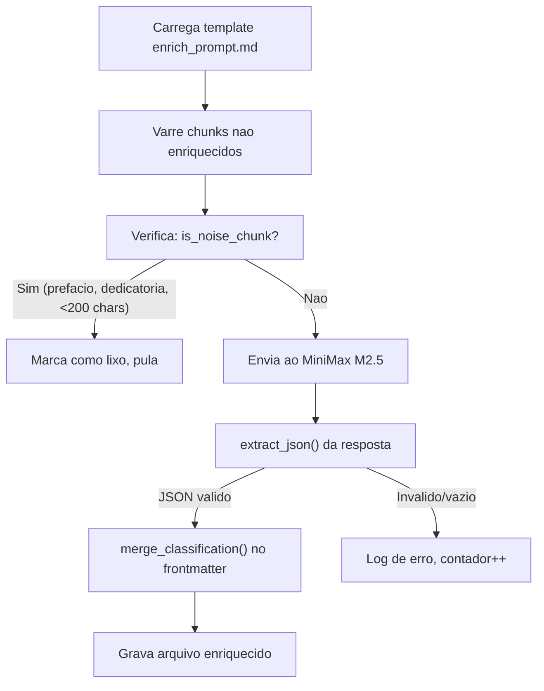

# Enriquecimento de Chunks (F03)

`pipeline/enrich_chunks.py` -- Classifica cada chunk usando o LLM MiniMax M2.5 para adicionar metadados juridicos estruturados. E a etapa que transforma texto bruto em conhecimento pesquisavel e filtravel, associando a cada chunk seu conceito juridico (`instituto`), tipo de conteudo, ramo do direito, fase processual e fontes normativas.

## Visao Geral

| Propriedade | Valor |
|-------------|-------|
| **Script** | `pipeline/enrich_chunks.py` (403 linhas) |
| **Entrada** | Arquivos markdown com `status_enriquecimento: "pendente"` |
| **Saida** | Mesmos arquivos com frontmatter enriquecido (13+ campos de metadados) |
| **LLM** | MiniMax M2.5 via Anthropic SDK com `base_url` customizada |
| **Concorrencia** | 5 threads, 0.5s de delay entre requests |
| **Idempotente** | Sim — pula chunks com `status_enriquecimento: "completo"` ou `"lixo"` |

:::danger
**CRITICO: `enrich_prompt.md` esta AUSENTE do repositorio.** A linha 27 referencia um arquivo de prompt que nao existe no repo:
```python
PROMPT_PATH = Path(__file__).parent / "enrich_prompt.md"
```
Isso significa que o prompt que gerou todos os metadados para ~31.500 chunks nao esta versionado. Se perdido, todos os metadados de enriquecimento tornam-se irreproduziveis. Rastreado como **F42** (prioridade P1, v0.3) e sinalizado como risco existencial no ROADMAP.
:::

## Como Funciona



### Etapa 1: Carregar template do prompt

O prompt de enriquecimento e carregado de `pipeline/enrich_prompt.md`. Variaveis placeholder sao substituidas por chunk:
- `{livro_titulo}` -- titulo do livro
- `{autor}` -- nome do autor
- `{capitulo}` -- titulo do capitulo
- `{chunk_numero}` / `{chunk_total}` -- posicao do chunk
- `{chunk_content}` -- primeiros 8.000 caracteres do corpo do chunk

### Etapa 2: Deteccao de ruido

Antes de enviar ao LLM, cada chunk e verificado contra padroes de ruido. Chunks que correspondem a qualquer um destes sao marcados como `"lixo"` sem chamadas a API:

- Titulo contem: "prefacio", "agradecimento", "dedicatoria", "nota do editor", "sobre o autor", etc.
- Texto do corpo tem menos de 200 caracteres

### Etapa 3: Classificacao via LLM

O texto do chunk + prompt e enviado ao MiniMax M2.5 via Anthropic SDK com base URL customizada:

```python
client = anthropic.Anthropic(
    api_key=api_key,
    base_url="https://api.minimax.io/anthropic"
)

message = client.messages.create(
    model="MiniMax-M2.5",
    max_tokens=2000,
    system="Voce e um classificador juridico especializado. "
           "Responda APENAS com JSON valido, sem markdown, sem backticks, sem explicacoes.",
    messages=[{"role": "user", "content": prompt}]
)
```

### Etapa 4: Extracao de JSON

A resposta do LLM e parseada usando `extract_json()`, que possui um fallback de contagem de chaves para casos em que o LLM envolve o JSON em code fences markdown ou adiciona texto ao redor:

```python
def extract_json(text: str) -> dict:
    text = text.strip()
    text = re.sub(r'^```json\s*', '', text)
    text = re.sub(r'\s*```$', '', text)
    text = text.strip()

    # Try direct parse first
    try:
        return json.loads(text)
    except json.JSONDecodeError:
        pass

    # Extract first complete JSON object by brace matching
    start = text.find('{')
    if start == -1:
        raise json.JSONDecodeError("No JSON object found", text, 0)

    depth = 0
    in_string = False
    escape = False
    for i in range(start, len(text)):
        c = text[i]
        if escape:
            escape = False
            continue
        if c == '\\' and in_string:
            escape = True
            continue
        if c == '"' and not escape:
            in_string = not in_string
            continue
        if in_string:
            continue
        if c == '{':
            depth += 1
        elif c == '}':
            depth -= 1
            if depth == 0:
                return json.loads(text[start:i+1])

    raise json.JSONDecodeError("Incomplete JSON object", text, len(text))
```

:::tip
A abordagem de contagem de chaves e robusta contra problemas comuns de saida de LLM: fencing markdown, texto introdutorio e explicacoes no final. Ela lida corretamente com objetos aninhados e caracteres de escape dentro de strings.
:::

### Etapa 5: Merge da classificacao

Os campos JSON parseados sao mesclados no frontmatter existente via `merge_classification()`, e metadados de status sao adicionados:

```python
enriched["status_enriquecimento"] = "completo"
enriched["data_enriquecimento"] = datetime.now().isoformat()
enriched["modelo_enriquecimento"] = "MiniMax-M2.5"
```

## Schema de Metadados

A funcao `merge_classification()` mapeia 13 campos da resposta do LLM para o frontmatter do chunk. Esses campos sao a base para toda busca e filtragem posterior.

| # | Campo | Tipo | Descricao | Exemplos |
|---|-------|------|-----------|----------|
| 1 | `categoria` | `str` | Categoria de alto nivel | `"doutrina"`, `"legislacao_comentada"` |
| 2 | `tipo_contratual` | `str` | Tipo de contrato (se aplicavel) | `"compra_e_venda"`, `"locacao"` |
| 3 | `objeto_especifico` | `str` | Assunto especifico | `"clausula_penal"`, `"exceptio"` |
| 4 | `instituto` | `list[str]` | Conceitos/institutos juridicos | `["exceptio_non_adimpleti_contractus", "contrato_bilateral"]` |
| 5 | `sub_instituto` | `list[str]` | Sub-conceitos | `["inadimplemento_relativo"]` |
| 6 | `fase` | `list[str]` | Fase contratual/processual | `["formacao", "execucao", "extincao"]` |
| 7 | `ramo` | `str` | Ramo do direito | `"direito_civil"`, `"processo_civil"` |
| 8 | `fontes_normativas` | `list[str]` | Referencias legislativas | `["CC art. 476", "CC art. 477"]` |
| 9 | `tipo_conteudo` | `list[str]` | Classificacao de tipo de conteudo | `["definicao", "requisitos", "jurisprudencia_comentada"]` |
| 10 | `utilidade` | `str` | Utilidade pratica | `"alta"`, `"media"`, `"baixa"` |
| 11 | `confiabilidade` | `str` | Confiabilidade da fonte | `"alta"`, `"media"` |
| 12 | `jurisdicao_estrangeira` | `bool` ou `str` | Referencia a jurisdicao estrangeira | `false`, `"common_law"` |
| 13 | `justificativa` | `str` | Raciocinio do LLM para a classificacao | Texto livre explicando a logica de classificacao |

Alem desses 13 campos fornecidos pelo LLM, `merge_classification()` adiciona 3 campos de sistema:

| Campo | Tipo | Valor |
|-------|------|-------|
| `status_enriquecimento` | `str` | `"completo"` |
| `data_enriquecimento` | `str` | Timestamp ISO 8601 |
| `modelo_enriquecimento` | `str` | `"MiniMax-M2.5"` |

## Configuracao

### Variaveis de Ambiente

| Variavel | Obrigatoria | Descricao |
|----------|-------------|-----------|
| `MINIMAX_API_KEY` | Sim (exceto `--dry-run`) | Autenticacao da API MiniMax |
| `VAULT_PATH` | Nao | Diretorio base (padrao: `/mnt/c/Users/sensd/vault`) |

### Argumentos CLI

```bash
# Enriquecer todos os chunks nao enriquecidos de todos os livros
python3 pipeline/enrich_chunks.py all

# Enriquecer um livro especifico
python3 pipeline/enrich_chunks.py contratos-orlando-gomes

# Re-enriquecer chunks ja completos
python3 pipeline/enrich_chunks.py all --force

# Limitar aos primeiros N chunks (para testes)
python3 pipeline/enrich_chunks.py all --limit 10

# Simular sem chamadas a API
python3 pipeline/enrich_chunks.py all --dry-run

# Usar uma API key especifica
python3 pipeline/enrich_chunks.py all --api-key "sk-..."

# Ajustar numero de threads (padrao: 5)
python3 pipeline/enrich_chunks.py all --workers 3
```

### Configuracoes de Concorrencia

| Configuracao | Valor | Descricao |
|--------------|-------|-----------|
| `WORKERS` | 5 | Numero de threads concorrentes |
| `DELAY_BETWEEN_REQUESTS` | 0.5s | Delay apos cada chamada de API (por thread) |

O tempo estimado de processamento e exibido na inicializacao:
```
Estimativa: ~{(total * 0.5) / workers / 60:.0f} min
```

Para 1.000 chunks com 5 workers: aproximadamente 1,7 minutos.

## Logging

Os resultados sao adicionados a `Logs/enrichment_log.jsonl`:

```json
{
  "timestamp": "2026-02-28T14:30:00",
  "file": "/path/to/chunk.md",
  "success": true,
  "model": "MiniMax-M2.5",
  "tags_count": 3,
  "tipo_conteudo": ["definicao", "requisitos"]
}
```

## Problemas Conhecidos

:::danger
**Prompt de enriquecimento ausente (F42):** O arquivo de prompt `pipeline/enrich_prompt.md` que gerou os metadados de todo o corpus nao esta no repositorio. Opcoes de recuperacao:
1. Localiza-lo na vault original ou no historico da API MiniMax
2. Reconstrui-lo a partir dos padroes de saida do enriquecimento
3. Escrever um novo prompt e re-enriquecer (caro mas garante reprodutibilidade)
:::

- **Sem validacao de schema na saida do LLM.** Se o LLM retornar valores inesperados nos campos (ex.: `ramo: "unknown_branch"`), o dado e aceito sem validacao. Metadados invalidos se propagam para embeddings e busca. Rastreado como mitigacao **M10** no ROADMAP.
- **`except Exception` amplo** em `classify_chunk()` e `process_one()` engole todos os erros, incluindo falhas de API, rate limits e problemas de rede. O contador de erros incrementa mas a causa especifica nao e registrada em `classify_chunk()`.
- **Sem medicao de acuracia.** A qualidade da classificacao do LLM nunca foi validada contra julgamento humano. A mitigacao **M06** propoe amostrar 200 chunks para revisao manual. Se a acuracia estiver abaixo de 85%, todo o enriquecimento deve ser refeito.
- **MiniMax via Anthropic SDK** usa uma camada de compatibilidade nao documentada. Se a MiniMax alterar sua API, a integracao pode quebrar silenciosamente. A decisao **D06** no ROADMAP considera migracao para Claude ou modelos locais.
- **Thread safety** depende de `threading.Lock()` para contadores e gravacao de logs. O client `anthropic.Anthropic` e compartilhado entre threads sem documentacao explicita de que e thread-safe.
- **Conteudo do chunk e truncado em 8.000 caracteres** antes do envio ao LLM. Chunks mais longos podem ter conteudo importante no final que o classificador nunca ve.
