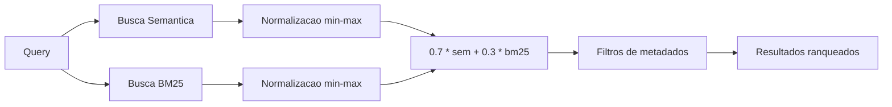

# Busca Hibrida (F05, F06, F07)

`pipeline/search_doutrina_v2.py` -- Interface de consulta do corpus doutrinario. Combina busca semantica (similaridade de cosseno em embeddings Legal-BERTimbau) com busca BM25 por keywords, filtragem pos-retrieval por metadados e suporte multi-area. Disponivel tanto como ferramenta CLI quanto como REPL interativo.

## Visao Geral

| Propriedade | Valor |
|-------------|-------|
| **Script** | `pipeline/search_doutrina_v2.py` (374 linhas) |
| **Entrada** | Query do usuario (linguagem natural ou termo juridico) |
| **Indices** | `embeddings_doutrina.json`, `search_corpus_doutrina.json`, `bm25_index_doutrina.json` |
| **Modelo** | `rufimelo/Legal-BERTimbau-sts-base` (compartilhado com geracao de embeddings) |
| **Modo padrao** | Hibrido (0.7 semantico + 0.3 BM25) |
| **Areas** | `contratos`, `processo_civil` ou `all` |

## Modos de Busca

### Busca Semantica

Codifica a query do usuario com Legal-BERTimbau (mesmo modelo usado na indexacao) e calcula a similaridade de cosseno contra todos os embeddings de chunks via dot product com numpy:

```python
def semantic_search(query: str, areas: list[str], top_k: int = 10):
    model = load_model()
    query_vec = model.encode(
        [query],
        normalize_embeddings=True,
        convert_to_numpy=True
    )

    for area in areas:
        data = load_area(area)
        emb = data["embeddings"]
        scores = np.dot(emb["vectors"], query_vec.T).flatten()
        top_idx = np.argsort(scores)[::-1][:top_k]
```

**Ideal para:** queries conceituais, matching de sinonimos, perguntas formuladas de forma diferente do texto original. Exemplo: buscar "defesa por inadimplemento" encontra chunks sobre "exceptio non adimpleti contractus".

### Busca BM25

Implementacao BM25 do zero com parametros padrao:

| Parametro | Valor | Significado |
|-----------|-------|-------------|
| `k1` | 1.5 | Saturacao de frequencia de termos |
| `b` | 0.75 | Normalizacao por tamanho do documento |

```python
def bm25_search(query: str, areas: list[str], top_k: int = 10):
    query_terms = set(re.findall(r'\w+', query.lower()))
    k1, b = 1.5, 0.75

    for area in areas:
        # ...
        for i, doc in enumerate(docs):
            doc_terms = re.findall(r'\w+', doc.lower())
            dl = len(doc_terms)
            tf = Counter(doc_terms)
            score = 0.0
            for t in query_terms:
                if tf[t] == 0:
                    continue
                idf = math.log((N - df[t] + 0.5) / (df[t] + 0.5) + 1)
                tf_norm = (tf[t] * (k1 + 1)) / (tf[t] + k1 * (1 - b + b * dl / avg_dl))
                score += idf * tf_norm
```

**Ideal para:** matching exato de termos, expressoes latinas, numeros de artigo. Exemplo: buscar "Art. 476" encontra a referencia legislativa exata.

### Busca Hibrida (Padrao)

Executa ambas as buscas (semantica e BM25), normaliza os scores independentemente usando normalizacao min-max e os combina com pesos configuraveis:

```python
def hybrid_search(query, areas, top_k=10, semantic_weight=0.7):
    sem_results = semantic_search(query, areas, top_k=top_k * 2)
    bm25_results = bm25_search(query, areas, top_k=top_k * 2)

    def normalize(results):
        if not results:
            return {}
        max_s = max(s for _, s, _ in results)
        min_s = min(s for _, s, _ in results)
        rng = max_s - min_s if max_s != min_s else 1.0
        return {(doc_id, area): (s - min_s) / rng for doc_id, s, area in results}

    sem_norm = normalize(sem_results)
    bm25_norm = normalize(bm25_results)

    all_keys = set(sem_norm.keys()) | set(bm25_norm.keys())
    combined = {}
    for key in all_keys:
        combined[key] = (
            semantic_weight * sem_norm.get(key, 0.0) +
            (1 - semantic_weight) * bm25_norm.get(key, 0.0)
        )
```

**Pesos padrao:** 0.7 semantico + 0.3 BM25.

**Por que hibrido?** A busca semantica se destaca em matching conceitual, mas pode perder termos exatos. O BM25 se destaca em matching de termos, mas perde sinonimos e parafrases. A combinacao cobre ambos os modos de falha. A ponderacao 0.7/0.3 favorece a compreensao semantica enquanto preserva a capacidade de match exato para precisao juridica.



## Busca Multi-Area (F06)

O sistema de busca suporta indices independentes para diferentes areas do direito. Cada area possui seu proprio conjunto de tres arquivos JSON:

| Area | Embeddings | Corpus | BM25 |
|------|-----------|--------|------|
| `contratos` | `embeddings_doutrina.json` | `search_corpus_doutrina.json` | `bm25_index_doutrina.json` |
| `processo_civil` | `embeddings_processo_civil.json` | `search_corpus_processo_civil.json` | `bm25_index_processo_civil.json` |

Quando `--area all` e usado, resultados de ambas as areas sao mesclados e re-ranqueados juntos. A area de origem e exibida nos resultados.

:::note
Adicionar uma nova area requer: (1) processar e enriquecer os livros, (2) gerar os tres arquivos JSON com nomes apropriados, e (3) adicionar uma entrada no dicionario `AREA_FILES` no script.
:::

## Filtragem por Metadados

Filtros pos-retrieval refinam resultados por metadados estruturados. Todos os filtros usam **matching de substring case-insensitive**:

| Filtro | Campo do Frontmatter | Flag CLI | Exemplo |
|--------|----------------------|----------|---------|
| Instituto | `instituto[]` | `--instituto` | `--instituto "boa-fe"` |
| Tipo de conteudo | `tipo_conteudo[]` | `--tipo` | `--tipo "definicao"` |
| Ramo do direito | `ramo` | `--ramo` | `--ramo "civil"` |
| Titulo do livro | `livro` | `--livro` | `--livro "orlando"` |
| Fase processual | `fase[]` | `--fase` | `--fase "execucao"` |

```python
def filter_by_metadata(results, areas, instituto=None, tipo=None,
                       ramo=None, livro=None, fase=None):
    for doc_id, score, area in results:
        meta = data["corpus"].get(doc_id, {})
        if instituto and not any(
            instituto.lower() in i.lower()
            for i in meta.get("instituto", [])
        ):
            continue
        # ... similar for tipo, ramo, livro, fase
```

:::caution
Os filtros sao aplicados **apos** o scoring e ranqueamento, nao durante o retrieval. Isso significa que resultados filtrados podem ter menos de `top_k` entradas. Tambem significa que o scoring nao se beneficia das restricoes de metadados -- um sistema de retrieval com filtros integrados produziria resultados melhores.
:::

## Modo Interativo (F07)

Inicie com `--interativo` ou `-i` para um REPL com parametros de busca configuraveis em tempo de execucao:

```bash
python3 pipeline/search_doutrina_v2.py --interativo
```

### Comandos

| Comando | Descricao | Exemplo |
|---------|-----------|---------|
| `/area` | Trocar area de busca | `/area contratos`, `/area processo_civil`, `/area all` |
| `/filtro` | Definir filtros de metadados | `/filtro instituto=boa-fe tipo=definicao` |
| `/verbose` | Alternar preview de texto nos resultados | `/verbose` |
| `/top N` | Alterar quantidade de resultados | `/top 10` |
| `/bm25` | Trocar para modo BM25 | `/bm25` |
| `/sem` | Trocar para modo semantico | `/sem` |
| `/hybrid` | Trocar para modo hibrido (padrao) | `/hybrid` |
| `/quit` | Sair | `/quit` |

### Exemplo de Sessao

```
BUSCA DOUTRINA JURIDICA v2 -- Multi-Area
============================================================
Carregando...
  Carregando contratos embeddings (487 MB)... OK (9365 docs)
  Carregando processo_civil embeddings (1.2 GB)... OK (22182 docs)
Pronto!

[contratos+processo_civil] > exceptio non adimpleti contractus

  (5 resultados, 0.34s, modo=hybrid, area=all)

  1. [0.947] Contratos bilaterais > Exceptio non adimpleti contractus
     Contratos (Orlando Gomes) (chunk 26/42) [contratos]
     exceptio_non_adimpleti_contractus | definicao, requisitos

  2. [0.891] Da Exceptio non adimpleti contractus
     Curso de Direito Civil (Fabio Ulhoa) (chunk 31/55) [contratos]
     exceptio_non_adimpleti_contractus | doutrina_comparada

[contratos+processo_civil] > /filtro tipo=requisitos
  Filtros: {'tipo': 'requisitos'}

[contratos+processo_civil] > tutela antecipada

  (3 resultados, 0.28s, modo=hybrid, area=all)
  ...
```

## Uso via CLI

```bash
# Busca basica em todas as areas
python3 pipeline/search_doutrina_v2.py "exceptio non adimpleti contractus" --area all

# Busca em area especifica
python3 pipeline/search_doutrina_v2.py "tutela antecipada requisitos" --area processo_civil

# Busca com filtro de metadados
python3 pipeline/search_doutrina_v2.py "boa-fe objetiva" --instituto "boa-fe" --area contratos

# Apenas BM25 (matching exato de termos)
python3 pipeline/search_doutrina_v2.py "Art. 476" --modo bm25

# Saida detalhada com preview de texto
python3 pipeline/search_doutrina_v2.py "clausula penal" --verbose --top 10

# Filtrar por livro
python3 pipeline/search_doutrina_v2.py "formacao do contrato" --livro "orlando"

# Modo interativo
python3 pipeline/search_doutrina_v2.py --interativo
python3 pipeline/search_doutrina_v2.py -i --area contratos
```

## Limitacoes Conhecidas

- **BM25 recalcula a cada query.** Frequencias de documento (`df`) e tamanho medio de documento (`avg_dl`) sao recomputados para cada query. Para ~31.500 documentos, isso adiciona latencia perceptivel. Pre-computar esses valores no momento da indexacao eliminaria esse custo. Rastreado como mitigacao **M13**.
- **Carga completa de JSON na inicializacao.** Todas as matrizes de embeddings, metadados do corpus e indices BM25 precisam ser carregados na memoria antes da primeira query. Para `all` areas, isso pode levar 10-20 segundos e consumir 1+ GB de RAM.
- **Sem cache entre queries.** No modo CLI (nao interativo), o modelo e os indices sao carregados do zero a cada invocacao. O modo interativo evita isso mantendo tudo em memoria.
- **Busca brute-force.** A similaridade de cosseno e calculada contra cada embedding no indice (O(n) por query). Um indice HNSW ou FAISS reduziria isso para O(log n) ao custo de resultados aproximados. Nao e problema na escala atual (~31K), mas nao escala alem de ~100K chunks.
- **Sem feedback de relevancia ou learning-to-rank.** O sistema nao consegue aprender com o comportamento do usuario para melhorar o ranqueamento ao longo do tempo.
- **Filtragem pos-retrieval por metadados** reduz a contagem de resultados abaixo de `top_k` quando os filtros sao restritivos. Uma abordagem pre-retrieval (filtrar antes do scoring) garantiria `top_k` resultados, mas requer uma arquitetura diferente.
- **Tokenizacao simplista.** Tanto o BM25 quanto o parser de query usam `re.findall(r'\w+', text.lower())` para tokenizacao. Isso nao trata stop words em portugues, stemming ou termos juridicos compostos (ex.: "boa-fe" e dividido em "boa" e "fe").
