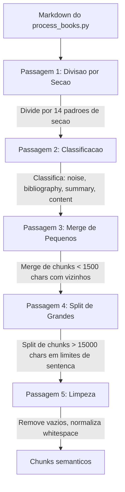

# Chunking Inteligente v3 (F02)

`pipeline/rechunk_v3.py` -- O componente mais sofisticado e critico do pipeline. Divide markdown juridico (saida do `process_books.py`) em chunks semanticamente coerentes usando heuristicas de dominio calibradas para livros doutrinarios brasileiros e internacionais.

## Visao Geral

| Propriedade | Valor |
|-------------|-------|
| **Script** | `pipeline/rechunk_v3.py` (890 linhas) |
| **Entrada** | Arquivos markdown em `_staging/processed/{book}/` |
| **Saida** | Arquivos markdown rechunked (mesmo diretorio, sobrescritos) |
| **Chunk minimo** | 1.500 caracteres (`MIN_CHUNK_CHARS`) |
| **Chunk maximo** | 15.000 caracteres (`MAX_CHUNK_CHARS`) |
| **Cobertura de testes** | 0% — sinalizado como **F26** (P1, v0.3) |

:::caution
Este script tem **0% de cobertura de testes** para 890 linhas de logica baseada em regex. E o componente de maior risco no pipeline inteiro. A criacao de testes esta rastreada como **F26** (prioridade P1, milestone v0.3).
:::

## O Algoritmo de 5 Passagens

O rechunker processa cada livro atraves de cinco passagens sequenciais. Cada passagem tem uma responsabilidade especifica, e a saida de uma alimenta a proxima.



### Passagem 1: Divisao por Secao

Detecta limites de secao usando 14 padroes regex (veja abaixo) e divide o documento em cada limite. Cada header de secao detectado vira o titulo de um novo chunk.

### Passagem 2: Classificacao

Classifica cada chunk por tipo de conteudo usando `classify_block_content()`:

| Classificacao | Logica de Deteccao | Tratamento |
|---------------|---------------------|------------|
| `example` | Padroes: "por exemplo", "imagine que", "e.g.", "for instance" | Mantido com o principio anterior |
| `table` | Mais de 5 pipes e 2+ quebras de linha | Pode ser chunk independente |
| `characteristics` | 3+ termos de caracteristica contratual (bilateral, oneroso, consensual...) | Mantido como bloco indivisivel |
| `law_article` | Inicia com `Art. {numero}` | Mantido com o comentario subsequente |
| `bibliography` | >50% das linhas comecam com nomes de autor em CAIXA ALTA, 5+ linhas | Extraido como chunk separado |
| `regular` | Padrao | Processamento normal |

### Passagem 3: Merge de Pequenos

Chunks abaixo de `MIN_CHUNK_CHARS` (1.500) sao mesclados com seus vizinhos. A estrategia de merge preserva a coerencia semantica:
- Exemplos sao mesclados com o principio anterior que ilustram
- Notas de rodape sao mescladas com o paragrafo que as referencia
- Artigos de lei sao mesclados com seu comentario

### Passagem 4: Split de Grandes

Chunks que excedem `MAX_CHUNK_CHARS` (15.000) sao divididos em limites de sentenca, garantindo que nenhum chunk ultrapasse o maximo e que sentencas sejam mantidas intactas.

### Passagem 5: Limpeza

Passagem final que remove chunks vazios, normaliza whitespace e valida que todos os chunks atendem ao limite minimo de conteudo (200 caracteres de texto real).

## 14 Padroes de Secao (`SECTION_PATTERNS`)

O detector de secoes usa estes padroes regex em ordem de prioridade. O primeiro match vence.

| # | Padrao | Tipo | Exemplo de Match |
|---|--------|------|------------------|
| 1 | `^#{1,3}\s+(.+)$` | `md_header` | `# Chapter 1` |
| 2 | `^\*\*Chapter\s+\d+[\.:]?\*?\*?\s*(.*?)` | `chapter_en` | `**Chapter 5:** Title` |
| 3 | `^\*?\*?Cap[ií]tulo\s+\*?\*?\w+\*?\*?\.?\s*(.*?)` | `capitulo_pt` | `Capitulo V - Dos Contratos` |
| 4 | `^CHAPTER\s+\d+\.?\s*(.*)$` | `chapter_caps` | `CHAPTER 5 BILATERAL CONTRACTS` |
| 5 | `^CAP[ÍI]TULO\s+\w+\.?\s*(.*)$` | `capitulo_caps` | `CAPITULO V` |
| 6 | `^\*?\*?T[ÍI]TULO\s+\w+\*?\*?\.?\s*(.*)$` | `titulo` | `**TITULO VI** Dos Contratos` |
| 7 | `^\*?\*?PARTE\s+\w+\*?\*?\.?\s*(.*)$` | `parte` | `PARTE ESPECIAL` |
| 8 | `^\*?\*?Part\s+\w+\*?\*?\.?\s*(.*)$` | `part_en` | `**Part One** General Theory` |
| 9 | `^(?:#{1,3}\s+)?\*?\*?Art\.?\s+\d+[\.\)]?\*?\*?\s*(.*)$` | `artigo` | `Art. 481.` ou `### Art. 481` |
| 10 | `^(?:#{1,3}\s+)?_?\*?\*?Se[çc][ãa]o\s+\w+_?\*?\*?\.?\s*(.*)$` | `secao` | `Secao I - Disposicoes Gerais` |
| 11 | `^\*?\*?Section\s+\w+\*?\*?\.?\s*(.*)$` | `section_en` | `**Section 3** Formation` |
| 12 | `^(\d{1,3})\.\s+([A-Z][A-Z\s,]{8,80})$` | `numbered_caps` | `1. CONTRATOS BILATERAIS` |
| 13 | `^\*\*(\d{1,3})\.?\*?\*?\s+(.{5,80})$` | `numbered_bold` | `**1.** Conceito e Natureza` |
| 14 | `^([A-Z\s,]{15,80})$` | `allcaps_title` | `CONTRATOS BILATERAIS E UNILATERAIS` |

:::note
O padrao 14 (`allcaps_title`) faz match com qualquer linha de 15-80 caracteres em CAIXA ALTA. Isso e intencionalmente amplo para capturar headers de secao juridica sem formatacao, mas pode produzir falsos positivos em entradas bibliograficas ou informacoes de editora.
:::

## Deteccao de Ruido e Metadados

### NOISE_TITLES

Conteudo com estas palavras-chave no titulo e filtrado como nao-substantivo:

```python
NOISE_TITLES = {
    # Portuguese
    'prefácio', 'prefacio', 'agradecimentos', 'agradecimento',
    'dedicatória', 'dedicatoria', 'palavras do coordenador',
    'nota do editor', 'notas do editor', 'nota à edição',
    'sobre o autor', 'sobre os autores', 'dados catalográficos',
    'ficha catalográfica', 'expediente',
    'editora forense', 'editora saraiva', 'editora atlas',
    'editora renovar', 'editora revista dos tribunais',
    'no_content_here',
    # English
    'preface', 'foreword', 'acknowledgements', 'acknowledgments',
    'dedication', 'about the author', 'about the authors',
    "editor's note", "publisher's note",
}
```

### BIBLIOGRAPHY_TITLES

Secoes que correspondem a estes titulos sao extraidas como chunks de bibliografia separados:

```python
BIBLIOGRAPHY_TITLES = {
    'bibliografia', 'referências bibliográficas', 'referências',
    'bibliography', 'references', 'works cited', 'further reading',
    'leituras complementares', 'obras consultadas',
}
```

### SUMMARY_TITLES

Sumarios sao marcados como metadados (nao descartados, mas sinalizados):

```python
SUMMARY_TITLES = {
    'sumário', 'sumario', 'índice', 'indice',
    'table of contents', 'contents', 'summary',
    'índice remissivo', 'indice remissivo',
    'table of cases', 'table of legislation', 'table of statutes',
}
```

## Funcionalidades Especificas do Dominio

### Deteccao de Running Headers

A extracao de PDF frequentemente produz linhas repetidas (titulo do livro, nome do autor, heading do capitulo) no topo de cada pagina. O rechunker detecta essas repeticoes por analise de frequencia ao longo do documento e as filtra antes do chunking.

### Agregacao de Notas de Rodape

Livros juridicos fazem uso intensivo de notas de rodape. O rechunker agrupa notas de rodape com o paragrafo que as referencia usando duas funcoes de deteccao:

```python
def is_footnote_line(line: str) -> bool:
    """Detect footnote lines at bottom of text."""
    stripped = line.strip()
    # "1 Author, Book, p. 123" or "¹ Author..." or "[1] Author..."
    if re.match(r'^\d{1,3}\s+[A-ZÁÉÍÓÚÀÂÊÔÃÕÇ]', stripped):
        return True
    if re.match(r'^[¹²³⁴⁵⁶⁷⁸⁹⁰]+\s+', stripped):
        return True
    if re.match(r'^\[\d{1,3}\]\s+', stripped):
        return True
    return False
```

### Preservacao Artigo de Lei + Comentario

Quando um chunk contem a transcricao de um artigo de lei (ex.: `Art. 476 do Codigo Civil...`), o rechunker garante que o comentario do autor que se segue nunca seja separado do artigo. Isso e critico porque o comentario so faz sentido no contexto do artigo sendo discutido.

### Blocos Indivisiveis

Listas de caracteristicas contratuais (bilateral, oneroso, consensual, comutativo...) sao detectadas quando 3+ termos de caracteristica aparecem juntos e sao mantidas como um unico bloco indivisivel, pois dividi-las destruiria a analise comparativa.

## Configuracao

### Argumentos CLI

```bash
# Rechunk de todos os livros em staging
python3 pipeline/rechunk_v3.py

# Rechunk de um livro especifico
python3 pipeline/rechunk_v3.py contratos-orlando-gomes

# Definir tamanho minimo de chunk (caracteres)
python3 pipeline/rechunk_v3.py --min-chars 1500

# Simular alteracoes sem gravar
python3 pipeline/rechunk_v3.py --dry-run

# Forcar rechunk mesmo se ja processado
python3 pipeline/rechunk_v3.py --force
```

### Constantes

| Constante | Valor | Descricao |
|-----------|-------|-----------|
| `MIN_CHUNK_CHARS` | 1.500 | Minimo de caracteres para um chunk valido |
| `MAX_CHUNK_CHARS` | 15.000 | Maximo de caracteres antes de split forcado |

## Limitacoes Conhecidas

:::danger
**VAULT_PATH hardcoded (linha 29):** O script usa um caminho WSL hardcoded:
```python
VAULT_PATH = Path("/mnt/c/Users/sensd/vault")
```
Este caminho e diferente do usado em `process_books.py` (que usa um caminho Linux). Rastreado como **F22** (prioridade P0) para v0.2.
:::

- **0% de cobertura de testes** para 890 linhas de logica baseada em regex. Um unico falso positivo na deteccao de secao pode se propagar pelo documento inteiro. Rastreado como **F26**.
- **Parser YAML customizado** usa regex em vez de PyYAML. Caracteres especiais em titulos (dois pontos, aspas) podem corromper o frontmatter. O mesmo parser regex esta duplicado em `enrich_chunks.py` e `embed_doutrina.py`. Rastreado como **F23**.
- **Assume estrutura hierarquica** -- livros sem padroes claros de H1/H2/secao (ex.: dicionarios, compilacoes legislativas, coletaneas multi-autor) produzem chunks de baixa qualidade.
- **Deteccao de running headers e heuristica** -- linhas repetidas que NAO sao headers (ex.: um brocardo juridico que aparece varias vezes) podem ser falsamente filtradas.
- **Padrao `allcaps_title` e amplo** -- qualquer linha de 15-80 caracteres maiusculos e tratada como limite de secao, o que pode gerar falsos positivos em entradas bibliograficas, nomes de editora ou texto enfatizado.
- **Sem tokenizacao especifica para portugues** -- o divisor de sentencas para chunks grandes nao usa um tokenizador especifico para portugues, o que pode dividir em abreviacoes (ex.: "Art.", "Dr.").
