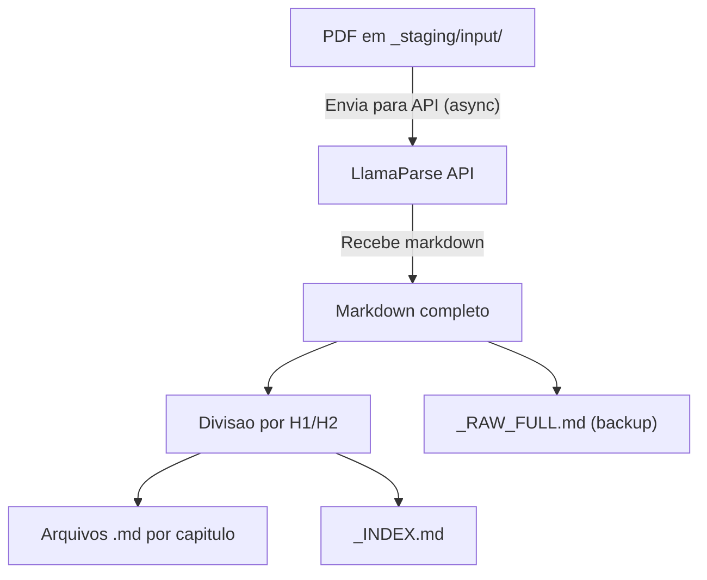

# Extracao de PDF (F01)

`pipeline/process_books.py` -- Ponto de entrada do pipeline do Douto. Converte PDFs de livros juridicos em arquivos markdown estruturados com divisao por capitulos e frontmatter YAML, preparando-os para as etapas subsequentes de chunking e enriquecimento.

## Visao Geral

| Propriedade | Valor |
|-------------|-------|
| **Script** | `pipeline/process_books.py` (414 linhas) |
| **Entrada** | Arquivos PDF em `Knowledge/_staging/input/` |
| **Saida** | Arquivos markdown em `Knowledge/_staging/processed/{slug}/` |
| **Engine** | [LlamaParse](https://docs.llamaindex.ai/en/stable/llama_cloud/llama_parse/) (LlamaIndex) |
| **Dependencias** | `llama_parse`, `asyncio` |
| **Idempotente** | Sim — pula PDFs ja processados via arquivos marker |



## Como Funciona

### 1. Varredura de PDFs nao processados

O script varre `_staging/input/` procurando arquivos `.pdf` que nao possuam um arquivo marker `.processed_{filename}`. Esse marker e criado apos o processamento bem-sucedido, tornando a operacao idempotente.

### 2. Envio ao LlamaParse

Cada PDF e enviado a API cloud do LlamaParse com tier de extracao configuravel:

| Tier | Caso de Uso | Custo |
|------|-------------|-------|
| `fast` | Extracao rapida sem formatacao, mais barato | Baixo |
| `cost_effective` | Melhor custo-beneficio para texto digital limpo (padrao) | Medio |
| `agentic` | PDFs escaneados ou layouts complexos | Alto |

O parser e configurado para portugues (`language="pt"`) com 2 workers:

```python
parser = LlamaParse(
    result_type="markdown",
    num_workers=2,
    verbose=True,
    language="pt",
)
documents = await parser.aload_data(str(pdf_path))
```

### 3. Divisao em capitulos

A funcao `split_into_chapters()` divide o markdown de saida por headers H1 (`#`) e H2 (`##`). Cada capitulo se torna um chunk independente:

```python
def split_into_chapters(markdown_text: str, filename: str) -> list[dict]:
    lines = markdown_text.split('\n')
    chunks = []
    current_chunk = {
        "title": "Introdução / Pré-textual",
        "level": 0,
        "content": [],
        "page_hint": ""
    }
    parent_title = filename

    for line in lines:
        h1_match = re.match(r'^# (.+)$', line)
        h2_match = re.match(r'^## (.+)$', line)

        if h1_match or h2_match:
            # Save previous chunk if it has substantial content
            if current_chunk["content"]:
                content_text = '\n'.join(current_chunk["content"]).strip()
                if len(content_text) > 100:  # ignore very small chunks
                    chunks.append({
                        "title": current_chunk["title"],
                        "parent": parent_title,
                        "content": content_text
                    })
            # Start new chunk...
```

Decisoes de design importantes:
- **Headers H1** definem o contexto de titulo-pai. Chunks H2 subsequentes herdam esse contexto como `parent_title > section_title`.
- **Limite minimo de conteudo**: chunks com menos de 100 caracteres sao descartados.
- **Fallback**: se nenhum header for detectado, o documento inteiro vira um unico chunk.

### 4. Geracao de slug

Nomes de arquivos e diretorios usam uma funcao de slugificacao preparada para portugues:

```python
def slugify(text: str) -> str:
    text = text.lower().strip()
    text = re.sub(r'[àáâãäå]', 'a', text)
    text = re.sub(r'[èéêë]', 'e', text)
    text = re.sub(r'[ìíîï]', 'i', text)
    text = re.sub(r'[òóôõö]', 'o', text)
    text = re.sub(r'[ùúûü]', 'u', text)
    text = re.sub(r'[ç]', 'c', text)
    text = re.sub(r'[^a-z0-9\s-]', '', text)
    text = re.sub(r'[\s_]+', '-', text)
    text = re.sub(r'-+', '-', text)
    return text.strip('-')[:80]
```

### 5. Gravacao dos arquivos de saida

Para cada livro, o script grava:

- **`_RAW_FULL.md`** -- Saida completa do LlamaParse como backup
- **`_INDEX.md`** -- Nota-indice do livro com wikilinks para todos os capitulos
- **`001-{slug}.md` ... `NNN-{slug}.md`** -- Arquivos individuais por capitulo com frontmatter YAML

## Formato de Saida

Cada arquivo de capitulo inclui frontmatter YAML projetado para o enriquecimento posterior:

```yaml
---
knowledge_id: ""
tipo: "livro_chunk"
titulo: "Contratos Bilaterais e Unilaterais"
livro_titulo: "Contratos"
livro_arquivo_original: "contratos-orlando-gomes.pdf"
chunk_numero: 5
chunk_total: 42
fonte_primaria: ""
autor: ""
editora: ""
edicao: ""
ano: ""
paginas: ""
confianca: "UNVERIFIED"
confidencialidade: "Publico"
area_direito: []
teses_extraidas: []
casos_vinculados: []
tags: []
data_criacao: "2026-02-28T14:30:00"
data_ultima_modificacao: ""
status_enriquecimento: "pendente"
---
```

:::note
Campos deixados vazios (ex.: `autor`, `editora`, `area_direito`) sao preenchidos pelo estagio de enriquecimento (F03). O flag `status_enriquecimento: "pendente"` sinaliza que o chunk ainda nao foi classificado.
:::

## Configuracao

### Variaveis de Ambiente

| Variavel | Obrigatoria | Descricao |
|----------|-------------|-----------|
| `LLAMA_CLOUD_API_KEY` | Sim | Autenticacao da API LlamaParse (via env ou `.env`) |

### Argumentos CLI

```bash
# Processar todos os PDFs nao processados em staging
python3 pipeline/process_books.py

# Processar um PDF especifico
python3 pipeline/process_books.py contratos-orlando-gomes.pdf

# Usar um tier diferente do LlamaParse
python3 pipeline/process_books.py --tier fast
python3 pipeline/process_books.py --tier agentic

# Tier padrao e cost_effective
python3 pipeline/process_books.py --tier cost_effective
```

:::caution
O `process_books.py` nao possui flag `--dry-run` (diferente dos outros scripts do pipeline). Executar o script envia PDFs para a API do LlamaParse e grava arquivos. Use o mecanismo de arquivos marker para evitar reprocessamento.
:::

### Estrutura de Diretorios

```
vault/Knowledge/_staging/
  input/              # Coloque os PDFs aqui
    livro.pdf
    .processed_livro.pdf   # Marker (criado automaticamente)
  processed/
    contratos-orlando-gomes/
      _RAW_FULL.md
      _INDEX.md
      001-introducao.md
      002-contratos-bilaterais.md
      ...
  failed/             # PDFs que falharam no processamento
```

## Logging

Todos os eventos sao adicionados a `_staging/processing_log.jsonl`:

```json
{"op": "process_success", "file": "contratos.pdf", "book_title": "Contratos", "chunks": 42, "chars": 185000, "tier": "cost_effective", "output_dir": "/path/to/output", "ts": "2026-02-28T14:30:00"}
{"op": "skip", "file": "contratos.pdf", "reason": "already_processed", "ts": "2026-02-28T14:35:00"}
{"op": "process_failed", "file": "scanned-book.pdf", "error": "LlamaParse retornou vazio", "tier": "fast", "ts": "2026-02-28T14:40:00"}
```

## Limitacoes Conhecidas

:::danger
**VAULT_PATH hardcoded (linha 27):** O script usa um caminho Linux hardcoded:
```python
VAULT_PATH = Path("/home/sensd/.openclaw/workspace/vault")
```
Isso vai falhar em qualquer outra maquina. Rastreado como **F22** (prioridade P0) para v0.2.
:::

- **Sem modo `--dry-run`** -- diferente de `rechunk_v3.py` e `enrich_chunks.py`, este script nao consegue simular operacoes sem fazer chamadas a API.
- **Qualidade do LlamaParse varia** -- PDFs escaneados ou com layouts complexos (tabelas, multi-colunas) podem gerar markdown de baixa qualidade. Use `--tier agentic` para PDFs dificeis.
- **Divisao por capitulos assume estrutura H1/H2** -- livros sem headers markdown (ex.: texto extraido plano) viram um unico chunk. Textos juridicos nao-hierarquicos (dicionarios, compilacoes) produzem resultados ruins.
- **Sem validacao de qualidade de OCR** -- nao ha verificacao pos-extracao para texto corrompido ou artefatos de extracao.
- **Deteccao de titulo e heuristica** -- o titulo do livro e derivado do nome do arquivo (`pdf_path.stem.replace('-', ' ').title()`), que pode nao corresponder ao titulo real.
- **`slugify()` esta duplicada** -- a mesma funcao existe em `rechunk_v3.py`. Rastreado como **F23** para extracao em `pipeline/utils.py`.
