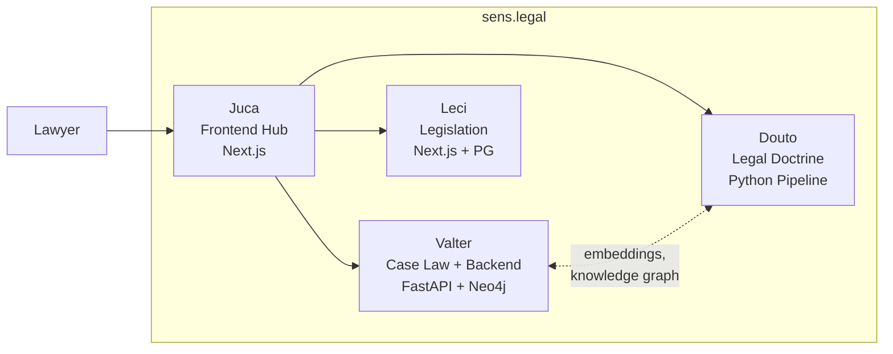

# Douto

Douto e o agente de conhecimento doutrinario do ecossistema [sens.legal](https://sens.legal). Ele transforma livros juridicos em conhecimento estruturado, pesquisavel e pronto para consumo por IA, por meio de um pipeline Python em cinco estagios, e mantem um skill graph navegavel organizado por ramo do direito.

## Capacidades Principais

O pipeline do Douto processa livros juridicos de PDF ate embeddings pesquisaveis:

- **Extracao de PDF** — converte PDFs juridicos em markdown estruturado via LlamaParse
- **Chunking Inteligente** — divide documentos usando heuristicas especificas do dominio juridico (agrupamento de notas de rodape, preservacao de artigos de lei, deteccao de running headers)
- **Enriquecimento via LLM** — classifica cada chunk com metadados estruturados: instituto juridico, tipo de conteudo, ramo do direito, fontes normativas
- **Embeddings Semanticos** — gera vetores de 768 dimensoes usando Legal-BERTimbau com composicao de texto enriquecida por metadados
- **Busca Hibrida** — combina busca semantica (similaridade cosseno) com BM25 (busca por palavras-chave) e filtragem por metadados

## Status Atual

| Metrica | Valor |
|---------|-------|
| Livros processados | ~50 |
| Chunks no corpus | ~31.500 |
| Ramos do direito cobertos | 3 ativos (Civil, Processual, Empresarial) + 5 planejados |
| Dimensoes dos embeddings | 768 (Legal-BERTimbau) |
| Modos de busca | Semantico, BM25, Hibrido |
| Cobertura de testes | 0% |
| Scripts no pipeline | 5 |
| Versao | v0.1.0 (pre-release) |

## Links Rapidos

| Secao | Descricao |
|-------|-----------|
| [Introducao](getting-started/introduction) | O que e o Douto, por que ele existe e quem o utiliza |
| [Quickstart](getting-started/quickstart) | Execute uma busca em menos de 5 minutos |
| [Arquitetura](architecture/overview) | Como o pipeline e a base de conhecimento funcionam |
| [Funcionalidades](features/) | Inventario completo de funcionalidades com status |
| [Roadmap](roadmap/) | Para onde o Douto esta indo — milestones v0.2 a v1.0 |
| [Glossario](reference/glossary) | Terminologia juridica e tecnica |

## Parte do sens.legal

Douto e um dos cinco componentes da plataforma unificada de pesquisa juridica sens.legal:

| Agente | Funcao | Stack |
|--------|--------|-------|
| **Valter** | Backend de jurisprudencia — 23.400+ decisoes do STJ, 28 ferramentas MCP | FastAPI, PostgreSQL, Qdrant, Neo4j, Redis |
| **Juca** | Frontend hub — interface para advogados | Next.js 16, block system, briefing progressivo |
| **Leci** | Legislacao — base de dados de leis federais | Next.js 15, PostgreSQL, Drizzle |
| **Joseph** | Orquestrador — coordena os agentes | — |
| **Douto** | Doutrina juridica — este projeto | Python 3, LlamaParse, Legal-BERTimbau |
