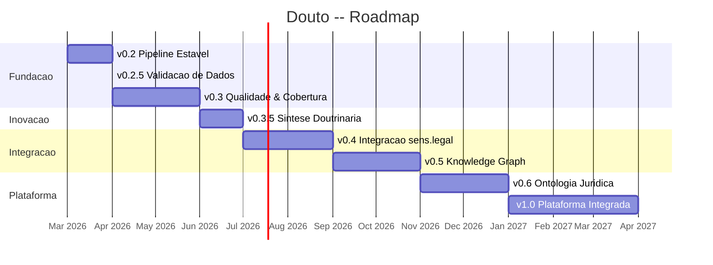

# Milestones

Detalhamento de cada milestone — o que esta incluido, como medir sucesso e o que precisa vir antes.

## v0.2 -- Pipeline Estavel

**Objetivo:** Eliminar a divida tecnica critica que impede o pipeline de rodar de forma confiavel em qualquer maquina.

**Features incluidas:**

| # | Feature | Prioridade | Status |
|---|---------|------------|--------|
| F22 | Padronizar todos os paths via `os.environ.get()` | P0 | Planejado |
| F23 | Extrair `pipeline/utils.py` (parse_frontmatter, slugify, etc.) | P1 | Planejado |
| F24 | Pinar versoes de dependencias no `requirements.txt` | P1 | Planejado |
| F20 | Completar padronizacao de env vars (2 de 5 scripts concluidos) | P1 | Em andamento |

**Criterios de aceitacao:**

- [ ] `python3 pipeline/process_books.py --dry-run` roda sem erro em uma maquina limpa (com env vars configuradas)
- [ ] Nenhum path absoluto hardcoded em qualquer script
- [ ] `parse_frontmatter()` e `slugify()` existem em um modulo compartilhado unico (`utils.py`)
- [ ] `pip install -r pipeline/requirements.txt` instala versoes deterministicas

**Estimativa:** 1 sessao de trabalho

---

## v0.2.5 -- Validacao de Dados (Proposto)

**Objetivo:** Validar a qualidade dos metadados antes de construir a camada de inovacao por cima. Este milestone foi proposto apos a analise PREMORTEM identificar metadados nao validados (PF01) como risco existencial.

**Acoes incluidas:**

| # | Acao | Risco mitigado | Esforco |
|---|------|----------------|---------|
| M06 | Validar 200 chunks aleatorios — verificar instituto, tipo_conteudo, ramo contra conteudo real | PF01, RT11 | 2-3 horas |
| M07 | Criar eval set: 30+ consultas com resultados esperados, medir recall@5 e nDCG | RE04 | 2 horas |
| M10 | Validacao de schema no enriquecimento — validar campos do output do LLM contra conjuntos de valores conhecidos | RT11, PF01 | 1 sessao |

**Quality gate:**

:::caution[Gate rigido — sem excecoes]
A precisao dos metadados deve ser **>= 85%** na amostra de 200 chunks. Se a precisao estiver abaixo de 85%, **todo o trabalho a jusante para** e o corpus deve ser re-enriquecido com modelo ou prompt melhor antes de avancar para o v0.3.
:::

**Justificativa:** Construir um Motor de Sintese (v0.3.5) ou Ontologia (v0.6) sobre metadados com 60% de precisao produz output sofisticado na aparencia mas nao confiavel. Em tecnologia juridica, output nao confiavel e pior que nenhum output.

**Estimativa:** 1 sessao de trabalho

---

## v0.3 -- Qualidade & Cobertura

**Objetivo:** Testes, linting, MOCs completos, documentacao — o minimo para que o projeto seja contribuivel por alguem que nao o criador.

**Features incluidas:**

| # | Feature | Prioridade | Status |
|---|---------|------------|--------|
| F25 | Criar MOCs ausentes (Tributario, Constitucional, Compliance, Sucessoes) | P1 | Planejado |
| F26 | Testes para `rechunk_v3.py` (pytest + fixtures) | P1 | Planejado |
| F27 | Testes para funcoes utilitarias | P2 | Planejado |
| F28 | README completo | P2 | Planejado |
| F31 | Makefile (`make pipeline`, `make test`, `make lint`) | P2 | Planejado |
| F32 | Linting com ruff | P2 | Planejado |
| F42 | Versionar e commitar `enrich_prompt.md` | P1 | Planejado |
| F19 | Completar MOC_CONSUMIDOR | P1 | Em andamento |

**Criterios de aceitacao:**

- [ ] 8/8 MOCs existem como arquivos (mesmo que alguns sejam placeholders estruturais)
- [ ] `make test` passa com pelo menos 1 teste para `rechunk_v3.py`
- [ ] `make lint` passa sem erros
- [ ] README tem secoes: Setup, Uso, Arquitetura, Corpus, Variaveis de Ambiente
- [ ] `enrich_prompt.md` esta presente no repositorio e versionado

**Pre-requisitos:** v0.2 concluido
**Estimativa:** 2-3 sessoes de trabalho

---

## v0.3.5 -- Sintese Doutrinaria (Proposto)

**Objetivo:** Transformar o Douto de um "motor de busca de livros" em um "motor de raciocinio doutrinario" que sintetiza posicoes de multiplos autores sobre um unico conceito juridico.

> **Feature planejada** — O Motor de Sintese Doutrinaria esta proposto mas ainda nao implementado ou aprovado.

**Features propostas:**

| # | Feature | Descricao |
|---|---------|-----------|
| F43 | Motor de Sintese | Dado um instituto juridico, coletar todos os chunks e sintetizar um parecer multi-autor |
| F44 | Prompt de sintese | Template de prompt versionado para geracao de Pareceres Doutrinarios |
| F45 | Template de Parecer Doutrinario | Formato de output estruturado: consenso, divergencia, evolucao, implicacoes praticas |

**Condicional:** So avanca se o quality gate do v0.2.5 for aprovado (precisao de metadados >= 85%).

**Pre-requisitos:** v0.3 concluido (testes existem), quality gate do v0.2.5 aprovado
**Estimativa:** 2-3 sessoes de trabalho

---

## v0.4 -- Integracao sens.legal

**Objetivo:** O Douto se conecta ao ecossistema — Valter pode consultar doutrina programaticamente.

**Features incluidas:**

| # | Feature | Prioridade |
|---|---------|------------|
| F29 | Protocolo de integracao Douto -> Valter | P1 |
| F30 | Servidor MCP para doutrina | P1 |

**Criterios de aceitacao:**

- [ ] Valter consegue consultar doutrina via protocolo definido (MCP ou REST)
- [ ] Pelo menos 3 tools MCP funcionais: `search_doutrina`, `get_chunk`, `list_areas`
- [ ] Busca doutrinaria acessivel via Claude Desktop/Code

**Pre-requisitos:** v0.2 concluido, Decisoes D01 e D02 resolvidas
**Decisoes bloqueantes:**

| Decisao | Pergunta | Opcoes |
|---------|----------|--------|
| D01 | Protocolo de integracao | MCP stdio / MCP HTTP/SSE / REST / JSON files |
| D02 | Douto como servico independente ou modulo do Valter | Repo separado / `valter/stores/doutrina/` / Proxy via Valter |

**Estimativa:** 3-5 sessoes de trabalho

---

## v0.5 -- Knowledge Graph & Automacao

**Objetivo:** Notas atomicas, avaliacao de qualidade, automacao de ingestao e CI/CD.

**Features incluidas:**

| # | Feature | Prioridade |
|---|---------|------------|
| F36 | Notas atomicas automaticas (1 nota por instituto juridico) | P2 |
| F40 | Eval set de qualidade de embeddings (30+ consultas) | P2 |
| F41 | CLI unificado de ingestao (`douto ingest livro.pdf`) | P3 |
| F39 | CI/CD: GitHub Actions com ruff + pytest | P3 |
| F21 | Completar knowledge nodes | P2 (em andamento) |

**Criterios de aceitacao:**

- [ ] `nodes/` contem notas atomicas geradas a partir de chunks enriquecidos
- [ ] Eval set com pelo menos 20 consultas e resultados esperados existe
- [ ] `make ingest livro.pdf` roda o pipeline completo
- [ ] GitHub Actions roda lint + test em PRs

**Pre-requisitos:** v0.3 concluido (testes existem)
**Decisoes pendentes:** D03 (notas atomicas: automaticas vs. curadas), D04 (tracking de issues)
**Estimativa:** 3-4 sessoes de trabalho

---

## v0.6 -- Ontologia Juridica (Proposto)

**Objetivo:** Construir um grafo de conceitos que mapeia relacoes entre institutos juridicos, criando uma ontologia estruturada do direito brasileiro.

> **Feature planejada** — A Ontologia Juridica e uma inovacao proposta que depende de metadados validados e do motor de sintese.

**Features propostas:**

| # | Feature | Descricao |
|---|---------|-----------|
| F46 | Extracao de relacoes entre institutos | Mapear como institutos se relacionam (pre-requisito, excecao, subtipo, etc.) |
| F47 | Estrutura do grafo de ontologia | Modelo de dados para o grafo de conceitos |
| F48 | API de navegacao da ontologia | Consultar o grafo (ex.: "quais sao os subtipos de responsabilidade civil?") |

**Pre-requisitos:** v0.3.5 concluido (motor de sintese), metadados validados
**Estimativa:** 5-8 sessoes de trabalho

---

## v1.0 -- Plataforma Integrada

**Objetivo:** Douto totalmente integrado ao sens.legal — doutrina como fonte de primeira classe ao lado de jurisprudencia e legislacao.

**Features incluidas:**

| # | Feature | Prioridade |
|---|---------|------------|
| F33 | Doutrina no knowledge graph Neo4j (Valter) | P2 |
| F34 | Cross-reference: doutrina <-> jurisprudencia (STJ) | P2 |
| F35 | Cross-reference: doutrina <-> legislacao (Leci) | P3 |
| F37 | Suporte ao Progressive Briefing (4 fases do Juca) | P2 |
| F38 | Containerizacao do pipeline com Docker | P3 |

**Criterios de aceitacao:**

- [ ] Nos doutrinarios no Neo4j com relacionamentos `CITA_DOUTRINA` e `FUNDAMENTA`
- [ ] Briefing do Juca inclui fontes doutrinarias automaticamente
- [ ] Pipeline executavel em container Docker

**Pre-requisitos:** v0.4 concluido (MCP funcional)
**Decisoes pendentes:** D05 (schema Neo4j)
**Estimativa:** Multiplas sessoes, depende da evolucao do Valter e Juca

---

## Gantt Chart



## Comparacao de Milestones: Original vs. Pos-PREMORTEM

A analise PREMORTEM recomendou inserir checkpoints de validacao antes de construir sobre fundacoes nao verificadas:

```
ORIGINAL:                       POS-PREMORTEM (atual):
v0.2 Pipeline Estavel           v0.2 Pipeline Estavel
  |                               |
  v                               v
v0.3 Qualidade                  v0.2.5 Validacao de Dados  <-- NOVO
  |                               |  Quality gate: >= 85%
  v                               v
v0.4 Integracao                 v0.3 Qualidade (testes, MOCs, docs)
  |                               |
  v                               v
v0.5 Knowledge Graph            v0.3.5 Sintese Doutrinaria  <-- NOVO
  |                               |
  v                               v
v1.0 Plataforma                 v0.4+ (continua como antes)
```

**Impacto:** Adiciona ~1 sessao de trabalho (v0.2.5) mas evita construir features de inovacao sobre dados nao confiaveis. Se o quality gate falhar (precisao < 85%), o re-enriquecimento acontece antes do v0.3, nao depois.
