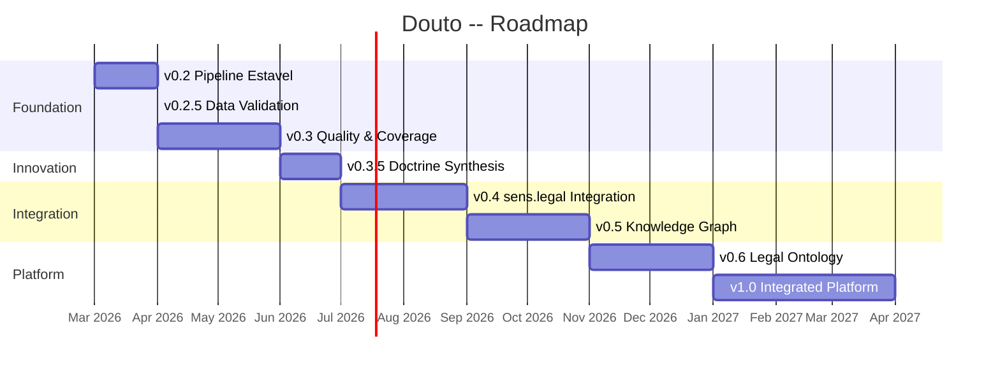

# Milestones

Detailed breakdown of each milestone -- what is included, what success looks like, and what must come first.

## v0.2 -- Stable Pipeline

**Objective:** Eliminate critical technical debt that prevents the pipeline from running reliably on any machine.

**Features included:**

| # | Feature | Priority | Status |
|---|---------|----------|--------|
| F22 | Standardize all paths via `os.environ.get()` | P0 | Planned |
| F23 | Extract `pipeline/utils.py` (parse_frontmatter, slugify, etc.) | P1 | Planned |
| F24 | Pin dependency versions in `requirements.txt` | P1 | Planned |
| F20 | Complete env var standardization (2 of 5 scripts done) | P1 | In progress |

**Acceptance criteria:**

- [ ] `python3 pipeline/process_books.py --dry-run` runs without error on a clean machine (with env vars set)
- [ ] No hardcoded absolute paths in any script
- [ ] `parse_frontmatter()` and `slugify()` exist in a single shared module (`utils.py`)
- [ ] `pip install -r pipeline/requirements.txt` installs deterministic versions

**Estimate:** 1 work session

---

## v0.2.5 -- Data Validation (Proposed)

**Objective:** Validate metadata quality before building innovation layer on top. This milestone was proposed after the PREMORTEM analysis identified unvalidated metadata (PF01) as an existential risk.

**Actions included:**

| # | Action | Risk mitigated | Effort |
|---|--------|----------------|--------|
| M06 | Validate 200 random chunks -- verify instituto, tipo_conteudo, ramo against actual content | PF01, RT11 | 2-3 hours |
| M07 | Create evaluation set: 30+ queries with expected results, measure recall@5 and nDCG | RE04 | 2 hours |
| M10 | Schema validation in enrichment -- validate LLM output fields against known value sets | RT11, PF01 | 1 session |

**Quality gate:**

:::caution[Hard gate -- no exceptions]
Metadata accuracy must be **>= 85%** on the 200-chunk sample. If accuracy is below 85%, **all downstream work stops** and the corpus must be re-enriched with a better model or prompt before proceeding to v0.3.
:::

**Rationale:** Building a Synthesis Engine (v0.3.5) or Ontology (v0.6) on top of 60% accurate metadata produces sophisticated-looking but unreliable output. In legal technology, unreliable output is worse than no output.

**Estimate:** 1 work session

---

## v0.3 -- Quality & Coverage

**Objective:** Tests, linting, complete MOCs, documentation -- the minimum for the project to be contributable by someone other than the creator.

**Features included:**

| # | Feature | Priority | Status |
|---|---------|----------|--------|
| F25 | Create missing MOCs (Tributario, Constitucional, Compliance, Sucessoes) | P1 | Planned |
| F26 | Tests for `rechunk_v3.py` (pytest + fixtures) | P1 | Planned |
| F27 | Tests for utility functions | P2 | Planned |
| F28 | Complete README | P2 | Planned |
| F31 | Makefile (`make pipeline`, `make test`, `make lint`) | P2 | Planned |
| F32 | Linting with ruff | P2 | Planned |
| F42 | Version and commit `enrich_prompt.md` | P1 | Planned |
| F19 | Complete MOC_CONSUMIDOR | P1 | In progress |

**Acceptance criteria:**

- [ ] 8/8 MOCs exist as files (even if some are structural placeholders)
- [ ] `make test` passes with at least 1 test for `rechunk_v3.py`
- [ ] `make lint` passes without errors
- [ ] README has sections: Setup, Usage, Architecture, Corpus, Env Vars
- [ ] `enrich_prompt.md` is present in the repository and version-controlled

**Prerequisites:** v0.2 completed
**Estimate:** 2-3 work sessions

---

## v0.3.5 -- Doctrine Synthesis (Proposed)

**Objective:** Transform Douto from a "book search engine" into a "doctrine reasoning engine" that synthesizes multiple authors' positions on a single legal concept.

> **Planned Feature** -- The Doctrine Synthesis Engine is proposed but not yet implemented or approved.

**Proposed features:**

| # | Feature | Description |
|---|---------|-------------|
| F43 | Synthesis Engine | Given an instituto juridico, collect all chunks, synthesize a multi-author brief |
| F44 | Synthesis prompt | Versioned prompt template for generating Doctrine Briefs |
| F45 | Doctrine Brief template | Structured output format: consensus, divergence, evolution, practical implications |

**Conditional:** Only proceeds if v0.2.5 quality gate passes (metadata accuracy >= 85%).

**Prerequisites:** v0.3 completed (tests exist), v0.2.5 quality gate passed
**Estimate:** 2-3 work sessions

---

## v0.4 -- sens.legal Integration

**Objective:** Douto connects to the ecosystem -- Valter can query doctrine programmatically.

**Features included:**

| # | Feature | Priority |
|---|---------|----------|
| F29 | Douto -> Valter integration protocol | P1 |
| F30 | MCP server for doctrine | P1 |

**Acceptance criteria:**

- [ ] Valter can query doctrine via a defined protocol (MCP or REST)
- [ ] At least 3 MCP tools are functional: `search_doutrina`, `get_chunk`, `list_areas`
- [ ] Doctrine search is accessible via Claude Desktop/Code

**Prerequisites:** v0.2 completed, Decisions D01 and D02 resolved
**Blocking decisions:**

| Decision | Question | Options |
|----------|----------|---------|
| D01 | Integration protocol | MCP stdio / MCP HTTP/SSE / REST / JSON files |
| D02 | Douto as independent service or Valter module | Separate repo / `valter/stores/doutrina/` / Proxy through Valter |

**Estimate:** 3-5 work sessions

---

## v0.5 -- Knowledge Graph & Automation

**Objective:** Atomic notes, quality evaluation, ingestion automation, and CI/CD.

**Features included:**

| # | Feature | Priority |
|---|---------|----------|
| F36 | Automatic atomic notes (1 note per instituto juridico) | P2 |
| F40 | Embedding quality eval set (30+ queries) | P2 |
| F41 | Unified ingestion CLI (`douto ingest livro.pdf`) | P3 |
| F39 | CI/CD: GitHub Actions with ruff + pytest | P3 |
| F21 | Complete knowledge nodes | P2 (in progress) |

**Acceptance criteria:**

- [ ] `nodes/` contains atomic notes generated from enriched chunks
- [ ] Evaluation set with at least 20 queries and expected results exists
- [ ] `make ingest livro.pdf` runs the complete pipeline
- [ ] GitHub Actions runs lint + test on PRs

**Prerequisites:** v0.3 completed (tests exist)
**Pending decisions:** D03 (atomic notes: auto vs. curated), D04 (issue tracking)
**Estimate:** 3-4 work sessions

---

## v0.6 -- Legal Ontology (Proposed)

**Objective:** Build a concept graph that maps relationships between legal institutes, creating a structured ontology of Brazilian law.

> **Planned Feature** -- The Legal Ontology is a proposed innovation that depends on validated metadata and the synthesis engine.

**Proposed features:**

| # | Feature | Description |
|---|---------|-------------|
| F46 | Instituto relationship extraction | Map how institutos relate (prerequisite, exception, subtype, etc.) |
| F47 | Ontology graph structure | Data model for the concept graph |
| F48 | Ontology navigation API | Query the graph (e.g., "what are the subtypes of responsabilidade civil?") |

**Prerequisites:** v0.3.5 completed (synthesis engine), validated metadata
**Estimate:** 5-8 work sessions

---

## v1.0 -- Integrated Platform

**Objective:** Douto fully integrated into sens.legal -- doctrine as a first-class source alongside case law and legislation.

**Features included:**

| # | Feature | Priority |
|---|---------|----------|
| F33 | Doctrine in Neo4j knowledge graph (Valter) | P2 |
| F34 | Cross-reference: doctrine <-> case law (STJ) | P2 |
| F35 | Cross-reference: doctrine <-> legislation (Leci) | P3 |
| F37 | Progressive Briefing support (Juca's 4 phases) | P2 |
| F38 | Docker containerization of pipeline | P3 |

**Acceptance criteria:**

- [ ] Doctrine nodes in Neo4j with `CITA_DOUTRINA` and `FUNDAMENTA` relationships
- [ ] Juca briefing includes doctrinal sources automatically
- [ ] Pipeline executable in Docker container

**Prerequisites:** v0.4 completed (MCP functional)
**Pending decisions:** D05 (Neo4j schema)
**Estimate:** Multiple sessions, depends on Valter and Juca evolution

---

## Gantt Chart



## Milestone Comparison: Original vs. Post-PREMORTEM

The PREMORTEM analysis recommended inserting validation checkpoints before building on unverified foundations:

```
ORIGINAL:                       POST-PREMORTEM (current):
v0.2 Pipeline Estavel           v0.2 Pipeline Estavel
  |                               |
  v                               v
v0.3 Quality                    v0.2.5 Data Validation  <-- NEW
  |                               |  Quality gate: >= 85%
  v                               v
v0.4 Integration                v0.3 Quality (tests, MOCs, docs)
  |                               |
  v                               v
v0.5 Knowledge Graph            v0.3.5 Doctrine Synthesis  <-- NEW
  |                               |
  v                               v
v1.0 Platform                   v0.4+ (continues as before)
```

**Impact:** Adds ~1 work session (v0.2.5) but prevents building innovation features on unreliable data. If the quality gate fails (accuracy < 85%), re-enrichment happens before v0.3, not after.
