# Architecture Diagrams

All diagrams use Mermaid syntax and render natively in Starlight. Each diagram focuses on one aspect of the system.

## Ecosystem Overview

The three-project sens.legal ecosystem:

```mermaid
graph LR
    subgraph "User-Facing"
        Juca["🖥️ Juca<br/>Frontend Hub<br/>Next.js 16 · React 19"]
    end
    subgraph "Backend Agents"
        Valter["⚖️ Valter<br/>STJ Jurisprudence<br/>FastAPI · 23.4K decisions"]
        Leci["📜 Leci<br/>Federal Legislation<br/>Next.js · Drizzle"]
    end
    subgraph "Infrastructure"
        Railway["Railway<br/>(hosting)"]
        Neo4j["Neo4j Aura<br/>(KG)"]
        Qdrant["Qdrant<br/>(vectors)"]
        PG["PostgreSQL"]
        Redis["Redis<br/>(cache)"]
    end

    Juca -->|"/v1/retrieve<br/>/v1/verify<br/>/v1/graph/*"| Valter
    Juca -.->|"future"| Leci
    Valter --> Neo4j
    Valter --> Qdrant
    Valter --> PG
    Valter --> Redis
    Leci -.-> PG
    Juca --> Railway
    Valter --> Railway
```

## Query Lifecycle

What happens when a user submits a query:

## Briefing Progressivo Flow

The 4-phase progressive disclosure system:

## Block System Type Hierarchy

The 11 block types and which briefing phase produces them:

## Deployment Architecture

## Tool Registry Priority

How the orchestrator selects which tool handles a query:

