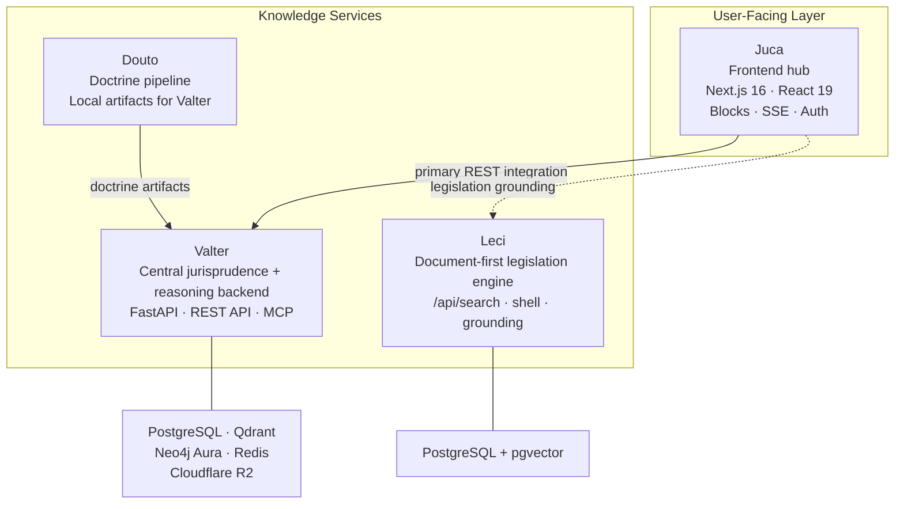

# sens.legal Ecosystem

sens.legal is a legal AI ecosystem composed of four specialized projects. Each project has a distinct responsibility, and the current architecture is organized around Juca as the frontend hub, Valter as the central jurisprudence and reasoning backend, Leci as the legislation engine, and Douto as the doctrine pipeline that feeds Valter.

## Architecture

```mermaid
graph TB
    subgraph "User-Facing Layer"
        Juca["Juca<br/>Frontend hub<br/>Next.js 16 · React 19<br/>Blocks · SSE · Auth"]
    end
    subgraph "Knowledge Services"
        Valter["Valter<br/>Central jurisprudence + reasoning backend<br/>FastAPI · REST API · MCP"]
        Leci["Leci<br/>Document-first legislation engine<br/>/api/search · shell · grounding"]
        Douto["Douto<br/>Doctrine pipeline<br/>Local artifacts for Valter"]
    end

    Juca -->|"primary REST integration"| Valter
    Juca -.->|"legislation grounding"| Leci
    Douto -->|"doctrine artifacts"| Valter

    Valter --- VDB["PostgreSQL · Qdrant<br/>Neo4j Aura · Redis<br/>Cloudflare R2"]
    Leci --- LDB["PostgreSQL + pgvector"]
```

## Juca (This Project)

| Attribute | Value |
|-----------|-------|
| **Role** | Frontend hub + lightweight orchestrator |
| **Stack** | Next.js 16, React 19, TypeScript 5, Tailwind v4 |
| **Status** | Active development — targeting v0.3 |
| **Hosting** | Railway (Docker) |

**Responsibilities:**
- Render all UI via the Block System (11 block types)
- Manage user sessions (SQLite)
- Detect user intent and route to appropriate backend agent
- Stream real-time progress via SSE
- Handle authentication (NextAuth v5 — Google OAuth + magic links)
- Generate PDF exports from briefing sessions

**Does NOT handle:**
- Jurisprudence retrieval and reasoning backend logic (centralized in Valter)
- LLM-heavy legal analysis pipelines (centralized in Valter)
- Doctrine ingestion and artifact production (handled by Douto)
- Legislative grounding infrastructure (handled by Leci)

## Valter

| Attribute | Value |
|-----------|-------|
| **Role** | Central backend for jurisprudence retrieval, reasoning, and MCP consumption |
| **Stack** | Python 3.12+, FastAPI, PostgreSQL, Qdrant, Neo4j Aura, Redis |
| **Status** | Production — and absorbing backend responsibilities from Juca |
| **URL** | `https://valter-api-production.up.railway.app` |
| **Auth** | `X-API-Key` header with scopes (read/write/admin) |
| **Repository** | Separate repo (`/Dev/Valter/`) |

**Key capabilities:**
- Graph-led retrieval over STJ jurisprudence with search as a complementary path
- Verification and anti-hallucination workflows over tribunal data
- Reasoning and explainability surfaces for REST and MCP consumers
- Central API surface used by Juca during the Juca → Valter backend migration

**Key API endpoints used by Juca:**

| Endpoint | Method | Purpose |
|----------|--------|---------|
| `/v1/retrieve` | POST | Retrieve jurisprudence through Valter's current retrieval pipeline |
| `/v1/verify` | POST | Verify citation accuracy against source documents |
| `/v1/graph/optimal-argument` | POST | Generate structured legal argument paths |
| `/v1/graph/divergencias` | GET/POST | Analyze minister/court divergences |
| `/v1/graph/temporal-evolution` | GET | Temporal trends in decision patterns |
| `/v1/similar_cases` | POST | Find similar cases based on features |
| `/v1/factual/*` | Various | Factual analysis endpoints |
| `/health` | GET | Health check (returns 200 when operational) |

## Leci

| Attribute | Value |
|-----------|-------|
| **Role** | Document-first legislation engine for reliable grounding |
| **Stack** | TypeScript, Next.js 16, Drizzle ORM, PostgreSQL + pgvector |
| **Status** | Operational baseline with search API, shell, and real-data validation |
| **Repository** | Separate repo (`/Dev/leci/`) |

**Current state:** Leci is no longer just a schema repository. Its current baseline already includes:

- `GET /api/search` for legislation retrieval
- a functional search and reading shell
- validation against real data
- a document-first model that treats legal documents as the primary grounding unit

Leci should be understood as the legislation authority of the ecosystem, serving reliable normative grounding to Valter and Juca.

## Douto

| Attribute | Value |
|-----------|-------|
| **Role** | Local doctrine pipeline and internal supplier of doctrinal artifacts to Valter |
| **Stack** | Python pipeline, markdown knowledge base, embeddings workflow |
| **Status** | Internal pipeline — not a standalone end-user product |
| **Repository** | Separate repo (`/Dev/Douto/`) |

**Current state:** Douto processes doctrine locally, generates structured artifacts, and feeds Valter's broader knowledge layer. It should not be described as an autonomous frontend or a user-facing doctrine product.

## Communication Patterns

**Current approach:** Juca communicates with Valter via direct REST API calls. The adapter layer (`src/lib/adapters/`) provides a unified interface so the orchestrator does not need to know which backend service it is calling.

**Authentication:** Valter uses API key authentication via the `X-API-Key` header. Juca stores the key in `VALTER_API_KEY` environment variable. The auth model for multi-user scenarios is a [pending decision](/roadmap/#pending-decisions).

**Service boundaries:** Valter owns the jurisprudence and reasoning surface, Leci owns legislation grounding, and Douto supplies doctrine artifacts into Valter. Juca remains the user-facing orchestration layer.

## Shared Conventions

All four projects follow these conventions:

| Convention | Value |
|-----------|-------|
| Branch naming | `feature/[issue]-[description]-[agent]` (e.g., `-claude`, `-codex`) |
| Commit format | `feat(scope):`, `fix(scope):`, `docs:`, `chore:` |
| AI agents | Claude Code (local) + Codex (cloud) — never on the same branch |
| Local builds | **Prohibited** — delegate to CI/Railway |
| Documentation | Starlight (Astro) with en-US + pt-BR |
