# sens.legal Ecosystem

sens.legal is a legal AI platform composed of three specialized projects. Each project has a distinct responsibility, and they communicate via REST APIs.

## Architecture

```mermaid
graph TB
    subgraph "Frontend Layer"
        Juca["Juca<br/>Frontend Hub<br/>Next.js 16 · React 19<br/>Block System · SSE · Auth"]
    end
    subgraph "Backend Layer"
        Valter["Valter<br/>STJ Jurisprudence Agent<br/>FastAPI · Python 3.12+<br/>23.4K decisions · 28 MCP tools"]
        Leci["Leci<br/>Federal Legislation Agent<br/>Next.js · Drizzle ORM<br/>PostgreSQL + pgvector"]
    end

    Juca -->|"X-API-Key<br/>REST API"| Valter
    Juca -.->|"Future<br/>REST API"| Leci

    Valter --- VDB["PostgreSQL · Qdrant<br/>Neo4j Aura · Redis<br/>Cloudflare R2"]
    Leci --- LDB["PostgreSQL + pgvector"]
```

## Juca (This Project)

| Attribute | Value |
|-----------|-------|
| **Role** | Frontend hub + lightweight orchestrator |
| **Stack** | Next.js 16, React 19, TypeScript 5, Tailwind v4 |
| **Status** | Active development — targeting v0.3 |
| **Hosting** | Railway (Docker) |

**Responsibilities:**
- Render all UI via the Block System (11 block types)
- Manage user sessions (SQLite)
- Detect user intent and route to appropriate backend agent
- Stream real-time progress via SSE
- Handle authentication (NextAuth v5 — Google OAuth + magic links)
- Generate PDF exports from briefing sessions

**Does NOT handle:**
- Legal document search (delegated to Valter)
- LLM processing (delegated to Valter)
- Knowledge graph queries (delegated to Valter)
- Citation verification (delegated to Valter)
- Legislation lookup (will be delegated to Leci)

## Valter

| Attribute | Value |
|-----------|-------|
| **Role** | Backend agent for STJ jurisprudence |
| **Stack** | Python 3.12+, FastAPI, PostgreSQL, Qdrant, Neo4j Aura, Redis |
| **Status** | Production — fully deployed |
| **URL** | `https://valter-api-production.up.railway.app` |
| **Auth** | `X-API-Key` header with scopes (read/write/admin) |
| **Repository** | Separate repo (`/Dev/Valter/`) |

**Key capabilities:**
- **23,400+ STJ decisions** indexed and searchable
- **28 MCP tools** across 3 categories (7 knowledge, 13 graph, 8 workflow)
- **Knowledge Graph:** 28.5K nodes, 207K edges in Neo4j Aura
- **4 runtimes:** REST API (port 8000), MCP stdio, MCP HTTP/SSE (port 8001), ARQ worker
- **Full ingest pipeline:** Download → Extract → Transform → Enrich → Index

**Key API endpoints used by Juca:**

| Endpoint | Method | Purpose |
|----------|--------|---------|
| `/v1/retrieve` | POST | Search STJ jurisprudence (hybrid: BM25 + semantic + KG) |
| `/v1/verify` | POST | Verify citation accuracy against source documents |
| `/v1/graph/optimal-argument` | POST | Generate optimal legal arguments (for/against) |
| `/v1/graph/divergencias` | GET/POST | Analyze minister/court divergences |
| `/v1/graph/temporal-evolution` | GET | Temporal trends in decision patterns |
| `/v1/similar_cases` | POST | Find similar cases based on features |
| `/v1/factual/*` | Various | Factual analysis endpoints |
| `/health` | GET | Health check (returns 200 when operational) |

## Leci

| Attribute | Value |
|-----------|-------|
| **Role** | Backend agent for federal legislation |
| **Stack** | TypeScript, Next.js 16, Drizzle ORM, PostgreSQL + pgvector |
| **Status** | v0.1-pre — DB schema only, no API routes |
| **Repository** | Separate repo (`/Dev/leci/`) |

**Current state:** Leci has a database schema with 6 tables but no API surface yet:

| Table | Purpose |
|-------|---------|
| `regulation_types` | Types of legal regulations |
| `regulations` | Regulation metadata |
| `document_nodes` | Structural nodes of legal documents |
| `embeddings` | Vector embeddings for semantic search |
| `suggestions` | AI-generated suggestions |
| `revisions` | Revision history (the only sanctioned way to mutate legal text) |

**Key design principle:** `apply_revision()` is the only function that can modify legal text, ensuring a complete audit trail.

**Integration timeline:** Planned for Juca v0.6+, contingent on Leci developing its REST API.

## Communication Patterns

**Current approach:** Juca communicates with Valter via direct REST API calls. The adapter layer (`src/lib/adapters/`) provides a unified interface so the orchestrator doesn't need to know which backend agent it's calling.

**Authentication:** Valter uses API key authentication via the `X-API-Key` header. Juca stores the key in `VALTER_API_KEY` environment variable. The auth model for multi-user scenarios is a [pending decision](/roadmap/#pending-decisions).

> 🚧 **Planned Feature** — MCP (Model Context Protocol) integration is planned for richer tool interaction between Juca and backend agents. Valter already supports MCP with 28 tools.

## Shared Conventions

All three projects follow these conventions:

| Convention | Value |
|-----------|-------|
| Branch naming | `feature/[issue]-[description]-[agent]` (e.g., `-claude`, `-codex`) |
| Commit format | `feat(scope):`, `fix(scope):`, `docs:`, `chore:` |
| AI agents | Claude Code (local) + Codex (cloud) — never on the same branch |
| Local builds | **Prohibited** — delegate to CI/Railway |
| Documentation | Starlight (Astro) with en-US + pt-BR |
