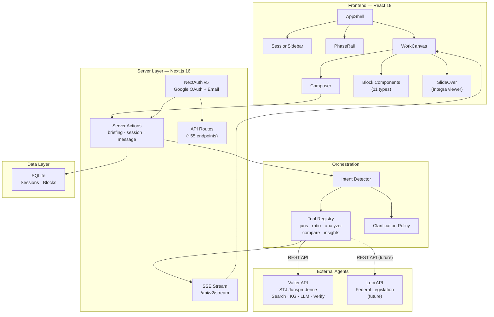

# Architecture Overview

Juca follows a **hub architecture** — a thin frontend with a lightweight orchestrator that delegates backend intelligence to external agents. The UI is composed entirely of typed Blocks rendered in a WorkCanvas.

## Architectural Model

Juca is built on five key patterns:

| Pattern | Implementation | Purpose |
|---------|---------------|---------|
| **Server Components + Server Actions** | Next.js 16 App Router | Data fetching and mutations without client-side state management |
| **Block System** | 11 typed blocks, factory functions | Uniform UI composition — every piece of content is a Block |
| **Tool Registry** | `src/lib/unified/tools/` | Routes user intents to specialized handler functions |
| **Adapter Pattern** | `src/lib/adapters/` (planned) | Unified interface for calling any backend agent (Valter, Leci, future) |
| **Feature Flags** | `src/lib/featureFlags.ts` | Progressive rollout of features via URL params or localStorage |

The pre-pivot architecture was a fullstack monolith where Juca contained its own search engine, LLM pipeline, knowledge graph, and validation logic. That backend is being migrated to the Valter API, leaving Juca as a lean frontend hub.

## System Architecture



## Entry Points

Juca has six entry points into the application:

| Entry Point | Location | Purpose |
|-------------|----------|---------|
| **Web App** | `src/app/page.tsx` | Server Component that loads sessions and renders `AppClient` |
| **API Routes** | `src/app/api/*/route.ts` | ~55 REST endpoints (many transitional, moving to Valter) |
| **SSE Stream** | `src/app/api/v2/stream/route.ts` | Real-time progress streaming via Server-Sent Events |
| **Server Actions** | `src/actions/` | Briefing, session, message, and recalculate mutations |
| **Instrumentation** | `src/instrumentation.ts` | Pre-warms caches (KG, Corpus, BM25) + OTel setup on startup |
| **Docker** | `scripts/entrypoint.sh` | Container bootstrap for Railway deployment |

## Data Flow

A typical user interaction follows this path:

```text
User types query in Composer
  → Server Action receives input
    → Intent Detector classifies the query
      → Tool Registry selects handler (e.g., JurisTool, AnalyzerTool)
        → Tool calls Valter REST API (/v1/retrieve, /v1/verify, etc.)
        → Response transformed by Block Factory
          → createDiagnosisData(), createPrecedentData(), etc.
        → Blocks persisted to SQLite via getBlocksDB().addBlock()
      → SSE streams block events to client
    → WorkCanvas renders new blocks in real-time
```

## Responsibility Matrix

With the hub pivot, responsibilities are clearly split:

| Concern | Owner | Notes |
|---------|-------|-------|
| UI rendering | **Juca** (React 19) | Block System, WorkCanvas, Composer |
| Session persistence | **Juca** (SQLite) | Sessions, blocks, user preferences. Will migrate to Postgres. |
| Orchestration | **Juca** (lightweight) | Intent Detection, Tool Registry, Clarification Policy |
| SSE streaming | **Juca** | Real-time progress via `/api/v2/stream` |
| Authentication | **Juca** | NextAuth v5 (Google OAuth + magic links) |
| Legal search | **Valter** | `/v1/retrieve`, `/v1/similar_cases` |
| LLM processing | **Valter** | Multi-model Generate → Criticize → Revise pipeline |
| Knowledge Graph | **Valter** | `/v1/graph/*` (Neo4j Aura, 28.5K nodes, 207K edges) |
| Citation verification | **Valter** | `/v1/verify` |
| Federal legislation | **Leci** (future) | Not yet available — DB schema only |

## Key Decisions

The architecture reflects several deliberate decisions. See [Architecture Decision Records](/architecture/decisions) for full context:

| Decision | Choice | Rationale |
|----------|--------|-----------|
| Frontend hub over monolith | Hub + external agents | Avoid duplicating Valter's capabilities in Juca |
| Block System over panels | 11 typed blocks | Uniform composition, easier to test, works with SSE |
| SQLite over Postgres | SQLite for now | Zero-config for single-dev; migrate at v0.6+ |
| Server Actions over API calls | Next.js Server Actions | Fewer network hops, built-in auth, TypeScript end-to-end |
| Tailwind v4 CSS-first | Design tokens in `globals.css` | Aligns with Tailwind v4 best practices |
