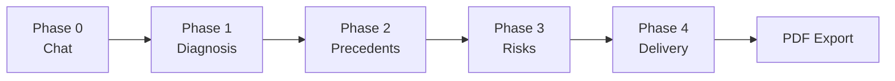

# Briefing Progressivo

The Briefing Progressivo is Juca's signature feature — a 4-phase progressive disclosure system that transforms raw legal analysis into structured, interactive deliverables. Instead of dumping all results at once, each phase reveals a deeper layer of analysis, building on the user's input and selections.

## Design Philosophy

Three principles guide the Briefing:

1. **Progressive disclosure** — Reveal complexity gradually, not all at once
2. **No mandatory interaction** — Each phase produces standalone value; the user can stop at any point
3. **Incremental implementation** — Build one phase at a time, test until stable, then proceed

## Phase Overview



| Phase | Name | Block Types | Valter Endpoints | Status |
|-------|------|------------|-----------------|--------|
| 0 | Chat | `message` | — | ✅ Implemented |
| 1 | [Diagnosis](/features/briefing/phase-1-diagnosis) | `diagnosis`, `action_prompt` | `/v1/retrieve` (context) | 🔨 In Progress |
| 2 | [Precedents](/features/briefing/phase-2-precedents) | `precedent`, `precedent_picker` | `/v1/retrieve`, `/v1/similar_cases` | 📋 Planned |
| 3 | [Risks](/features/briefing/phase-3-risks) | `risk_balance`, `chart` | `/v1/graph/optimal-argument`, `/v1/graph/divergencias` | 📋 Planned |
| 4 | [Delivery](/features/briefing/phase-4-delivery) | `delivery`, `exit_card` | Aggregation of all phases | 📋 Planned |

## Implementation Architecture

### Server Actions

All briefing state transitions are managed by server actions in `src/actions/briefing.ts`:

| Phase | Action | Purpose |
|-------|--------|---------|
| 1 | `updateDiagnosis(sessionId, fields)` | Update diagnosis card fields |
| 1 | `chooseSituation(sessionId, situation)` | Select user situation → determines delivery mode |
| 1 | `addAdditionalContext(sessionId, text)` | Append context information |
| 2 | `evaluatePrecedent(sessionId, processoId, evaluation)` | Rate a precedent (useful/not) |
| 3 | `resolveRisk(sessionId, riskId)` | Mark a risk as resolved |
| 3 | `advanceToPhase3(sessionId)` | Transition from P2 → P3 |
| 4 | `generateDelivery(sessionId)` | Generate the final deliverable |
| 4 | `choosePath(sessionId, pathId)` | Select a strategic path |
| 4 | `setFaseProcessual(sessionId, fase)` | Set procedural stage |
| 4 | `finalizeSession(sessionId)` | Complete the session |
| 4 | `handleExitAction(sessionId, action)` | Handle exit card actions |

### State Management

Briefing state is stored as JSON in the session's `metadata` field. The `loadBriefingState()` helper loads or initializes the state:

```typescript
// State is loaded per-session, not globally
const state = await loadBriefingState(sessionId);
// Returns BriefingFlowState with: phase, situation, diagnosis, precedentEvaluations, risks, etc.
```

### PhaseRail Component

The `PhaseRail` (`src/components/shell/PhaseRail.tsx`) is a vertical navigation rail showing:

- Current active phase (highlighted)
- Completed phases (clickable for navigation)
- Future phases (dimmed)

It sits alongside the WorkCanvas in the AppShell layout.

## Situation-to-Delivery Mapping

The user's situation, selected in Phase 1, determines which delivery mode Phase 4 produces:

| Situation (Phase 1) | Delivery Mode (Phase 4) | Content |
|---------------------|------------------------|---------|
| `pesquisando` (researching) | Síntese (Synthesis) | Concise summary of favorable/unfavorable precedents |
| `avaliando` (evaluating) | Parecer (Opinion) | Formal legal opinion with favorability percentage |
| `atuando` (acting) | Estratégia (Strategy) | 2-3 strategic paths with actionable steps |
| `estudando` (studying) | Mapa (Map) | Temporal evolution + divergent currents |

## PDF Integration

After Phase 4, users can export the entire briefing as a PDF. The PDF reflects selections made across all four phases. See [PDF Export](/features/pdf-export) for details.
