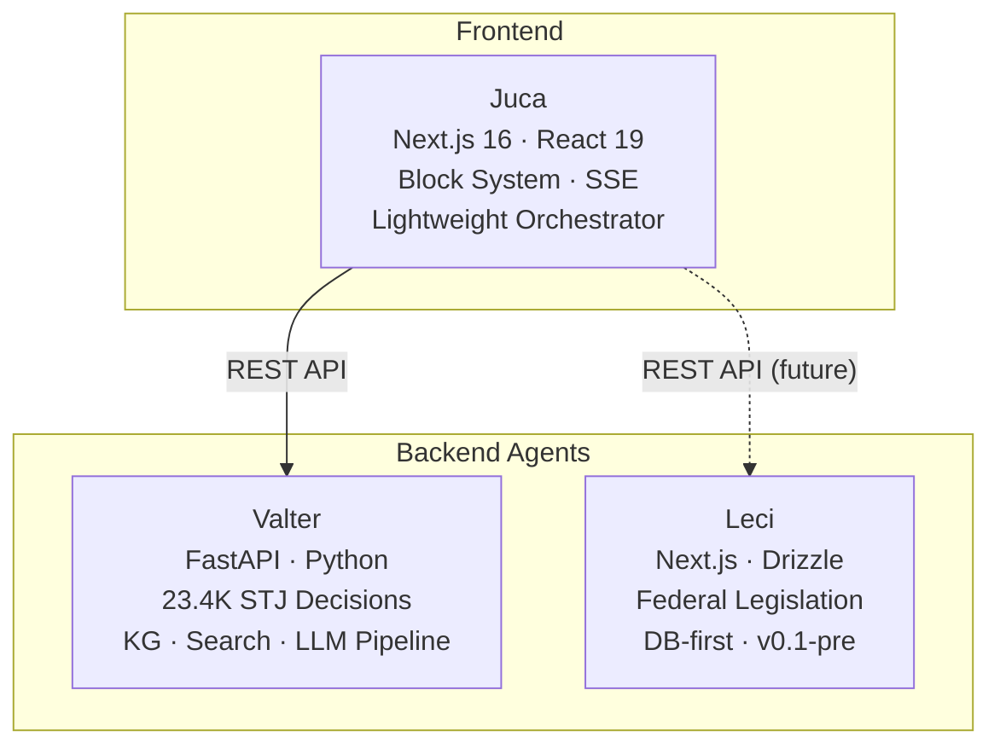

# Juca

Juca is the frontend hub for the **sens.legal** ecosystem — a conversational interface that orchestrates specialized legal AI agents for Brazilian legal research.

Built with Next.js 16 and React 19, Juca provides a Fintool/Perplexity-style interface where lawyers interact with a unified Composer, and the system routes their queries to the right backend agent. Results are rendered as structured **Blocks** — typed UI cards that present diagnoses, precedents, risk analyses, and strategic recommendations.

## Key Capabilities

Juca's core value is **progressive disclosure of legal analysis** through the Briefing Progressivo system:

- **[Block System](/features/block-system)** — 11 typed UI blocks that render structured legal content (diagnoses, precedents, risk balances, deliveries)
- **[Briefing Progressivo](/features/briefing/)** — 4-phase progressive disclosure: Diagnosis → Precedents → Risks → Delivery
- **[Valter Integration](/api/valter-adapter)** — Consumes the Valter REST API for STJ jurisprudence search, citation verification, and knowledge graph analysis
- **[Session Management](/features/session-management)** — Persistent sessions with SQLite, navigable via sidebar
- **[PDF Export](/features/pdf-export)** — Generate PDF documents from briefing sessions
- **[Real-time Streaming](/features/composer)** — SSE-based progress streaming during analysis

## The sens.legal Ecosystem

Juca does not work alone. It is the user-facing layer of a three-project ecosystem:

See [Architecture → Ecosystem](/architecture/ecosystem) for details on each project.

## Quick Links

| I want to... | Go to |
|---|---|
| Run Juca locally in 5 minutes | [Quickstart](/getting-started/quickstart) |
| Understand the architecture | [Architecture Overview](/architecture/overview) |
| Learn about the Block System | [Block System](/features/block-system) |
| See the product roadmap | [Roadmap](/roadmap/) |
| Configure environment variables | [Environment](/configuration/environment) |
| Write or run tests | [Testing Guide](/development/testing) |

## Project Status

Juca is currently targeting **v0.3 — "Hub Foundation"**: transforming from a fullstack monolith into a lightweight frontend hub connected to the Valter backend agent. See the [Roadmap](/roadmap/) for milestone details.
