# Diagramas de Arquitetura

Todos os diagramas usam sintaxe Mermaid e renderizam nativamente no Starlight. Cada diagrama foca em um aspecto do sistema.

## Visão Geral do Ecossistema

O ecossistema sens.legal com seus três projetos:

```mermaid
graph LR
    subgraph "Voltado ao Usuário"
        Juca["🖥️ Juca<br/>Hub Frontend<br/>Next.js 16 · React 19"]
    end
    subgraph "Agentes Backend"
        Valter["⚖️ Valter<br/>Jurisprudência STJ<br/>FastAPI · 23.4K decisões"]
        Leci["📜 Leci<br/>Legislação Federal<br/>Next.js · Drizzle"]
    end
    subgraph "Infraestrutura"
        Railway["Railway<br/>(hospedagem)"]
        Neo4j["Neo4j Aura<br/>(KG)"]
        Qdrant["Qdrant<br/>(vetores)"]
        PG["PostgreSQL"]
        Redis["Redis<br/>(cache)"]
    end

    Juca -->|"/v1/retrieve<br/>/v1/verify<br/>/v1/graph/*"| Valter
    Juca -.->|"futuro"| Leci
    Valter --> Neo4j
    Valter --> Qdrant
    Valter --> PG
    Valter --> Redis
    Leci -.-> PG
    Juca --> Railway
    Valter --> Railway
```

## Ciclo de Vida de uma Consulta

O que acontece quando um usuário envia uma consulta:

```mermaid
sequenceDiagram
    participant U as Usuário
    participant C as Composer
    participant SA as Server Action
    participant ID as Detector de Intenção
    participant TR as Tool Registry
    participant V as Valter API
    participant BF as Block Factory
    participant DB as SQLite
    participant SSE as SSE Stream
    participant WC as WorkCanvas

    U->>C: Digita consulta jurídica
    C->>SA: Envia via Server Action
    SA->>ID: Classifica intenção
    ID->>TR: Direciona para tool (ex.: JurisTool)
    TR->>V: POST /v1/retrieve
    V-->>TR: Resultados da busca
    TR->>BF: Transforma em blocks
    BF->>DB: Persiste blocks
    BF->>SSE: Transmite eventos de block
    SSE-->>WC: Renderização em tempo real
    WC-->>U: Vê resultados estruturados
```

## Fluxo do Briefing Progressivo

O sistema de divulgação progressiva em 4 fases:

## Hierarquia de Tipos do Block System

Os 11 tipos de block e qual fase do briefing os produz:

## Arquitetura de Deploy

```mermaid
graph LR
    Dev["Desenvolvedor"]
    GH["GitHub"]
    CI["GitHub Actions<br/>lint + build + testes"]
    Rail["Railway<br/>Deploy Docker"]
    Prod["Produção<br/>juca no Railway"]
    VProd["Valter API<br/>Railway"]

    Dev -->|"git push"| GH
    GH -->|"no push/PR"| CI
    GH -->|"no merge para main"| Rail
    Rail --> Prod
    Prod -->|"REST API"| VProd
```

## Prioridade do Tool Registry

Como o orquestrador seleciona qual tool trata uma consulta:

```mermaid
graph LR
    Query["Consulta do Usuário"] --> ID["Detector de Intenção"]
    ID --> TR["Tool Registry"]
    TR --> A["AnalyzerTool<br/>prioridade: 9"]
    TR --> J["JurisTool<br/>prioridade: 8"]
    TR --> R["RatioTool<br/>prioridade: 7"]
    TR --> C["CompareTool<br/>prioridade: 5"]
    TR --> I["InsightsTool<br/>prioridade: 4"]

    style A fill:#ff6b6b,color:#fff
    style J fill:#ffa94d,color:#fff
    style R fill:#ffd43b,color:#333
    style C fill:#69db7c,color:#333
    style I fill:#74c0fc,color:#333
```

