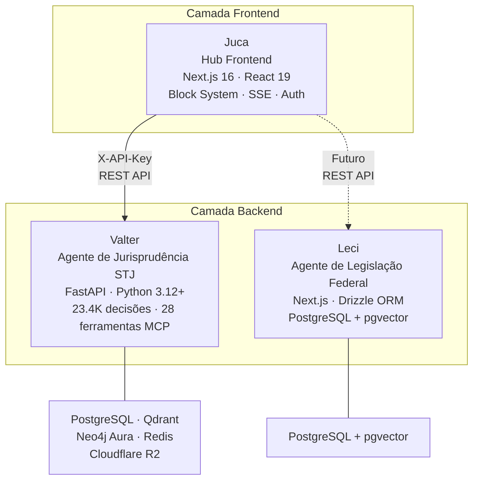

# Ecossistema sens.legal

O sens.legal é uma plataforma de IA jurídica composta por três projetos especializados. Cada projeto tem uma responsabilidade distinta e eles se comunicam via APIs REST.

## Arquitetura

## Juca (Este Projeto)

| Atributo | Valor |
|----------|-------|
| **Papel** | Hub frontend + orquestrador leve |
| **Stack** | Next.js 16, React 19, TypeScript 5, Tailwind v4 |
| **Status** | Desenvolvimento ativo — targetando v0.3 |
| **Hospedagem** | Railway (Docker) |

**Responsabilidades:**
- Renderizar toda a UI via Block System (11 tipos de block)
- Gerenciar sessões de usuário (SQLite)
- Detectar intenção do usuário e direcionar para o agente backend adequado
- Transmitir progresso em tempo real via SSE
- Gerenciar autenticação (NextAuth v5 — Google OAuth + magic links)
- Gerar exportações de PDF a partir de sessões de briefing

**Não trata:**
- Busca de documentos jurídicos (delegado ao Valter)
- Processamento LLM (delegado ao Valter)
- Consultas ao grafo de conhecimento (delegado ao Valter)
- Verificação de citações (delegado ao Valter)
- Consulta de legislação (será delegado ao Leci)

## Valter

| Atributo | Valor |
|----------|-------|
| **Papel** | Agente backend para jurisprudência do STJ |
| **Stack** | Python 3.12+, FastAPI, PostgreSQL, Qdrant, Neo4j Aura, Redis |
| **Status** | Produção — totalmente deployado |
| **URL** | `https://valter-api-production.up.railway.app` |
| **Auth** | Header `X-API-Key` com escopos (read/write/admin) |
| **Repositório** | Repositório separado (`/Dev/Valter/`) |

**Capacidades principais:**
- **23.400+ decisões do STJ** indexadas e pesquisáveis
- **28 ferramentas MCP** em 3 categorias (7 knowledge, 13 graph, 8 workflow)
- **Grafo de Conhecimento:** 28,5K nós, 207K arestas no Neo4j Aura
- **4 runtimes:** REST API (porta 8000), MCP stdio, MCP HTTP/SSE (porta 8001), worker ARQ
- **Pipeline de ingestão completo:** Download → Extração → Transformação → Enriquecimento → Indexação

**Principais endpoints de API usados pelo Juca:**

| Endpoint | Método | Finalidade |
|----------|--------|------------|
| `/v1/retrieve` | POST | Busca jurisprudência do STJ (híbrida: BM25 + semântica + KG) |
| `/v1/verify` | POST | Verifica precisão de citações contra documentos fonte |
| `/v1/graph/optimal-argument` | POST | Gera argumentos jurídicos ótimos (a favor/contra) |
| `/v1/graph/divergencias` | GET/POST | Analisa divergências entre ministros/turmas |
| `/v1/graph/temporal-evolution` | GET | Tendências temporais em padrões de decisão |
| `/v1/similar_cases` | POST | Encontra casos similares baseado em características |
| `/v1/factual/*` | Variados | Endpoints de análise factual |
| `/health` | GET | Health check (retorna 200 quando operacional) |

## Leci

| Atributo | Valor |
|----------|-------|
| **Papel** | Agente backend para legislação federal |
| **Stack** | TypeScript, Next.js 16, Drizzle ORM, PostgreSQL + pgvector |
| **Status** | v0.1-pre — apenas schema do banco, sem rotas de API |
| **Repositório** | Repositório separado (`/Dev/leci/`) |

**Estado atual:** O Leci possui um schema de banco com 6 tabelas mas ainda sem superfície de API:

| Tabela | Finalidade |
|--------|------------|
| `regulation_types` | Tipos de normas jurídicas |
| `regulations` | Metadados das normas |
| `document_nodes` | Nós estruturais dos documentos jurídicos |
| `embeddings` | Embeddings vetoriais para busca semântica |
| `suggestions` | Sugestões geradas por IA |
| `revisions` | Histórico de revisões (a única forma sancionada de mutar texto jurídico) |

**Princípio de design chave:** `apply_revision()` é a única função que pode modificar texto jurídico, garantindo uma trilha de auditoria completa.

**Cronograma de integração:** Planejado para o Juca v0.6+, condicionado ao desenvolvimento da REST API do Leci.

## Padrões de Comunicação

**Abordagem atual:** O Juca se comunica com o Valter via chamadas diretas à REST API. A camada de adapter (`src/lib/adapters/`) fornece uma interface unificada para que o orquestrador não precise saber qual agente backend está chamando.

**Autenticação:** O Valter usa autenticação por chave de API via header `X-API-Key`. O Juca armazena a chave na variável de ambiente `VALTER_API_KEY`. O modelo de autenticação para cenários multi-usuário é uma [decisão pendente](/roadmap/#pending-decisions).

> 🚧 **Funcionalidade Planejada** — A integração com MCP (Model Context Protocol) está planejada para interação mais rica entre o Juca e os agentes backend. O Valter já suporta MCP com 28 ferramentas.

## Convenções Compartilhadas

Os três projetos seguem estas convenções:

| Convenção | Valor |
|-----------|-------|
| Nomenclatura de branch | `feature/[issue]-[descrição]-[agente]` (ex.: `-claude`, `-codex`) |
| Formato de commit | `feat(scope):`, `fix(scope):`, `docs:`, `chore:` |
| Agentes de IA | Claude Code (local) + Codex (nuvem) — nunca na mesma branch |
| Builds locais | **Proibidos** — delegar ao CI/Railway |
| Documentação | Starlight (Astro) com en-US + pt-BR |
