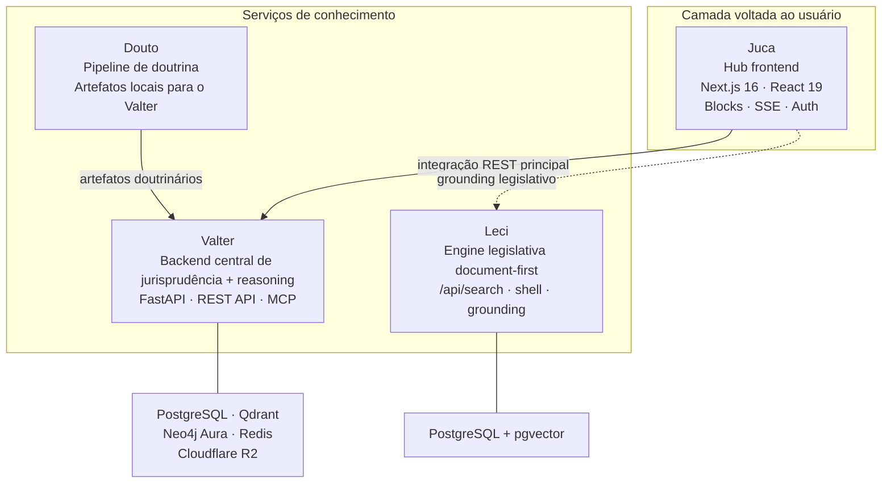

# Ecossistema sens.legal

O sens.legal é um ecossistema de IA jurídica composto por quatro projetos especializados. A arquitetura atual se organiza com o Juca como hub frontend, o Valter como backend central de jurisprudência e reasoning, o Leci como engine legislativa e o Douto como pipeline de doutrina que alimenta o Valter.

## Arquitetura

```mermaid
graph TB
    subgraph "Camada voltada ao usuário"
        Juca["Juca<br/>Hub frontend<br/>Next.js 16 · React 19<br/>Blocks · SSE · Auth"]
    end
    subgraph "Serviços de conhecimento"
        Valter["Valter<br/>Backend central de jurisprudência + reasoning<br/>FastAPI · REST API · MCP"]
        Leci["Leci<br/>Engine legislativa document-first<br/>/api/search · shell · grounding"]
        Douto["Douto<br/>Pipeline de doutrina<br/>Artefatos locais para o Valter"]
    end

    Juca -->|"integração REST principal"| Valter
    Juca -.->|"grounding legislativo"| Leci
    Douto -->|"artefatos doutrinários"| Valter

    Valter --- VDB["PostgreSQL · Qdrant<br/>Neo4j Aura · Redis<br/>Cloudflare R2"]
    Leci --- LDB["PostgreSQL + pgvector"]
```

## Juca (Este Projeto)

| Atributo | Valor |
|----------|-------|
| **Papel** | Hub frontend + orquestrador leve |
| **Stack** | Next.js 16, React 19, TypeScript 5, Tailwind v4 |
| **Status** | Desenvolvimento ativo — targetando v0.3 |
| **Hospedagem** | Railway (Docker) |

**Responsabilidades:**
- Renderizar toda a UI via Block System (11 tipos de block)
- Gerenciar sessões de usuário (SQLite)
- Detectar intenção do usuário e direcionar para o agente backend adequado
- Transmitir progresso em tempo real via SSE
- Gerenciar autenticação (NextAuth v5 — Google OAuth + magic links)
- Gerar exportações de PDF a partir de sessões de briefing

**Não trata:**
- Lógica de backend de jurisprudência e reasoning (centralizada no Valter)
- Pipelines pesados com LLM (centralizados no Valter)
- Produção de artefatos de doutrina (feita pelo Douto)
- Infraestrutura de grounding legislativo (feita pelo Leci)

## Valter

| Atributo | Valor |
|----------|-------|
| **Papel** | Backend central para retrieval de jurisprudência, reasoning e consumo via MCP |
| **Stack** | Python 3.12+, FastAPI, PostgreSQL, Qdrant, Neo4j Aura, Redis |
| **Status** | Produção — e absorvendo responsabilidades de backend do Juca |
| **URL** | `https://valter-api-production.up.railway.app` |
| **Auth** | Header `X-API-Key` com escopos (read/write/admin) |
| **Repositório** | Repositório separado (`/Dev/Valter/`) |

**Capacidades principais:**
- Retrieval graph-led sobre jurisprudência do STJ, com search como caminho complementar
- Verificação e anti-alucinação sobre dados reais do tribunal
- Superfícies de reasoning e explicabilidade para consumidores REST e MCP
- API central usada pelo Juca durante a migração Juca → Valter

**Principais endpoints de API usados pelo Juca:**

| Endpoint | Método | Finalidade |
|----------|--------|------------|
| `/v1/retrieve` | POST | Recupera jurisprudência pelo pipeline atual do Valter |
| `/v1/verify` | POST | Verifica precisão de citações contra documentos fonte |
| `/v1/graph/optimal-argument` | POST | Gera caminhos estruturados de argumentação jurídica |
| `/v1/graph/divergencias` | GET/POST | Analisa divergências entre ministros/turmas |
| `/v1/graph/temporal-evolution` | GET | Tendências temporais em padrões de decisão |
| `/v1/similar_cases` | POST | Encontra casos similares baseado em características |
| `/v1/factual/*` | Variados | Endpoints de análise factual |
| `/health` | GET | Health check (retorna 200 quando operacional) |

## Leci

| Atributo | Valor |
|----------|-------|
| **Papel** | Engine legislativa document-first para grounding confiável |
| **Stack** | TypeScript, Next.js 16, Drizzle ORM, PostgreSQL + pgvector |
| **Status** | Baseline operacional com API de busca, shell e validação com dados reais |
| **Repositório** | Repositório separado (`/Dev/leci/`) |

**Estado atual:** O Leci já não é apenas um schema. O baseline atual inclui:

- `GET /api/search` para recuperação legislativa
- shell funcional de busca e leitura
- validação com dados reais
- modelo document-first em que o documento legal é a unidade primária de grounding

O Leci deve ser entendido como a autoridade legislativa do ecossistema, servindo grounding normativo confiável para Valter e Juca.

## Douto

| Atributo | Valor |
|----------|-------|
| **Papel** | Pipeline local de doutrina e fornecedor interno de artefatos doutrinários para o Valter |
| **Stack** | Pipeline Python, base markdown, workflow de embeddings |
| **Status** | Pipeline interno — não é produto autônomo para usuário final |
| **Repositório** | Repositório separado (`/Dev/Douto/`) |

**Estado atual:** O Douto processa doutrina localmente, gera artefatos estruturados e alimenta a camada de conhecimento do Valter. Ele não deve ser descrito como frontend próprio nem como produto final autônomo.

## Padrões de Comunicação

**Abordagem atual:** O Juca se comunica com o Valter via chamadas diretas à REST API. A camada de adapter (`src/lib/adapters/`) fornece uma interface unificada para que o orquestrador não precise saber qual serviço backend está chamando.

**Autenticação:** O Valter usa autenticação por chave de API via header `X-API-Key`. O Juca armazena a chave na variável de ambiente `VALTER_API_KEY`. O modelo de autenticação para cenários multi-usuário é uma [decisão pendente](/pt-br/roadmap/#pending-decisions).

**Fronteiras de serviço:** o Valter é dono da superfície de jurisprudência e reasoning, o Leci é dono do grounding legislativo e o Douto fornece artefatos de doutrina para dentro do Valter. O Juca permanece como camada de orquestração voltada ao usuário.

## Convenções Compartilhadas

Os quatro projetos seguem estas convenções:

| Convenção | Valor |
|-----------|-------|
| Nomenclatura de branch | `feature/[issue]-[descrição]-[agente]` (ex.: `-claude`, `-codex`) |
| Formato de commit | `feat(scope):`, `fix(scope):`, `docs:`, `chore:` |
| Agentes de IA | Claude Code (local) + Codex (nuvem) — nunca na mesma branch |
| Builds locais | **Proibidos** — delegar ao CI/Railway |
| Documentação | Starlight (Astro) com en-US + pt-BR |
