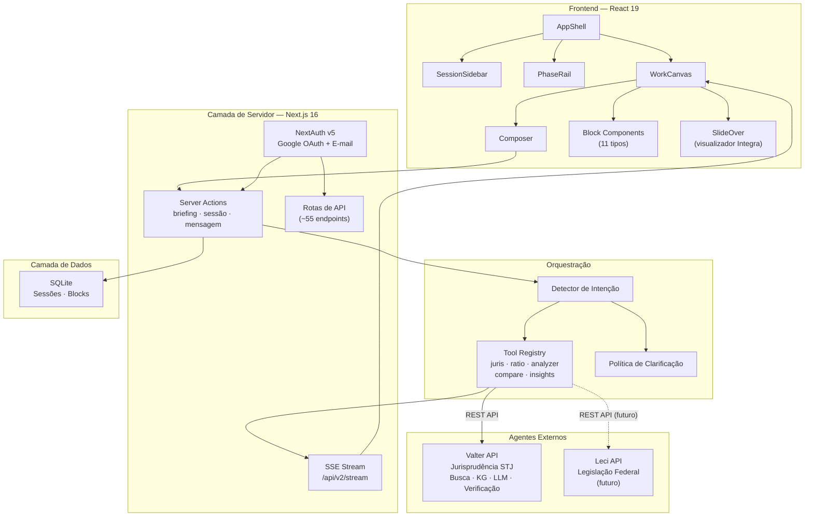

# Visão Geral da Arquitetura

O Juca segue uma **arquitetura de hub** — um frontend enxuto com um orquestrador leve que delega a inteligência de backend a agentes externos. A interface é composta inteiramente de Blocks tipados renderizados em um WorkCanvas.

## Modelo Arquitetural

O Juca é construído sobre cinco padrões principais:

| Padrão | Implementação | Finalidade |
|--------|---------------|------------|
| **Server Components + Server Actions** | Next.js 16 App Router | Busca de dados e mutações sem gerenciamento de estado no cliente |
| **Block System** | 11 tipos de block, funções factory | Composição uniforme de UI — todo conteúdo é um Block |
| **Tool Registry** | `src/lib/unified/tools/` | Direciona intenções do usuário para funções handler especializadas |
| **Adapter Pattern** | `src/lib/adapters/` (planejado) | Interface unificada para chamar qualquer agente backend (Valter, Leci, futuros) |
| **Feature Flags** | `src/lib/featureFlags.ts` | Rollout progressivo de funcionalidades via parâmetros de URL ou localStorage |

A arquitetura pré-pivô era um monolito fullstack onde o Juca continha seu próprio motor de busca, pipeline de LLM, grafo de conhecimento e lógica de validação. Esse backend está sendo migrado para a API Valter, deixando o Juca como um hub frontend enxuto.

## Arquitetura do Sistema



## Pontos de Entrada

O Juca possui seis pontos de entrada na aplicação:

| Ponto de Entrada | Localização | Finalidade |
|------------------|-------------|------------|
| **Web App** | `src/app/page.tsx` | Server Component que carrega sessões e renderiza `AppClient` |
| **Rotas de API** | `src/app/api/*/route.ts` | ~55 endpoints REST (muitos transitórios, migrando para o Valter) |
| **SSE Stream** | `src/app/api/v2/stream/route.ts` | Streaming de progresso em tempo real via Server-Sent Events |
| **Server Actions** | `src/actions/` | Mutações de briefing, sessão, mensagem e recalculação |
| **Instrumentação** | `src/instrumentation.ts` | Pré-aquece caches (KG, Corpus, BM25) + configuração de OTel na inicialização |
| **Docker** | `scripts/entrypoint.sh` | Bootstrap do container para deploy no Railway |

## Fluxo de Dados

Uma interação típica de usuário segue este caminho:

```text
Usuário digita consulta no Composer
  → Server Action recebe o input
    → Detector de Intenção classifica a consulta
      → Tool Registry seleciona o handler (ex.: JurisTool, AnalyzerTool)
        → Tool chama a REST API do Valter (/v1/retrieve, /v1/verify, etc.)
        → Resposta transformada pelo Block Factory
          → createDiagnosisData(), createPrecedentData(), etc.
        → Blocks persistidos no SQLite via getBlocksDB().addBlock()
      → SSE transmite eventos de block para o cliente
    → WorkCanvas renderiza os novos blocks em tempo real
```

## Matriz de Responsabilidades

Com o pivô para hub, as responsabilidades ficam claramente divididas:

| Responsabilidade | Dono | Observações |
|------------------|------|-------------|
| Renderização de UI | **Juca** (React 19) | Block System, WorkCanvas, Composer |
| Persistência de sessão | **Juca** (SQLite) | Sessões, blocks, preferências do usuário. Migrará para Postgres. |
| Orquestração | **Juca** (leve) | Detecção de Intenção, Tool Registry, Política de Clarificação |
| SSE streaming | **Juca** | Progresso em tempo real via `/api/v2/stream` |
| Autenticação | **Juca** | NextAuth v5 (Google OAuth + magic links) |
| Busca jurídica | **Valter** | `/v1/retrieve`, `/v1/similar_cases` |
| Processamento LLM | **Valter** | Pipeline multi-modelo Gerar → Criticar → Revisar |
| Grafo de Conhecimento | **Valter** | `/v1/graph/*` (Neo4j Aura, 28,5K nós, 207K arestas) |
| Verificação de citações | **Valter** | `/v1/verify` |
| Legislação federal | **Leci** (futuro) | Ainda não disponível — apenas schema do banco |

## Decisões Principais

A arquitetura reflete várias decisões deliberadas. Veja os [Architecture Decision Records](/architecture/decisions) para contexto completo:

| Decisão | Escolha | Justificativa |
|---------|---------|---------------|
| Hub frontend em vez de monolito | Hub + agentes externos | Evitar duplicar as capacidades do Valter no Juca |
| Block System em vez de painéis | 11 blocks tipados | Composição uniforme, mais fácil de testar, funciona com SSE |
| SQLite em vez de Postgres | SQLite por enquanto | Zero configuração para dev solo; migrar na v0.6+ |
| Server Actions em vez de chamadas de API | Next.js Server Actions | Menos saltos de rede, auth integrado, TypeScript end-to-end |
| Tailwind v4 CSS-first | Design tokens em `globals.css` | Alinhado com as boas práticas do Tailwind v4 |
