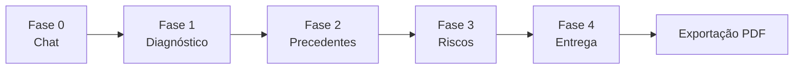

# Briefing Progressivo

O Briefing Progressivo é a funcionalidade principal do Juca — um sistema de divulgação progressiva em 4 fases que transforma análises jurídicas brutas em entregáveis estruturados e interativos. Em vez de apresentar todos os resultados de uma vez, cada fase revela uma camada mais profunda de análise, construindo sobre os dados e seleções do usuário.

## Filosofia de Design

Três princípios guiam o Briefing:

1. **Divulgação progressiva** — Revelar a complexidade de forma gradual, não de uma vez
2. **Sem interação obrigatória** — Cada fase produz valor de forma independente; o usuário pode parar a qualquer momento
3. **Implementação incremental** — Construir uma fase por vez, testar até estabilizar e então avançar

## Visão Geral das Fases



| Fase | Nome | Tipos de Bloco | Endpoints do Valter | Status |
|------|------|----------------|---------------------|--------|
| 0 | Chat | `message` | — | ✅ Implementado |
| 1 | [Diagnóstico](/features/briefing/phase-1-diagnosis) | `diagnosis`, `action_prompt` | `/v1/retrieve` (contexto) | 🔨 Em Progresso |
| 2 | [Precedentes](/features/briefing/phase-2-precedents) | `precedent`, `precedent_picker` | `/v1/retrieve`, `/v1/similar_cases` | 📋 Planejado |
| 3 | [Riscos](/features/briefing/phase-3-risks) | `risk_balance`, `chart` | `/v1/graph/optimal-argument`, `/v1/graph/divergencias` | 📋 Planejado |
| 4 | [Entrega](/features/briefing/phase-4-delivery) | `delivery`, `exit_card` | Agregação de todas as fases | 📋 Planejado |

## Arquitetura de Implementação

### Server Actions

Todas as transições de estado do Briefing são gerenciadas por server actions em `src/actions/briefing.ts`:

| Fase | Action | Propósito |
|------|--------|-----------|
| 1 | `updateDiagnosis(sessionId, fields)` | Atualizar campos do card de diagnóstico |
| 1 | `chooseSituation(sessionId, situation)` | Selecionar situação do usuário → determina o modo de entrega |
| 1 | `addAdditionalContext(sessionId, text)` | Adicionar informações de contexto |
| 2 | `evaluatePrecedent(sessionId, processoId, evaluation)` | Avaliar um precedente (útil/não útil) |
| 3 | `resolveRisk(sessionId, riskId)` | Marcar um risco como resolvido |
| 3 | `advanceToPhase3(sessionId)` | Transição da F2 → F3 |
| 4 | `generateDelivery(sessionId)` | Gerar o entregável final |
| 4 | `choosePath(sessionId, pathId)` | Selecionar um caminho estratégico |
| 4 | `setFaseProcessual(sessionId, fase)` | Definir a fase processual |
| 4 | `finalizeSession(sessionId)` | Concluir a sessão |
| 4 | `handleExitAction(sessionId, action)` | Tratar ações do card de saída |

### Gerenciamento de Estado

O estado do Briefing é armazenado como JSON no campo `metadata` da sessão. O helper `loadBriefingState()` carrega ou inicializa o estado:

```typescript
// O estado é carregado por sessão, não globalmente
const state = await loadBriefingState(sessionId);
// Retorna BriefingFlowState com: phase, situation, diagnosis, precedentEvaluations, risks, etc.
```

### Componente PhaseRail

O `PhaseRail` (`src/components/shell/PhaseRail.tsx`) é um trilho de navegação vertical que mostra:

- Fase ativa atual (destacada)
- Fases concluídas (clicáveis para navegação)
- Fases futuras (esmaecidas)

Ele fica ao lado do WorkCanvas no layout do AppShell.

## Mapeamento Situação → Entrega

A situação do usuário, selecionada na Fase 1, determina qual modo de entrega a Fase 4 produz:

| Situação (Fase 1) | Modo de Entrega (Fase 4) | Conteúdo |
|-------------------|--------------------------|----------|
| `pesquisando` (pesquisando) | Síntese | Resumo conciso de precedentes favoráveis e desfavoráveis |
| `avaliando` (avaliando) | Parecer | Parecer jurídico formal com percentual de favorabilidade |
| `atuando` (atuando) | Estratégia | 2-3 caminhos estratégicos com passos acionáveis |
| `estudando` (estudando) | Mapa | Evolução temporal + correntes divergentes |

## Integração com PDF

Após a Fase 4, os usuários podem exportar o briefing completo como PDF. O PDF reflete as seleções feitas ao longo das quatro fases. Consulte [Exportação PDF](/features/pdf-export) para mais detalhes.
