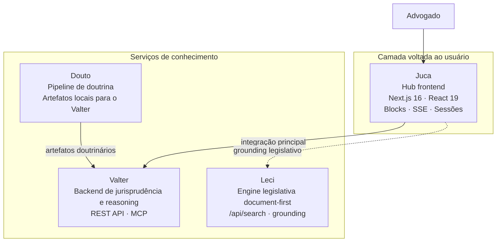

# Juca

Juca é o hub frontend do ecossistema **sens.legal** — uma interface conversacional que orquestra as camadas de jurisprudência, legislação e doutrina para pesquisa jurídica brasileira.

Construído com Next.js 16 e React 19, o Juca oferece uma interface no estilo Fintool/Perplexity onde advogados interagem com um Composer unificado enquanto a responsabilidade de backend sai do frontend e é centralizada em serviços especializados. Os resultados são renderizados como **Blocks** estruturados — cards de UI tipados que apresentam diagnósticos, precedentes, análises de risco e recomendações estratégicas.

## Principais Funcionalidades

O valor central do Juca é a **divulgação progressiva de análises jurídicas** por meio do sistema Briefing Progressivo:

- **[Sistema de Blocks](/features/block-system)** — 11 blocks de UI tipados que renderizam conteúdo jurídico estruturado (diagnósticos, precedentes, balanços de risco, entregas)
- **[Briefing Progressivo](/features/briefing/)** — Divulgação progressiva em 4 fases: Diagnóstico → Precedentes → Riscos → Entrega
- **[Integração com o Valter](/api/valter-adapter)** — Consome a API REST do Valter para pesquisa de jurisprudência do STJ, verificação de citações e análise de grafo de conhecimento
- **[Gerenciamento de Sessões](/features/session-management)** — Sessões persistentes com SQLite, navegáveis pela barra lateral
- **[Exportação para PDF](/features/pdf-export)** — Gera documentos PDF a partir de sessões de briefing
- **[Streaming em Tempo Real](/features/composer)** — Streaming de progresso via SSE durante a análise

## O Ecossistema sens.legal

O Juca não funciona sozinho. Ele é a camada voltada ao usuário de um ecossistema com quatro projetos:

```mermaid
graph TB
    User["Advogado"]

    subgraph "Camada voltada ao usuário"
        Juca["Juca<br/>Hub frontend<br/>Next.js 16 · React 19<br/>Blocks · SSE · Sessões"]
    end
    subgraph "Serviços de conhecimento"
        Valter["Valter<br/>Backend de jurisprudência e reasoning<br/>REST API · MCP"]
        Leci["Leci<br/>Engine legislativa document-first<br/>/api/search · grounding"]
        Douto["Douto<br/>Pipeline de doutrina<br/>Artefatos locais para o Valter"]
    end

    User --> Juca
    Juca -->|"integração principal"| Valter
    Juca -.->|"grounding legislativo"| Leci
    Douto -->|"artefatos doutrinários"| Valter
```

Veja [Arquitetura → Ecossistema](/pt-br/architecture/ecosystem) para detalhes sobre cada projeto.

## Links Rápidos

| Quero... | Ir para |
|---|---|
| Rodar o Juca localmente em 5 minutos | [Quickstart](/pt-br/getting-started/quickstart) |
| Entender a arquitetura | [Visão Geral da Arquitetura](/pt-br/architecture/overview) |
| Aprender sobre o Sistema de Blocks | [Sistema de Blocks](/pt-br/features/block-system) |
| Ver o roadmap do produto | [Roadmap](/pt-br/roadmap/) |
| Configurar variáveis de ambiente | [Ambiente](/pt-br/configuration/environment) |
| Escrever ou rodar testes | [Guia de Testes](/pt-br/development/testing) |

## Status do Projeto

O Juca está atualmente na fase **v0.3 — "Hub Foundation"**: transformando-se de um monólito fullstack em um hub frontend leve enquanto busca, reasoning e outras responsabilidades de backend são centralizadas no Valter. Veja o [Roadmap](/pt-br/roadmap/) para detalhes sobre os marcos.
