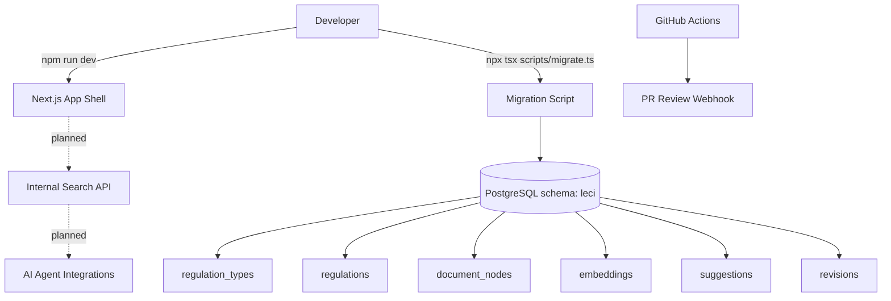
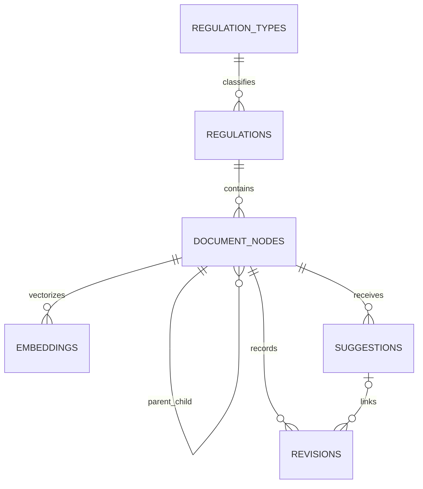
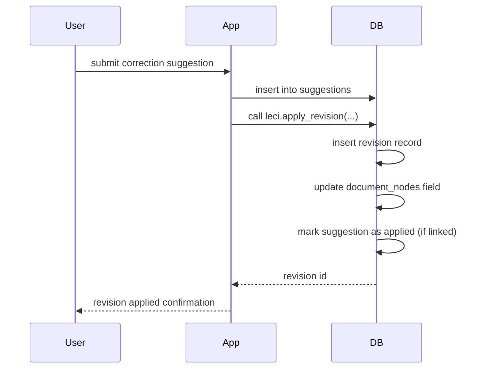
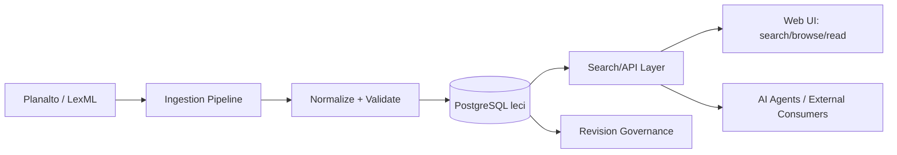

# Architecture Diagrams

## System context diagram
This diagram represents currently implemented runtime boundaries plus immediate planned extensions.

## Data model relationship diagram
This diagram shows core table relationships used by legal retrieval and revision auditing.

## Revision lifecycle diagram
This sequence diagram highlights the integrity path for legal text updates.

## Planned end-to-end flow diagram
This view shows the intended target lifecycle once roadmap capabilities are implemented.

