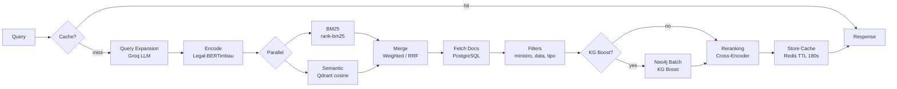
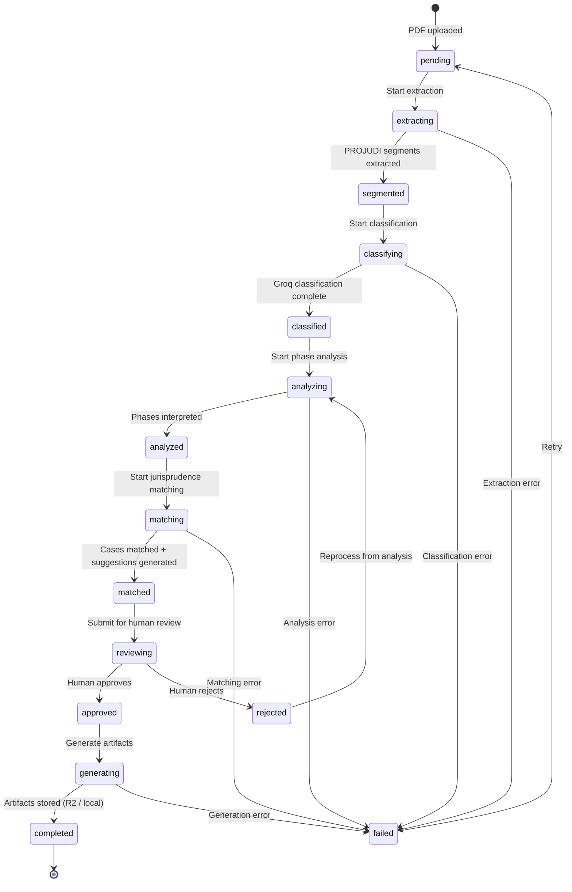

# Architecture Diagrams

> Visual representations of Valter's architecture using Mermaid diagrams.

## Component Diagram

This diagram shows all major components and their connections, from external consumers down to data stores. The arrows represent runtime dependencies — the direction data flows during a request.

```mermaid
graph TB
    subgraph Consumidores
        JUCA[Juca Frontend<br/>Next.js]
        CHATGPT[ChatGPT<br/>MCP Remoto]
        CLAUDE[Claude Desktop/Code<br/>MCP stdio]
    end

    subgraph "Valter — Entry Points"
        API[REST API<br/>FastAPI :8000]
        MCP_STDIO[MCP Server<br/>stdio]
        MCP_HTTP[MCP Server<br/>HTTP/SSE :8001]
        WORKER[ARQ Worker<br/>Background Jobs]
    end

    subgraph "Middleware Stack"
        CORS[CORS]
        METRICS_MW[Metrics IP Allowlist]
        TRACKING[Request Tracking<br/>trace_id + Prometheus]
        RATELIMIT[Rate Limiter<br/>Redis sliding window]
        AUTH[Auth Middleware<br/>API Key + Scopes]
    end

    subgraph "API Layer (api/)"
        ROUTES[11 Routers<br/>health, retrieve, verify,<br/>enrich, similar, graph,<br/>features, factual, ingest,<br/>memories, datasets]
        SCHEMAS[Pydantic v2 Schemas<br/>Request/Response]
        DEPS[Dependency Container<br/>DI via Depends()]
    end

    subgraph "Core Layer (core/)"
        RETRIEVER[HybridRetriever<br/>BM25 + Semantic + KG Boost]
        DVR[DualVectorRetriever<br/>Facts + Thesis]
        ENRICHER[DocumentEnricher<br/>IRAC + KG Context]
        VERIFIER[LegalVerifier<br/>Anti-hallucination]
        SIMILARITY[SimilarityFinder<br/>70% semantic + 30% structural]
        FACTUAL[FactualExtractor<br/>Groq LLM]
        QE[QueryExpander<br/>Multi-query RAG]
        WORKFLOW_ORCH[WorkflowOrchestrator<br/>Full Case Analysis]
        PROJUDI[ProjudiOrchestrator<br/>PDF Extraction]
        PHASE[PhaseAnalysis<br/>Interpreter + Rules]
        PROTOCOLS[Protocols<br/>Runtime-checkable interfaces]
    end

    subgraph "Store Layer (stores/)"
        PG_DOC[PostgresDocStore]
        PG_FEAT[PostgresFeaturesStore]
        PG_STJ[PostgresSTJStore]
        PG_INGEST[PostgresIngestStore]
        PG_MEM[PostgresMemoryStore]
        QDRANT_STORE[QdrantVectorStore]
        NEO4J_STORE[Neo4jGraphStore<br/>12+ query methods]
        REDIS_STORE[RedisCacheStore]
        GROQ_CLIENT[GroqLLMClient]
        ARTIFACT[ArtifactStorage<br/>R2 / Local]
    end

    subgraph "Embeddings"
        ENCODER[SentenceTransformerEncoder<br/>Legal-BERTimbau 768d]
        RERANKER[CrossEncoderReranker]
        RAIL_ENC[RailwayEncoder<br/>Remote HTTP]
        RAIL_RER[RailwayReranker<br/>Remote HTTP]
    end

    subgraph "Data Stores"
        PG[(PostgreSQL 16)]
        QD[(Qdrant)]
        N4J[(Neo4j / Aura)]
        RD[(Redis 7)]
        CF[(Cloudflare R2)]
        GROQ_API[(Groq API)]
    end

    subgraph "Observability"
        STRUCTLOG[structlog<br/>JSON + trace_id]
        PROM[Prometheus<br/>/metrics]
        OTEL[OpenTelemetry<br/>Tracing]
    end

    JUCA --> API
    CHATGPT --> MCP_HTTP
    CLAUDE --> MCP_STDIO
    MCP_STDIO --> API
    MCP_HTTP --> API

    API --> CORS --> METRICS_MW --> TRACKING --> RATELIMIT --> AUTH
    AUTH --> ROUTES
    ROUTES --> DEPS
    DEPS --> RETRIEVER & DVR & ENRICHER & VERIFIER & SIMILARITY & FACTUAL

    RETRIEVER --> QDRANT_STORE & NEO4J_STORE & PG_DOC & REDIS_STORE & ENCODER & RERANKER & QE
    WORKFLOW_ORCH --> PROJUDI & PHASE & PG_INGEST & ARTIFACT

    PG_DOC --> PG
    PG_FEAT --> PG
    PG_STJ --> PG
    PG_INGEST --> PG
    PG_MEM --> PG
    QDRANT_STORE --> QD
    NEO4J_STORE --> N4J
    REDIS_STORE --> RD
    GROQ_CLIENT --> GROQ_API
    ARTIFACT --> CF

    WORKER --> WORKFLOW_ORCH

    TRACKING --> STRUCTLOG & PROM & OTEL
```

### Reading the Diagram

The diagram is organized in layers from top to bottom, matching the dependency rule (`api/ -> core/ -> models/`):

- **Consumers** at the top connect to entry points. Juca uses the REST API directly. ChatGPT uses MCP over HTTP/SSE with HMAC authentication. Claude uses MCP over stdio locally.
- **Entry Points** represent the four runtimes. The REST API and both MCP servers ultimately call the same core logic. The ARQ Worker handles background ingestion jobs.
- **Middleware Stack** processes every HTTP request in sequence. Each middleware adds a capability: CORS headers, metrics access control, request tracing, rate limiting, and authentication.
- **API Layer** contains 11 routers (one per domain), Pydantic schemas for request/response validation, and the dependency container that wires stores into core functions.
- **Core Layer** holds all business logic. No module here imports from `stores/` directly — they receive store instances through dependency injection via the `Protocols` module.
- **Store Layer** provides concrete implementations for each data backend. The `GroqLLMClient` is here because it is an external data provider, not because it is a traditional database.
- **Embeddings** are handled by either local models (SentenceTransformer, CrossEncoder) or remote Railway-hosted instances, selected by configuration.
- **Data Stores** are the actual database processes (PostgreSQL, Qdrant, Neo4j, Redis) plus external APIs (Groq, Cloudflare R2).
- **Observability** collects structured logs, Prometheus metrics, and OpenTelemetry traces from the middleware tracking layer.

## Search Pipeline

The hybrid search pipeline is Valter's most complex data flow. It combines three search strategies (BM25 keyword search, semantic vector search, and knowledge graph boosting) into a single ranked result set.



### Pipeline Stages

1. **Cache check** — Redis is queried first with the exact query hash. Cache TTL is 180 seconds. On a hit, the cached result is returned immediately.
2. **Query expansion** — if Groq is enabled, the query is expanded into up to 3 semantic variants using multi-query RAG. This improves recall for ambiguous legal queries.
3. **Encoding** — the query (and its expansions) are encoded into 768-dimensional vectors using Legal-BERTimbau (`rufimelo/Legal-BERTimbau-sts-base`).
4. **Parallel search** — BM25 keyword search against PostgreSQL and semantic cosine similarity search against Qdrant run concurrently.
5. **Merge** — results from both strategies are combined using either weighted fusion or Reciprocal Rank Fusion (RRF), configurable per request.
6. **Document fetch** — full document data is loaded from PostgreSQL for the merged candidate set.
7. **Filters** — post-retrieval filters apply (minister, date range, decision type, result).
8. **KG Boost** — if enabled, Neo4j is queried in batch to score each candidate based on shared criteria, facts, evidence, and legal devices in the knowledge graph. The KG boost score is blended with the search score.
9. **Reranking** — a cross-encoder model re-scores the top candidates based on query-document relevance, producing the final ranking.
10. **Cache store** — the final result is stored in Redis with a 180-second TTL.

## Ingestion Workflow

The ingestion workflow handles the complete lifecycle of a legal case analysis, from PDF upload through AI-powered extraction to human-reviewed artifacts. The workflow is managed by a state machine in `core/workflow_state_machine.py`.



### Workflow Stages

- **pending** — a PDF has been uploaded but no processing has started.
- **extracting** — the PROJUDI pipeline (`core/projudi_pipeline.py`) segments the document, classifying each section with confidence scores and applying sibling inheritance for ambiguous segments.
- **classifying** — Groq LLM extracts 21 structured fields from the document (facts, legal thesis, outcome, minister, category, etc.).
- **analyzing** — the phase analysis pipeline (`core/phase_interpreter.py` + rules) produces deterministic interpretation of legal proceeding phases with jurisprudence recommendations per phase.
- **matching** — the hybrid retriever finds similar cases, and the system generates suggestions for the lawyer.
- **reviewing** — a human (lawyer) reviews the analysis and suggestions, approving or rejecting each phase. Rejections trigger reprocessing.
- **generating** — approved analyses are serialized as JSON and PDF artifacts, stored in Cloudflare R2 (or local filesystem).
- **completed** — the workflow is finished. All state transitions are recorded as auditable events in a JSONL manifest.

:::note
The state machine enforces valid transitions. For example, a workflow cannot jump from `pending` to `reviewing` — it must pass through all intermediate states. Invalid transitions raise errors that are logged for audit.
:::

## Data Model (FRBR Ontology)

The Neo4j knowledge graph is structured around the FRBR (Functional Requirements for Bibliographic Records) ontology, adapted for Brazilian legal documents. This ontology distinguishes between the abstract intellectual content of a law or decision (Work), a specific version of that content (Expression), and its physical form (Manifestation).

### Node Types

| Node Type | Description | Example |
|-----------|-------------|---------|
| `Decision` | An STJ court decision (the primary entity) | REsp 1.234.567/SP |
| `Criterion` | A legal criterion or test applied in decisions | "boa-fe objetiva", "nexo causal" |
| `LegalDevice` | A specific article, paragraph, or clause of legislation | Art. 14 do CDC, Art. 927 do CC |
| `Precedent` | A precedent cited by decisions | Sumula 297/STJ |
| `Minister` | An STJ minister (judge) | Min. Nancy Andrighi |
| `Category` | A legal subject area | Direito do Consumidor, Responsabilidade Civil |
| `Fact` | A factual element relevant to the case | "defeito do produto", "dano moral" |
| `Evidence` | A type of evidence referenced | "prova pericial", "documento" |

### Relationship Types

| Relationship | From | To | Meaning |
|-------------|------|-----|---------|
| `APLICA` | Decision | LegalDevice | The decision applies this legal provision |
| `USA_CRITERIO` | Decision | Criterion | The decision uses this legal criterion |
| `CITA` | Decision | Decision | One decision cites another |
| `CITA_PRECEDENTE` | Decision | Precedent | The decision cites this precedent |
| `RELATOR_DE` | Minister | Decision | This minister was the reporting judge |
| `PERTENCE_A` | Decision | Category | The decision belongs to this subject area |
| `TEM_FATO` | Decision | Fact | The decision involves this fact |
| `TEM_PROVA` | Decision | Evidence | The decision references this evidence |
| `DIVERGE_DE` | Decision | Decision | The decisions have divergent outcomes on the same criterion |

### Scale

The current graph contains approximately **28,482 nodes** and **207,163 edges**, representing the relational structure of STJ jurisprudence. The 12 graph analytics endpoints in the API expose different traversal and aggregation patterns over this graph.

## Deployment Architecture

In production, Valter runs on Railway with the following service layout:

```
                    Internet
                       │
          ┌────────────┼────────────┐
          │            │            │
          ▼            ▼            ▼
    ┌──────────┐ ┌──────────┐ ┌──────────┐
    │ REST API │ │MCP Remote│ │   Juca   │
    │ :8000    │ │ :8001    │ │ (Next.js)│
    │ FastAPI  │ │ HMAC Auth│ │          │
    └────┬─────┘ └────┬─────┘ └────┬─────┘
         │            │            │
         │            ▼            │
         │      ┌──────────┐       │
         │      │ REST API │◄──────┘
         │      │ (bridge)  │
         │      └──────────┘
         │
    ┌────┴─────────────────────────────┐
    │         Internal Network         │
    │                                  │
    │  ┌──────┐ ┌──────┐ ┌──────────┐ │
    │  │  PG  │ │Qdrant│ │  Redis   │ │
    │  │  16  │ │      │ │    7     │ │
    │  └──────┘ └──────┘ └──────────┘ │
    │                                  │
    │  ┌──────────┐                    │
    │  │ARQ Worker│                    │
    │  │(ingest)  │                    │
    │  └──────────┘                    │
    └──────────────────────────────────┘

    External Services:
    ┌──────────┐ ┌──────────┐ ┌──────┐
    │Neo4j Aura│ │Groq API  │ │  R2  │
    │(managed) │ │(LLM)     │ │(S3)  │
    └──────────┘ └──────────┘ └──────┘
```

### Key Points

- **REST API** and **MCP Remote** are separate Railway services running the same Docker image with different start commands. This provides independent scaling and rollback.
- **PostgreSQL, Qdrant, and Redis** run as Railway plugins on the internal network, not exposed to the internet.
- **Neo4j Aura** is a managed external service (not self-hosted). PRs touching graph code must pass the `Aura Validation` CI workflow before merge.
- **Groq API** and **Cloudflare R2** are external services accessed over HTTPS. Both are optional — the system degrades gracefully without them (no AI features, local filesystem for artifacts).
- **ARQ Worker** runs as a separate process consuming the Redis job queue for background ingestion workflows.
- **Juca** (the Next.js frontend) calls the REST API directly. It is a separate deployment, not part of the Valter codebase.
