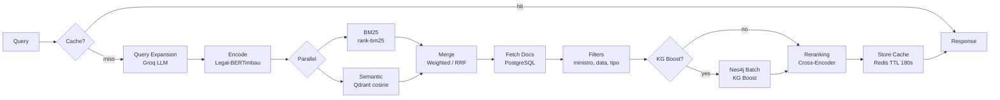
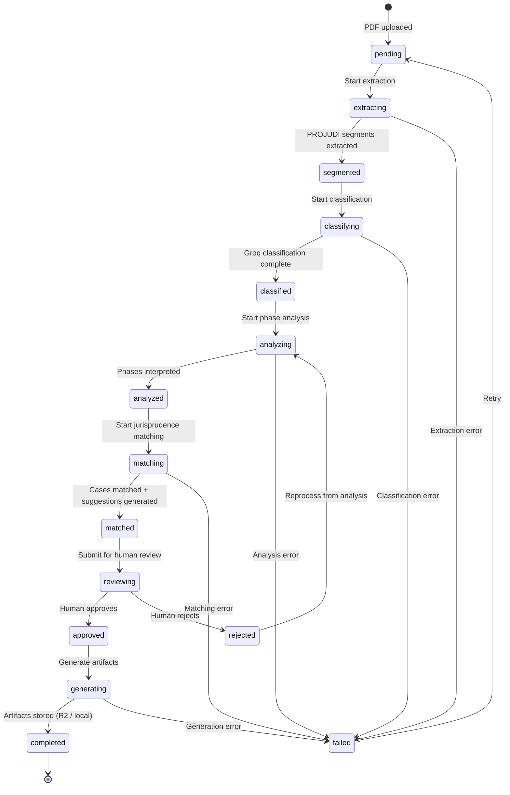

# Diagramas de Arquitetura

> Representacoes visuais da arquitetura do Valter usando diagramas Mermaid.

## Diagrama de Componentes

Este diagrama mostra todos os componentes principais e suas conexoes, desde consumidores externos ate os data stores. As setas representam dependencias em runtime — a direcao que os dados fluem durante um request.

```mermaid
graph TB
    subgraph Consumidores
        JUCA[Juca Frontend<br/>Next.js]
        CHATGPT[ChatGPT<br/>MCP Remoto]
        CLAUDE[Claude Desktop/Code<br/>MCP stdio]
    end

    subgraph "Valter — Entry Points"
        API[REST API<br/>FastAPI :8000]
        MCP_STDIO[MCP Server<br/>stdio]
        MCP_HTTP[MCP Server<br/>HTTP/SSE :8001]
        WORKER[ARQ Worker<br/>Background Jobs]
    end

    subgraph "Middleware Stack"
        CORS[CORS]
        METRICS_MW[Metrics IP Allowlist]
        TRACKING[Request Tracking<br/>trace_id + Prometheus]
        RATELIMIT[Rate Limiter<br/>Redis sliding window]
        AUTH[Auth Middleware<br/>API Key + Scopes]
    end

    subgraph "API Layer (api/)"
        ROUTES[11 Routers<br/>health, retrieve, verify,<br/>enrich, similar, graph,<br/>features, factual, ingest,<br/>memories, datasets]
        SCHEMAS[Pydantic v2 Schemas<br/>Request/Response]
        DEPS[Dependency Container<br/>DI via Depends()]
    end

    subgraph "Core Layer (core/)"
        RETRIEVER[HybridRetriever<br/>BM25 + Semantic + KG Boost]
        DVR[DualVectorRetriever<br/>Facts + Thesis]
        ENRICHER[DocumentEnricher<br/>IRAC + KG Context]
        VERIFIER[LegalVerifier<br/>Anti-hallucination]
        SIMILARITY[SimilarityFinder<br/>70% semantic + 30% structural]
        FACTUAL[FactualExtractor<br/>Groq LLM]
        QE[QueryExpander<br/>Multi-query RAG]
        WORKFLOW_ORCH[WorkflowOrchestrator<br/>Full Case Analysis]
        PROJUDI[ProjudiOrchestrator<br/>PDF Extraction]
        PHASE[PhaseAnalysis<br/>Interpreter + Rules]
        PROTOCOLS[Protocols<br/>Runtime-checkable interfaces]
    end

    subgraph "Store Layer (stores/)"
        PG_DOC[PostgresDocStore]
        PG_FEAT[PostgresFeaturesStore]
        PG_STJ[PostgresSTJStore]
        PG_INGEST[PostgresIngestStore]
        PG_MEM[PostgresMemoryStore]
        QDRANT_STORE[QdrantVectorStore]
        NEO4J_STORE[Neo4jGraphStore<br/>12+ query methods]
        REDIS_STORE[RedisCacheStore]
        GROQ_CLIENT[GroqLLMClient]
        ARTIFACT[ArtifactStorage<br/>R2 / Local]
    end

    subgraph "Embeddings"
        ENCODER[SentenceTransformerEncoder<br/>Legal-BERTimbau 768d]
        RERANKER[CrossEncoderReranker]
        RAIL_ENC[RailwayEncoder<br/>Remote HTTP]
        RAIL_RER[RailwayReranker<br/>Remote HTTP]
    end

    subgraph "Data Stores"
        PG[(PostgreSQL 16)]
        QD[(Qdrant)]
        N4J[(Neo4j / Aura)]
        RD[(Redis 7)]
        CF[(Cloudflare R2)]
        GROQ_API[(Groq API)]
    end

    subgraph "Observability"
        STRUCTLOG[structlog<br/>JSON + trace_id]
        PROM[Prometheus<br/>/metrics]
        OTEL[OpenTelemetry<br/>Tracing]
    end

    JUCA --> API
    CHATGPT --> MCP_HTTP
    CLAUDE --> MCP_STDIO
    MCP_STDIO --> API
    MCP_HTTP --> API

    API --> CORS --> METRICS_MW --> TRACKING --> RATELIMIT --> AUTH
    AUTH --> ROUTES
    ROUTES --> DEPS
    DEPS --> RETRIEVER & DVR & ENRICHER & VERIFIER & SIMILARITY & FACTUAL

    RETRIEVER --> QDRANT_STORE & NEO4J_STORE & PG_DOC & REDIS_STORE & ENCODER & RERANKER & QE
    WORKFLOW_ORCH --> PROJUDI & PHASE & PG_INGEST & ARTIFACT

    PG_DOC --> PG
    PG_FEAT --> PG
    PG_STJ --> PG
    PG_INGEST --> PG
    PG_MEM --> PG
    QDRANT_STORE --> QD
    NEO4J_STORE --> N4J
    REDIS_STORE --> RD
    GROQ_CLIENT --> GROQ_API
    ARTIFACT --> CF

    WORKER --> WORKFLOW_ORCH

    TRACKING --> STRUCTLOG & PROM & OTEL
```

### Como Ler o Diagrama

O diagrama esta organizado em camadas de cima para baixo, seguindo a regra de dependencia (`api/ -> core/ -> models/`):

- **Consumidores** no topo conectam aos entry points. O Juca usa a REST API diretamente. O ChatGPT usa MCP sobre HTTP/SSE com autenticacao HMAC. O Claude usa MCP sobre stdio localmente.
- **Entry Points** representam os quatro runtimes. A REST API e os dois servidores MCP chamam a mesma logica do core. O ARQ Worker lida com jobs de ingestao em background.
- **Stack de Middleware** processa cada request HTTP em sequencia. Cada middleware adiciona uma capacidade: headers CORS, controle de acesso a metricas, rastreamento de requests, rate limiting e autenticacao.
- **Camada API** contem 11 routers (um por dominio), schemas Pydantic para validacao de request/response e o container de dependencias que conecta stores as funcoes do core.
- **Camada Core** armazena toda a logica de negocio. Nenhum modulo aqui importa de `stores/` diretamente — recebem instancias de stores por injecao de dependencia via o modulo `Protocols`.
- **Camada Store** fornece implementacoes concretas para cada backend de dados. O `GroqLLMClient` esta aqui porque e um provedor externo de dados, nao porque e um banco de dados tradicional.
- **Embeddings** sao tratados por modelos locais (SentenceTransformer, CrossEncoder) ou instancias remotas hospedadas no Railway, selecionados por configuracao.
- **Data Stores** sao os processos reais de banco de dados (PostgreSQL, Qdrant, Neo4j, Redis) alem de APIs externas (Groq, Cloudflare R2).
- **Observabilidade** coleta logs estruturados, metricas Prometheus e traces OpenTelemetry a partir da camada de tracking do middleware.

## Pipeline de Busca

O pipeline de busca hibrida e o fluxo de dados mais complexo do Valter. Ele combina tres estrategias de busca (busca por palavras-chave BM25, busca semantica vetorial e boosting via knowledge graph) em um unico conjunto de resultados ranqueados.



### Etapas do Pipeline

1. **Verificacao de cache** — o Redis e consultado primeiro com o hash exato da query. O TTL do cache e 180 segundos. Em caso de hit, o resultado em cache e retornado imediatamente.
2. **Expansao de query** — se o Groq estiver habilitado, a query e expandida em ate 3 variantes semanticas usando multi-query RAG. Isso melhora o recall para queries juridicas ambiguas.
3. **Encoding** — a query (e suas expansoes) sao codificadas em vetores de 768 dimensoes usando Legal-BERTimbau (`rufimelo/Legal-BERTimbau-sts-base`).
4. **Busca paralela** — busca por palavras-chave BM25 contra o PostgreSQL e busca por similaridade de cosseno semantica contra o Qdrant rodam concorrentemente.
5. **Merge** — resultados de ambas as estrategias sao combinados usando fusao ponderada ou Reciprocal Rank Fusion (RRF), configuravel por request.
6. **Fetch de documentos** — dados completos dos documentos sao carregados do PostgreSQL para o conjunto de candidatos resultante do merge.
7. **Filtros** — filtros pos-retrieval sao aplicados (ministro, intervalo de datas, tipo de decisao, resultado).
8. **KG Boost** — se habilitado, o Neo4j e consultado em batch para pontuar cada candidato com base em criterios, fatos, provas e dispositivos legais compartilhados no knowledge graph. O score do KG boost e combinado com o score de busca.
9. **Reranking** — um modelo cross-encoder repontua os melhores candidatos com base na relevancia query-documento, produzindo o ranking final.
10. **Armazenamento em cache** — o resultado final e armazenado no Redis com TTL de 180 segundos.

## Workflow de Ingestao

O workflow de ingestao gerencia o ciclo de vida completo de uma analise de caso juridico, desde o upload do PDF, passando por extracao alimentada por IA, ate artefatos revisados por humano. O workflow e gerenciado por uma maquina de estados em `core/workflow_state_machine.py`.



### Etapas do Workflow

- **pending** — um PDF foi enviado mas nenhum processamento foi iniciado.
- **extracting** — o pipeline PROJUDI (`core/projudi_pipeline.py`) segmenta o documento, classificando cada secao com scores de confianca e aplicando heranca de irmaos para segmentos ambiguos.
- **classifying** — o Groq LLM extrai 21 campos estruturados do documento (fatos, tese juridica, resultado, ministro, categoria, etc.).
- **analyzing** — o pipeline de analise de fases (`core/phase_interpreter.py` + regras) produz interpretacao deterministica das fases processuais com recomendacoes de jurisprudencia por fase.
- **matching** — o retriever hibrido encontra casos similares e o sistema gera sugestoes para o advogado.
- **reviewing** — um humano (advogado) revisa a analise e as sugestoes, aprovando ou rejeitando cada fase. Rejeicoes disparam reprocessamento.
- **generating** — analises aprovadas sao serializadas como artefatos JSON e PDF, armazenados no Cloudflare R2 (ou sistema de arquivos local).
- **completed** — o workflow esta finalizado. Todas as transicoes de estado sao registradas como eventos auditaveis em um manifesto JSONL.

:::note
A maquina de estados aplica transicoes validas. Por exemplo, um workflow nao pode pular de `pending` para `reviewing` — precisa passar por todos os estados intermediarios. Transicoes invalidas geram erros que sao logados para auditoria.
:::

## Modelo de Dados (Ontologia FRBR)

O knowledge graph Neo4j e estruturado em torno da ontologia FRBR (Functional Requirements for Bibliographic Records), adaptada para documentos juridicos brasileiros. Essa ontologia distingue entre o conteudo intelectual abstrato de uma lei ou decisao (Work), uma versao especifica desse conteudo (Expression) e sua forma fisica (Manifestation).

### Tipos de Nos

| Tipo de No | Descricao | Exemplo |
|------------|-----------|---------|
| `Decision` | Uma decisao judicial do STJ (entidade primaria) | REsp 1.234.567/SP |
| `Criterion` | Um criterio ou teste juridico aplicado em decisoes | "boa-fe objetiva", "nexo causal" |
| `LegalDevice` | Um artigo, paragrafo ou clausula especifica de legislacao | Art. 14 do CDC, Art. 927 do CC |
| `Precedent` | Um precedente citado por decisoes | Sumula 297/STJ |
| `Minister` | Um ministro (magistrado) do STJ | Min. Nancy Andrighi |
| `Category` | Uma area tematica do direito | Direito do Consumidor, Responsabilidade Civil |
| `Fact` | Um elemento factual relevante para o caso | "defeito do produto", "dano moral" |
| `Evidence` | Um tipo de prova referenciado | "prova pericial", "documento" |

### Tipos de Relacionamentos

| Relacionamento | De | Para | Significado |
|---------------|-----|------|-------------|
| `APLICA` | Decision | LegalDevice | A decisao aplica este dispositivo legal |
| `USA_CRITERIO` | Decision | Criterion | A decisao usa este criterio juridico |
| `CITA` | Decision | Decision | Uma decisao cita outra |
| `CITA_PRECEDENTE` | Decision | Precedent | A decisao cita este precedente |
| `RELATOR_DE` | Minister | Decision | Este ministro foi o relator |
| `PERTENCE_A` | Decision | Category | A decisao pertence a esta area tematica |
| `TEM_FATO` | Decision | Fact | A decisao envolve este fato |
| `TEM_PROVA` | Decision | Evidence | A decisao referencia esta prova |
| `DIVERGE_DE` | Decision | Decision | As decisoes tem resultados divergentes sobre o mesmo criterio |

### Escala

O grafo atual contem aproximadamente **28.482 nos** e **207.163 arestas**, representando a estrutura relacional da jurisprudencia do STJ. Os 12 endpoints de graph analytics na API expoem diferentes padroes de travessia e agregacao sobre este grafo.

## Arquitetura de Deploy

Em producao, o Valter roda no Railway com o seguinte layout de servicos:

```
                    Internet
                       │
          ┌────────────┼────────────┐
          │            │            │
          ▼            ▼            ▼
    ┌──────────┐ ┌──────────┐ ┌──────────┐
    │ REST API │ │MCP Remote│ │   Juca   │
    │ :8000    │ │ :8001    │ │ (Next.js)│
    │ FastAPI  │ │ HMAC Auth│ │          │
    └────┬─────┘ └────┬─────┘ └────┬─────┘
         │            │            │
         │            ▼            │
         │      ┌──────────┐       │
         │      │ REST API │◄──────┘
         │      │ (bridge)  │
         │      └──────────┘
         │
    ┌────┴─────────────────────────────┐
    │         Rede Interna             │
    │                                  │
    │  ┌──────┐ ┌──────┐ ┌──────────┐ │
    │  │  PG  │ │Qdrant│ │  Redis   │ │
    │  │  16  │ │      │ │    7     │ │
    │  └──────┘ └──────┘ └──────────┘ │
    │                                  │
    │  ┌──────────┐                    │
    │  │ARQ Worker│                    │
    │  │(ingest)  │                    │
    │  └──────────┘                    │
    └──────────────────────────────────┘

    Servicos Externos:
    ┌──────────┐ ┌──────────┐ ┌──────┐
    │Neo4j Aura│ │Groq API  │ │  R2  │
    │(managed) │ │(LLM)     │ │(S3)  │
    └──────────┘ └──────────┘ └──────┘
```

### Pontos-chave

- **REST API** e **MCP Remote** sao servicos Railway separados rodando a mesma imagem Docker com comandos de inicio diferentes. Isso proporciona escalonamento e rollback independentes.
- **PostgreSQL, Qdrant e Redis** rodam como plugins Railway na rede interna, sem exposicao a internet.
- **Neo4j Aura** e um servico externo gerenciado (nao auto-hospedado). PRs que tocam codigo de grafo devem passar no workflow de CI `Aura Validation` antes do merge.
- **Groq API** e **Cloudflare R2** sao servicos externos acessados via HTTPS. Ambos sao opcionais — o sistema degrada graciosamente sem eles (sem funcionalidades de IA, sistema de arquivos local para artefatos).
- **ARQ Worker** roda como um processo separado consumindo a fila de jobs do Redis para workflows de ingestao em background.
- **Juca** (o frontend Next.js) chama a REST API diretamente. E um deploy separado, nao faz parte do codebase do Valter.
